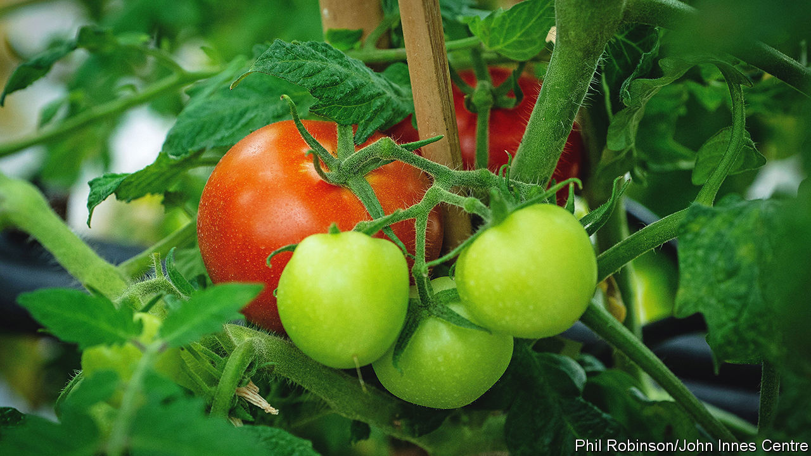

###### Tweak and ye shall find

# Gene-edited food is coming to Britain 

##### A new law allows the cultivation and sale of gene-edited crops. Good 

 

> May 24th 2022 

The tomatoes look like any other. But unlike those which sit on supermarket shelves, they are a source of vitamin d. That is owing to the clever work of scientists at the John Innes Centre in Norwich, who have used gene-editing techniques to boost the tomatoes’ nutritional value. By making small deletions in the plant’s genome they blocked the production of a certain enzyme, prompting the plants to accumulate provitamin d3. This in turn is converted to vitamin d on exposure to ultraviolet light, such as that found in sunlight. A single upgraded tomato could provide around 20% of the recommended daily intake of the vitamin. 

This fruit was produced in a laboratory; no British farmer could grow it today. A European Court of Justice (ecj) ruling in 2018 made it all but impossible to grow gene-edited crops commercially across Europe, including in Britain. Even running research trials became burdensome. The ruling thereby treated gene-editing, which works by tweaking dna that is already there, in the same way as early genetic-modification (gm) techniques, which work by adding external dna, often from different species, to a crop. 

Britain’s departure from the eu has given it an opportunity to strike out on its own path. Earlier this year the government made it easier for scientists to conduct trials of gene-edited crops. And on May 25th it introduced legislation that would allow such crops to be cultivated commercially in England. (That will also be followed by a review of England’s gm regime, which remains strictly regulated for now.) George Eustice, the environment secretary, has said that gene-edited products could be on shelves as soon as next year. 

That could be a boon for farmers, for consumers and for Britain. As well as producing nutrient-enriched foods, geneediting can increase yields, reduce the amount of insecticides and fertiliser that crops need, and produce more climate-tolerant crops. 

The criticisms of gene-editing are flimsy. There is no evidence that the technique is unsafe (two decades of research on genetically modified crops have demonstrated their safety, too). Unintended side-effects are more likely to occur with conventional plant-breeding methods, which irradiate seeds to generate random mutations. The worry that businesses will be able to patent gene-edited crops, making farmers beholden to big agricultural companies, is also unfounded. Farmers already plant patented, “hybrid” crops, which are produced by cross-pollinating different plant varieties; most seem happy to do so because of the yield benefits they offer.

For researchers, the changes to crop trials have already had an impact. According to Johnathan Napier at Rothamsted Research, an agricultural-research institution in Harpenden, applying for a geneediting trial used to require reams of documentation and a long waiting-period. Now it takes “about one minute” and half a page, he says. The ease of conducting trials has already led to increased activity from British researchers, says Gilad Gershon, whose company, Tropic Biosciences, offers a technology platform for gene-editing. 

But problems remain. One is trade. The eu requires all gene-edited imports to be labelled and approved, yet Mr Eustice has said he does not think gene-edited products grown in Britain will be labelled. That could worsen already tense discussions around the flow of goods from Great Britain into Northern Ireland, which is treated as being inside the eu’s single market. (Within Great Britain, the devolved governments of Wales and Scotland have both said they will not yet allow the cultivation of gene-edited crops, although they cannot prevent their sale.) Such disruption may be short-lived, however, as the European Commission now also plans to liberalise gene-editing rules. A legislative proposal is planned for the middle of 2023, and if that passes, the eu and Britain will again be in alignment. 

A bigger issue is the guiding principle of the British government’s gene-editing regulation. Rather than look at the actual properties of the crops, it focuses on the process by which they were produced: if the crop “could have occurred naturally”, it is allowed. Not only is that a nebulous definition, but according to the Royal Society, a scientific academy, a focus on process “perpetuates the false assumption that risk is determined by the breeding technology rather than the outcomes that the breeding technology is used to deliver”. 

An outcome-based system would treat all crops the same, regardless of how they were created, and assess the safety of the final product. Such an approach would result in a regulatory system that works for future technologies, and also allow the production of all types of genetically modified crops, not just gene-edited ones. The government, in promising its gm “review”, has hinted that it may indeed move in this direction. But it is moving slowly, perhaps because of negative public perceptions.

Those perceptions are the greatest challenge that gene-edited produce will face. Around a third of British adults think that gene-edited food is unsafe to eat; 31% say they are not sure. This resistance stems from decades of scaremongering about gm foods, along with a lack of awareness about gene-editing’s advantages. If the public see benefits such as lower prices or healthier fruits, they may come to embrace the technology. So Professor Napier says the onus is now on researchers to step up. “If you’ve been saying, ‘What’s blockading us from delivering all these innovations and useful stuff is the regulatory burden’, [and] if that regulatory burden has been removed, where’s this flood of great stuff?” ■


