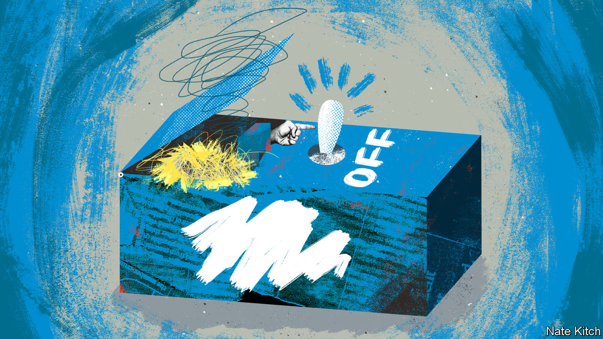

###### Bagehot

# How the Conservatives became an opposition in government 

##### The Tories have been in power so long that they are undoing their own policies 

 

> May 26th 2022 

Bell labs, the former research arm of at&amp;t, an American telecoms giant, invented large chunks of the modern world. Transistors, the silicon solar cell and the laser all started life at its laboratory in New Jersey. Engineers there also invented something utterly pointless. Nicknamed the Ultimate Machine, it was a small wooden box with a lid and a switch. The switch did one thing only: if turned on, an arm popped out of the lid and flicked it off again. 

Watching a useless machine repeatedly turn itself off was “devastating”, wrote Arthur C. Clarke, a science-fiction author. “There is something unspeakably sinister about a machine that does nothing—absolutely nothing—except switch itself off.” A similar sense of dread occurs when examining the Tories’ record in power over the past 12 years. The Conservative government exists to undo the previous acts of Conservative governments. 

It starts with the government’s flagship policy: “levelling up”. In theory, this is a fundamental reshaping of Britain, which will see economic largesse and political attention shift from a spoilt south-east to a neglected north and Midlands. In practice, it amounts to replacing some of the funding lost under David Cameron’s 2010-15 coalition government and its successors. In the decade to 2020, local government funding was halved in real terms. 

Since some services, such as social care, are statutory, others were slashed to compensate. Parts of the public realm that make an area nice—the libraries, parks and emptied bins—suffered most. Now money removed by the Tories during austerity is being dribbled back, often to marginal Tory seats, in a weird form of political extortion: vote Conservative or the flowerbed gets it. 

It is a similar story when it comes to dealing with rocketing energy prices. Ofgem, which regulates energy prices in Britain, said this week that the typical annual energy bill would rise by about £800 ($1,000) to £2,800 this autumn. An alliance ranging from Labour to Martin Lewis, a personal-finance guru, have demanded more government action to support poorer households. 

By heeding their calls, Mr Johnson will again be undoing previous Conservative Party policy. The cost-of-living squeeze is so acute in part because benefits have fallen steeply in real terms since 2010. An unemployed person is about £700 a year worse off in real terms than they were in 2010, according to the New Economics Foundation, a think-tank. If the government wants to survive a chilly winter, generous support for Britain’s less well-off is almost obligatory. In order to stay in power the Conservative government will return money a previous Tory government removed.

Sometimes the self-cancelling action is as quick as the machine that so disturbed Clarke. No sooner had the government agreed the Northern Ireland protocol, part of the Brexit withdrawal treaty that keeps the province in the eu’s single market for goods, in early 2020, than it started threatening to undo it. Skip forward three years, and Britain and the eu stand on the brink of a trade war over the topic. Liz Truss, the foreign secretary, cranks up the rhetoric with Ireland, only for more soothing noises to emerge elsewhere from the British government. Click, whirr, click.

Policies change as times do. There is usually, however, a consistent thread when a party stays in power. Yet almost every feature of the Cameron era is being erased. George Osborne, the then chancellor, boasted of making Britain’s corporation tax the lowest in the g7. Rishi Sunak, the current chancellor, plans to return it to 25%, above the oecd average. Flagship policies of that period are now forgotten. New Schools Network, a government-backed charity that helped set up “free schools”, has shut down after the government cut its funding. The Health and Care Act passed this year unpicks the botched nhs reforms put forward under Mr Cameron.

Strategically, running against previous Conservative governments has merit. Mr Johnson can present his government as a new one, untarnished by the nine years of Tory rule that preceded him. Such political mid-air refuelling is hard to pull off. Labour did not manage it when Gordon Brown succeeded Tony Blair in 2007. The Conservatives themselves failed to do it after Margaret Thatcher was turfed out of office. A certain brazenness is required, which suits Mr Johnson to a tee. Humility would do no good. Facing a camera and proclaiming “Oops! Our mistake!” would not trigger a surge in Tory polling. 

Politically, it makes sense too. Austerity was popular when it happened to other people. There is little innate love for Mr Cameron’s project of tight spending and social liberalism. In 2010 the Conservatives failed to win a majority on the back of an enormous recession. In 2015 they managed only a slim one of 16. By contrast, in 2019 big-spending authoritarianism helped win the Conservatives their first large majority since Thatcher. That Mr Cameron is Mr Johnson’s lifelong rival makes burying his legacy an enjoyable task. Inventing a pointless machine is fun; for parts of the government, so is trampling on its predecessors. 

There is no alternative

Unfortunately for them, the Conservatives have been in power for so long that almost any problem can be laid at their door. Governments are usually kicked out when voters want fresh policies. But in the general election of 2019, a fusion of Brexit and Labour’s leftward tilt ensured that a Conservative government was returned with the pledge of doing something new. The Conservatives were handed the task of undoing Conservative policy. 

Just as Clarke found a useless machine perturbing, there is something obscene about a government that has so much power but does so little with it. The government has become an opposition in office, railing against the actions of its predecessors. Useless machines are now sold as amusing toys on Amazon for £11.85. “They would make perfect retirement gifts for unsuccessful chief executives,” suggested Clarke. The Conservative prime minister does not need one; he can just look in the mirror. ■


