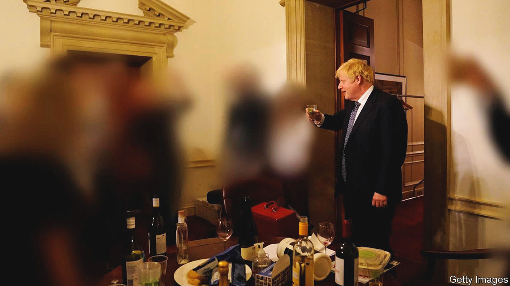

###### Neither black nor white

# Sue Gray produces a patchy account of the Downing Street parties 

##### A civil servant’s blend of precision and pixellation 

 

> May 25th 2022 

On may 25th Sue Gray, a senior civil servant, published a report into gatherings that had taken place in Downing Street during the pandemic. Nine photos are included, depicting two events: a drinks party in November 2020 (shown above) for a departing official, and a gathering in the Cabinet Room in June 2020 to mark the prime minister’s birthday. In parts the images are pin-sharp, capturing tins of lager, emptied wine glasses and Boris Johnson holding a plastic beaker aloft. Much of them are a blur, the identities of Mr Johnson’s fellow partygoers obscured. 

This blend of precision and pixellation characterises Ms Gray’s report into events that scandalised Britons. The revelations that politicians and officials had been breaking pandemic-era restrictions had already resulted in 126 police fines for 83 people, including one each for Mr Johnson, his wife, and Rishi Sunak, the chancellor. But Ms Gray’s long-awaited report was meant to clear up what had been going on. Ministers had vowed that her report would be “independent”: a former head of government propriety and ethics, she is known for having no-nonsense grip. 

Yet she is also a civil-service veteran, an insider’s insider with a reputation for foiling freedom-of-information requests, now called upon to pass judgment on her colleagues and her ultimate boss, Mr Johnson. Expectations for her report veered between forensic exposé and artful obscuration.

In the end, she delivered both. The report is an embarrassing portrait of a government which, while confronting the worst pandemic in a century, seemed remarkably preoccupied by a schedule of leaving drinks, Christmas parties, garden receptions and “Wine Time Friday”. But elsewhere its gaze is cloudy and incurious. As a crime report, it logs the blood, fingerprints and weaponry, but the perpetrator is no more than a silhouette.

One bash on June 18th, fuelled by pizza and prosecco, spilled through the Downing Street complex from 6.30pm until the last attendee left at 3.13am. Helen MacNamara, then the deputy cabinet secretary, produced a karaoke machine. One attendee drank until they vomited. Two others fell into a “minor altercation”. At another “crowded and noisy” bash, a panic alarm was triggered, prompting the police to arrive. Ms Gray found “multiple examples of a lack of respect and poor treatment of security and cleaning staff”. The scandal exposed those involved not to be particularly wicked, but callow, self-absorbed, almost bored by high office. 

Elsewhere, Ms Gray’s gaze is much less piercing. She decided to identify by name only the most senior officials. There are curiously few references to the role of Dominic Cummings, Mr Johnson’s anarchic chief aide for much of the period, who once declared that successful political operations are characterised by “hot women and beer and pizza and music in the office on Friday and Saturday night”. Ms Gray declined to investigate a gathering in Mr Johnson’s private flat on the night Mr Cummings resigned, in which celebrating special advisers were said to have blared abba songs. Some events Ms Gray found out about only through the press; she acknowledges she may have missed more. 

Her conclusions are also rather coy: the closest she comes to censuring Mr Johnson or Simon Case, the cabinet secretary, is to declare that the “senior leadership at the centre, both political and official, must bear responsibility for this culture”. She declares that progress has been made on overhauling Downing Street’s management, and hopes junior officials “have taken the learning from this experience”. It is a report that manages to satisfy two constituencies: a public that wants lurid detail and officials who hope to avoid the blame. 

Mr Johnson’s response to the report was a similar mixture of lucidity and evasion. He told the House of Commons that he was “humbled”, and accepted “full responsibility” for his own breaches. Moments later he was rather less humble, accusing Sir Keir Starmer, the Labour leader, of a “sanctimonious obsession”. He was right to drop in on his staff’s leaving drinks—one of the “essential duties of leadership” and a way to boost morale. As for the bacchanalia that later unfolded, he could not be responsible for he knew nothing of it. 

That appears to be his defence for a forthcoming House of Commons inquiry into whether he lied to mps about the affair. The principle of individual ministerial responsibility, by which ministers shoulder the errors of their unelected staff, whether they knew of them or not, has been out of fashion for some years. Mr Johnson has discarded it entirely. 

Mr Johnson seems yet again to have dodged the immediate threat. If 54 members of the parliamentary Conservative Party declare a lack of confidence in him, a leadership ballot will be triggered. In the House of Commons, many Tory mps declared themselves satisfied with Mr Johnson’s apology. Libertarian types are thrilled that the affair makes it harder for a future government to introduce a lockdown. 

Others see danger through the murk. According to YouGov, a pollster, 59% of voters, and 27% of those who voted Tory in the general election of 2019, think Mr Johnson should resign. Tobias Ellwood, a Conservative mp, told the House that he had lost faith in the prime minister. “A question I humbly put to my colleagues is: are you willing, day in day out, to defend this behaviour publicly? Can we continue to govern without distraction, given the erosion of the trust of the British people? Can we win a general election on this trajectory?” Ms Gray’s report may not have cleared things up. The voters eventually will. ■

