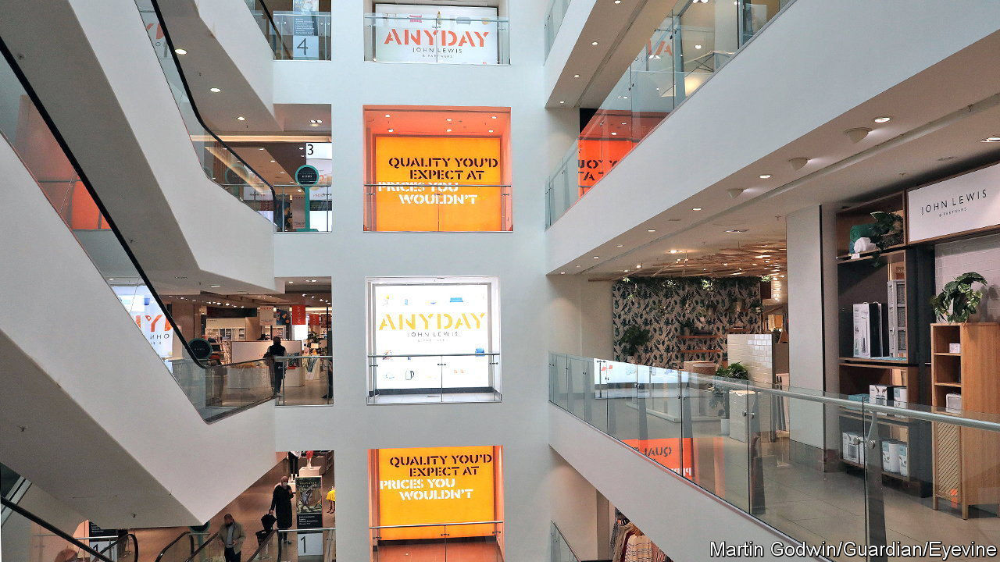
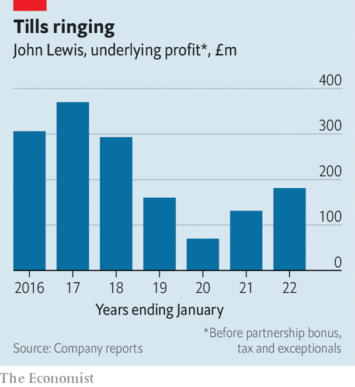

###### Retailer therapy

# What John Lewis’s turnaround says about the British high street 

##### The chain has arrested its decline by closing stores and diversifying its business 

 

> May 26th 2022 

Britain lacks a direct parallel to America’s Super Bowl commercials, but if you had to pick one, it would probably be the John Lewis Christmas advert. Each year, over the course of a two- or three-minute video, a monster, a dragon or a man on the moon is taught the meaning of Christmas, usually by small children or animals. The nation either weeps or carps that the wrong song was used for the soundtrack. And the John Lewis Partnership—which runs John Lewis, a department-store chain that sells everything from board games to bathroom fittings, and Waitrose, a posh supermarket—is reaffirmed as having a special place in middle-class Britain’s collective consciousness.

John Lewis’s cuddly version of capitalism, conceived in 1928 by John Spedan Lewis as an antidote to rising communist sentiment, used to be similarly feted. In 2012 it was touted by Sir Nick Clegg, then deputy prime minister, as a model for the British economy. Employees are dubbed “partners”, paid a share of profits as an annual bonus and given generous benefits; they elect a “partnership council” every three years with the power to dismiss the chairman. But by 2020, even before the pandemic shut down the high street, cut-throat online competition and years of declining profits had put that model under threat, says Clive Black of Shore Capital, an investment firm. 

 


In February 2020 Dame Sharon White, a former boss of Ofcom, the communications regulator, took the reins of the John Lewis Partnership. Two years on, a turnaround is under way: underlying profits are climbing once again (see chart). The revamped business holds a mirror up to Britain’s high streets: more online, more cost-conscious and keen to diversify.

Most painful was the decision permanently to shut a third of John Lewis’s 50 physical stores, from Ashford and Aberdeen to Tamworth and Tunbridge Wells. That reduced costs, and has been vindicated by Brits’ increasing fondness for shopping online. Despite the closures and weeks of covid-induced lockdowns, the chain posted record sales of £4.9bn ($6.1bn) in 2021. The partnership plans to spend £1bn over five years, much of which will go towards improving its digital services and delivery capabilities. Meanwhile, notes Mr Black, the physical stores that remain give John Lewis an edge over online-only rivals, like Asos and Boohoo, by reducing shipping costs (customers can collect their internet purchases in person) and by making returns easier.

At the same time, the partnership is attempting to broaden its appeal beyond a fairly specific subset of the middle class. A Facebook page from 2014 entitled “Overheard in Waitrose” contains the immortal entry “Darling, do we need Parmesan for both houses?”. The supermarket’s inclusion of rosemary and sea salt focaccia in its “essentials” range gave much the same impression. Now the focaccia is out, and a refocused essentials range emphasises value for money rather than status-signalling.

The launch of a parallel “Anyday” range at John Lewis has similar goals. They seem to be being met: last year, of the 2m people who bought Anyday products, a quarter were new or “reactivated” customers. Meanwhile, the share of younger customers is ticking up. Kantar, a research firm, says that 40% of John Lewis’s sales were to under-45s in the year to March 2022, compared with 37% the year before. This was achieved while ditching the chain’s long-held promise to be “never knowingly undersold” in the face of competition from online titans like Amazon. 

Perhaps most strikingly, Dame Sharon concluded that “John Lewis cannot stay only a retailer if we’re to maintain ourselves as a financially independent partnership.” Instead, it is branching out into financial services and the build-to-rent property market. The partnership already offers Britain’s most-used retail credit card; now it intends to add savings accounts and insurance to that. It has picked 20 sites, three of which it already owns, that it wants to turn into “quality and sustainable housing” to rent out. 

Risks loom. Most obviously, the cost-of-living squeeze is bound to affect a retailer that epitomises discretionary spending. Diversification will stretch the business beyond its core expertise. But John Lewis is better placed to navigate these dangers than it was. ■

