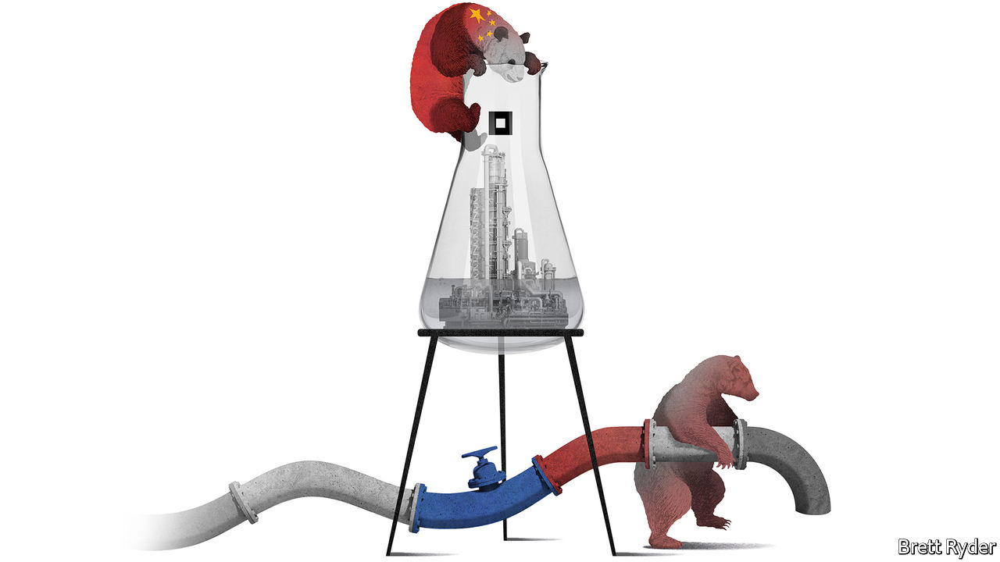

###### Schumpeter

# BASF’s plan to wean itself off cheap Russian gas comes with pitfalls 

##### The German chemicals giant is turning towards China 

 

> May 26th 2022 

There is no better place to experience German efficiency than at Ludwigshafen, a site operated by basf, the world’s largest chemicals company, an hour’s drive south of Frankfurt. Everything is joined together in this city-sized cluster of dozens of plants connected by 2,850km of twisting pipes, from two steam crackers, industrial cathedrals where a hydrocarbon mixture called naphtha is split into its components, to an immense incineration facility, where residues are put to rest. Despite the vast scale of Ludwigshafen everything is accounted for. Reuse and recycling ensure that barely a molecule is wasted. According to basf’s proud tour guide, 94% of the chemicals that enter this system make it into one of the firm’s 45,000 products. 

Yet basf’s success is not entirely home-baked. Another essential ingredient is cheap Russian gas, reliably delivered via pipeline. The complex in Ludwigshafen is Germany’s biggest industrial consumer of the stuff, piping in about 4% of the country’s total annual gas consumption, enough to heat millions of households through the coldest of winters. basf uses about half to produce steam, the other half as feedstock. “There is no question that low-priced energy has brought wealth to Germany,” says Martin Brudermüller, basf’s chief executive. “If prices had been higher, maybe parts of our production would already be gone.”

Now this energy dividend is set to be curtailed, even if the war in Ukraine ends soon. For a generation at least, Germany’s leaders will look to end their country’s dependence on Russian gas and oil. As a result, Europe’s largest economy not only faces a rethink about how much it needs to invest in defence, but an equally difficult economic reckoning. Its industrial titans have started to reconsider their finely tuned business models. basf offers a revealing case study of this shift.

How severe a blow Germany’s economy takes will depend on how quickly it can adapt to doing without Russian gas. A group of economists led by Rüdiger Bachmann of the University of Notre Dame recently estimated that the hit from a sudden halt of Russian energy imports would be “substantial but manageable”, causing a decline in gdp of between 0.5% and 3%. That is less severe than the damage done by the coronavirus. But in some locales, such as Ludwigshafen, the shock of shunning Russian gas could be far more dramatic. If pressure in the pipeline that feeds the giant complex drops below 50% of its normal flow, the whole place will have to shut down. That in turn will cause chaos further down the chemical-industry supply chain. “When Ludwigshafen stops,” warns Mr Brudermüller, “there will be no more cars, no more pharmaceuticals and no more many other things.”

basf’s boss says that he will try to keep the chemicals flowing by doubling down on the firm’s existing plans to do away with hydrocarbons, hoping that he has time before a European gas embargo takes hold or Russia elects to cut off supply. The firm already aims to achieve net-zero carbon-dioxide emissions by 2050. As part of that process, last year it bought part of the world’s biggest offshore wind farm, off the Dutch coast. It plans to acquire stakes in other such projects. That electricity will replace the gas that powers its steam crackers. Green hydrogen and heat pumps will be added to the mix in Ludwigshafen and at five similar sites that basf operates around the world. As for the gas it needs as a feedstock, much will arrive in ships as pricey liquefied natural gas.

The second part of Mr Brudermüller’s strategy is more surprising. The economic repercussions of the war in Ukraine are pushing his firm eastwards. Higher energy costs and stricter environmental regulations in Europe make China look ever more attractive, he says. Having lived in Hong Kong for a decade, he has long admired what he describes as the country’s pragmatic authorities and dedicated workers. The firm’s future looks less firmly planted in Ludwigshafen than in Zhanjiang in southern China, where it is investing $10bn in a state-of-the-art site. The German titan has no alternative to continuing to expand in China if it wants to remain the world’s biggest chemicals-maker. Greater China already represents about half the world market for chemicals and will account for more than three-quarters of its global growth in the next few years, he reckons. “Everything we know about how to make things with less CO will be applied there,” says Mr Brudermüller, adding that “the money we will make in China will be needed to pay for the green transformation in Ludwigshafen.”

Chemistry lessons

The risks of such a strategy are clear. Although basf has, in Mr Brudermüller’s words, “never seen a theft of technology” since it started production in China in the late 1960s, few would be surprised to see the firm’s know-how trickle into the Chinese chemicals industry. More importantly, the economic decoupling between China and the West may yet go beyond some elements of high tech, such as semiconductors, and reach areas in which basf specialises. The danger is that, in trying to wean itself off one kind of dependency—on Russian energy—basf may simply strengthen another. Relying on China might not pose such an obvious danger as a Russian finger on a gas pipeline’s off switch, but banking on it for a big chunk of profits still leaves the firm vulnerable.

Mr Brudermüller looks like the most energetic of Germany’s big bosses in his drive towards China. But many others are said to be tempted to turn more decisively towards the east. They should think twice before embracing a greater reliance on China and instead try to rekindle the spirit of Teutonic thrift and inventiveness that made possible the industrial wonder that is Ludwigshafen. basf has done it before, albeit for a more dubious purpose. When the British navy blockaded Germany during the first world war, the firm built a new plant to make nitric acid without imported ammonia, thus ensuring the resupply of explosives. Necessity, after all, is the mother of invention.■


