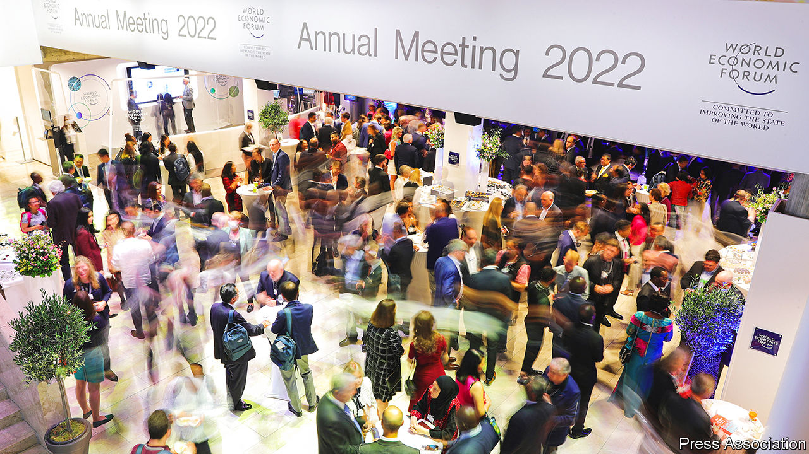

###### A postcard from the edge

# Is this the end of Davos man? 

##### Don’t bank on it 

 

> May 26th 2022 

The annual meeting of the World Economic Forum (wef) is a study in contrasts: business and politics, East and West, north and south, a few insiders cloistered in wintry Davos and the billions of outsiders on whose fate they pontificate. This time around, as thousands of the world’s movers and shakers belatedly descended on the Swiss ski resort between May 22nd and 26th, the big disparity was between the gloom about the state of the world and the joy of shoulder-rubbing in person (minus the snow) after a two-year pandemic hiatus. 

The macro mood was sombre for good reason. High inflation doesn’t feature in the Bible but other than that the list of ceos’ top concerns currently reads like the Book of Revelation: war (in Ukraine), pestilence (particularly China’s destructive effort to stamp out covid-19 at home), famine (everywhere, if war and pestilence aren’t staved off). On top of that, one Western boss after another got an earful from their emerging-market counterparts about the global knock-on effects of the American-led sanctions against Russia on food and fuel prices.

This apocalyptic backdrop helps explain why companies reined in the pizzazz. JPMorgan Chase, an American bank, cancelled its hot-ticket party. The one thrown by Salesforce, a business-software giant, was as raucous as ever but some other corporate dos looked virtually empty. The boss of one giant firm noted the lack of “vibrancy”. 

Attendance seemed down on previous years—by half or so, chief executives reckoned. Several American regulars were kept away by prior engagements (Amazon, BlackRock, ExxonMobil and Meta all hosted their annual shareholder meetings this week). Russians were uninvited; Russia House became Russia War Crimes House, displaying images of atrocities committed by Vladimir Putin’s troops. The absence of China, whose representation fell from hundreds to a handful owing to President Xi Jinping’s zero-covid policy, made the talking shop less global—and less useful—than usual. 

But not useless. This year’s worthy panel discussions will not fix globalisation, avert climate catastrophe or foster inclusive growth. At the same time, in no small part because things were less hectic, attendees reported enjoying the frank back-room chats that are the wef’s main draw more than ever. Individually, these are about corporate self-interest. Collectively, they can add up to something meaningful. Davos needs the world more than the world needs Davos. That isn’t to say there are no mutual benefits.


