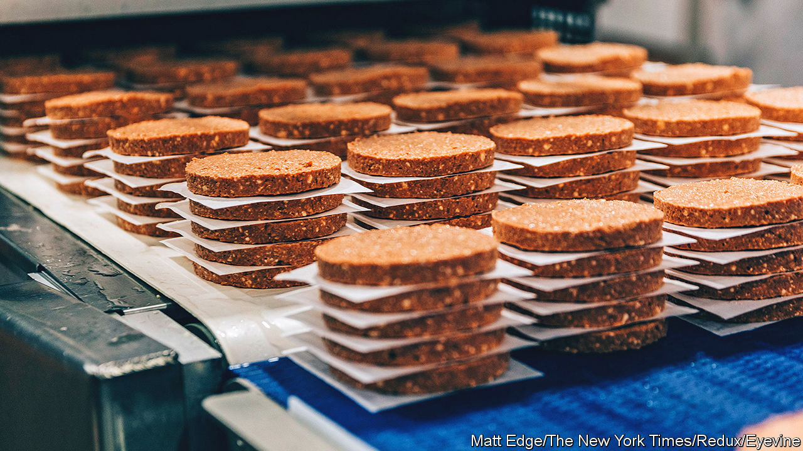
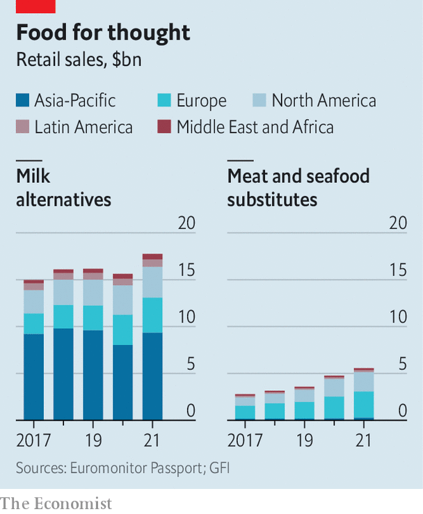

###### A taste of things to come

# Plant-based proteins are no longer a side dish in diets 

##### Their makers’ place as the main course is another matter 

 

> May 25th 2022 

A good vegan milk needs to look like milk and taste like milk, whether it’s a fatty version, preferred by bakers, or a skimmed one, favoured by the health-conscious. And, for coffee-drinkers, it should ideally foam like the stuff from a cow. For years manufacturers have had trouble hacking this delicate imitation game. Rapidly rising revenues suggest that they are getting much better at it. In America alone, $2.6bn of plant-based milk was sold in 2021, up from $2bn in 2018. 

 


Pseudo-milks are only one category in the growing assortment of passable plant-based alternatives to animal products. There are now convincing versions not just of meat but of cheese, eggs and even prawns. Burger King and McDonald’s sell vegan patties; Chipotle has made a plant-based chorizo. Last year the world’s largest producer of canned tuna, Thai Union, launched a plant-based line. Growing sales show the growing taste for this type of foodstuff (see chart). bcg, a consultancy, reckons that global revenues from alternative proteins could reach $290bn by 2035—and that is a cautious estimate.

Eager investors have poured into the business like oatmilk into a latte. Alternative-protein companies lapped up $5bn in investments in 2021, 60% more than in 2020. Oatly, a Swedish firm that makes plant-based milk, raised $1.4bn on its Nasdaq debut last year. Impossible Foods, which makes meatless burgers, raised $500m in November, valuing the firm at $7bn. In February Nestlé, a packaged-goods giant, acquired Orgain, which makes plant-based protein powder, for an undisclosed sum rumoured to be around $2bn. Can the feast last?

One reason to be hopeful is that alternative proteins have come a long way since the 1980s, when Quorn, a fungus-based meat alternative, first hit supermarket shelves. Silk, a soya milk, followed in the 1990s. Unlike those early products, which were neither terribly tasty nor particularly nutritious, the latest crop are often both. Clever processing improves texture, additives boost taste and a pinch of specially engineered peas and beans adds nutrients. 

Firms are experimenting with ever more novel ingredients in search of meat- and dairy-like properties that will attract ever more shoppers. TerViva, an American startup, is using the oil of pongamia, an Asian tree, to mimic butter. ChickP, an Israeli firm, is using chickpea extracts to mimic the texture and nutritional value of eggs in mayonnaise. Firms are also getting better at turning such bounty into consumer products. There are now ways of using corn protein to make plant-based cheese alternatives melt and stretch. 

Better products and lower prices—the result of both improved manufacturing techniques and scale—have coincided with the rise of “flexitarians”, who forgo meat but not always. Some are trying to cut saturated fat for health reasons—a trend fuelled by the pandemic. Fitness fanatics on faddish diets want to develop bulging muscles without building up cholesterol. Concerns about animal welfare and greenhouse-gas emissions from rearing livestock are driving the climate-conscious to limit their animal-derived intake; producing a gram of beef generates 25 times the volume of greenhouse-gas emissions as producing a gram of tofu. 

For all the advantages, making a plant not taste like a plant takes work, and ultra-processed substitutes seldom match animal proteins in nutritional value. Plant-based junk food is still junk. Soya is a common allergen and can have a disruptive effect on hormones. Green-minded consumers are realising that plant-based does not necessarily mean sustainable. Farming almonds to make a milk-like drink, for example, uses huge quantities of water. As inflation rises, even diehard flexitarians may turn into omnivores, and pick either the real deal (cheaper than faux animal proteins) or veg (cheaper still). 

Plant-based proteins are also a tough sell in giant markets like India, where diets are already plant-rich, or Nigeria, where meat-eating is a sign of wealth. That limits their global appeal. And animal products, including milk, are better for children’s bone development and nurturing gut bacteria, though lab-grown versions of meat and dairy are becoming more nutritious.

All this suggests that alternative proteins have far to go to replace the animal kind. The limitations may be weighing on the firms involved. Oatly’s market value has fallen by about 80% since its listing, partly because of production difficulties. That of Beyond Meat, whose burgers feature in McDonald’s McPlant sandwich, is down by 90% from its peak in 2019. Sales slowed in 2021 and losses widened to $100m in the first quarter of 2022, compared with $27m a year earlier. Plant-based foods may no longer be only an appetiser in diets, but their makers remain one in the food business. ■


