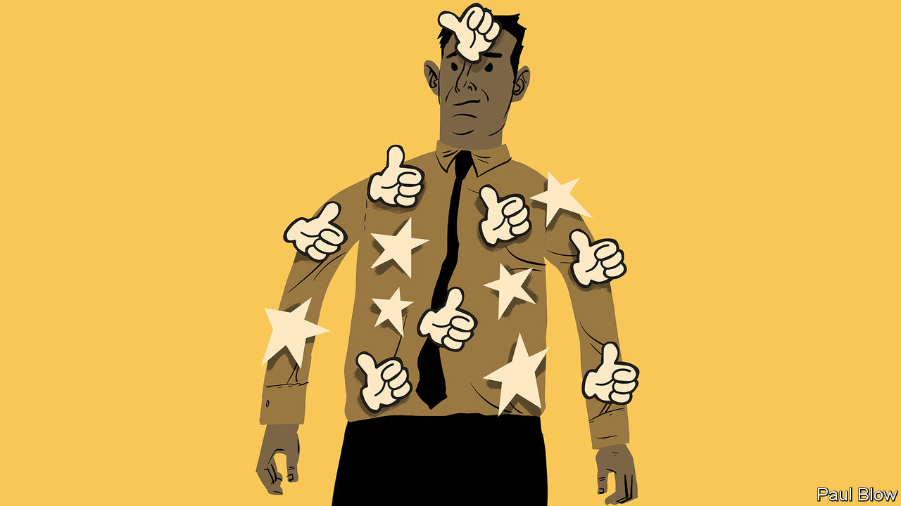

###### Bartleby

# The power of small gestures 

##### Small acts of appreciation can delight employees. But they are not meant to be industrialised 

 

> May 26th 2022 

When labour markets are tight, the perks tend to get better. Spotify is rolling out a new corporate-subscription package, enabling firms to offer the streaming service to their employees. If you are sufficiently high up at Goldman Sachs, you are now entitled to take as much holiday as you want (this is a nominal perk; no one who cherishes work-life balance gets to climb the ladder at Goldman in the first place). Salesforce has a ranch in California to which it can send workers for in-person get-togethers. If you work long enough for Blue Origin, you might get blasted into space. 

For firms that don’t own rockets or ranches, it can seem hard to compete. The good news is that small gestures of appreciation can have an outsized effect on employee satisfaction and loyalty. The bad news is that they are not meant to be scaled up. 

Several pieces of research look at the effect that acts of thoughtfulness can have on staff. In one recent study by academics at King’s College London and Harvard Business School, a group of social workers was randomly divided in two: members of one group got a letter of thanks for their work from their line manager, and members of the other got nothing. A month later, recipients of the letter reported feeling much more valued than their counterparts. 

In similar vein, a study in 2010 found that university fundraisers who were personally thanked for their work by a senior member of staff made many more calls to ask alumni for donations in the week following this small act of recognition than they had in the week before. There was no statistically significant change for an unthanked control group. 

Another study involved workers at a Coca-Cola facility in Madrid, some of whom had secretly been told to perform acts of kindness to a subset of their colleagues (bringing someone a drink, say, or emailing them a note of thanks). Both givers and receivers of these acts reported feeling higher levels of job satisfaction; and the receivers ended up doing other colleagues more favours, too. 

Such studies carry two lessons for employers. One is that recognition can have a meaningful impact on workers. The other is that this impact is amplified if shows of appreciation are personal and unexpected. In their haste to act on the first lesson, plenty of companies completely forget the second. 

Many firms now run formal employee-recognition initiatives, from rewards programmes to award schemes. Vendors offer clients a variety of services, including internal noticeboards on which colleagues can publicly thank each other for their work and bestow points that can be redeemed for gifts and experiences. The website of one vendor offers managers advice on what to say to employees to make them feel recognised, because absolutely nothing says “authenticity” like a script. (Sample quote: “Congratulations on your great victory! Only you could have pulled it off!”, which sounds like a Hallmark card for Napoleon.) 

Industrialising appreciation misses the point completely. Automated birthday and work-anniversary congratulations are about as personal as an invoice. Platforms on which peers publicly recognise the hard work of others are liable to encourage performative displays of praise. That is especially likely if every compliment shows up on an analytics dashboard for the boss; one employee-engagement firm tracks shows of gratitude and breaks these “recognition occasions” into a series of ghastly categories like “Owning the Results” and “Building Trust Like a Family”. 

Award schemes also require careful handling. They are great if you win and somewhat less motivating if you don’t stand a chance. In one study from 2014, academics looked at the effect of an award programme on Zambian health-care trainees; they found that comparison with others worsened performance, especially for less able workers. 

The secret to showing appreciation is that scarcity matters. It should involve effort: a handwritten note is better than an email, which is better than an algorithm. It should feel personal, not part of a scheme cooked up by the human-resources department. And it should be sufficiently rare to register as meaningful; thanking everyone for everything turns gratitude into a commodity. In other words, appreciation is not a big-data project. Individual managers can harness the power of small gestures to make a real difference to their teams. The best thing firms can do is to hire the sort of people who recognise as much.

:


