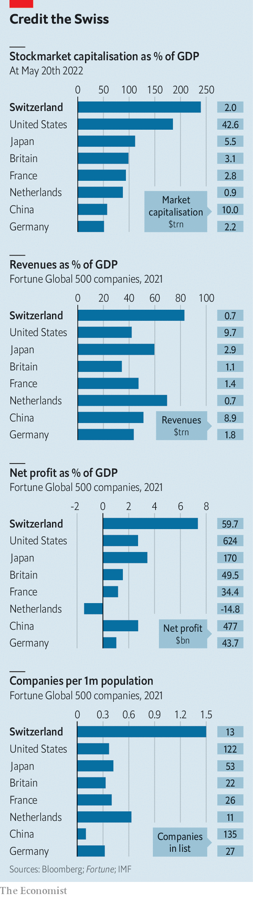

###### Secret sauce

# The recipe for the outperformance of Swiss businesses 

##### Common sense and low taxes make the Alpine nation a corporate haven 

 

> May 23rd 2022 

Big cheeses from the world of politics, business, academia, media and the arts descended on Davos on May 22nd for the first in-person bash of the  in more than two years. For over half a century the great and the good have used the annual get-together to chew over the world’s most pressing problems. They feel at home in Switzerland. Just as the small mountain village punches far above its weight as a talking-shop, Switzerland has prospered as a haven for businesses far beyond what might be expected of a small, landlocked country with few natural resources. It is home to 13 of the top 100 European firms by market capitalisation and 12 of the top 500 worldwide. What is the secret sauce of the Swiss? 

 


Something remarkable must be going on in the nation of mountains and valleys that before playing host to world-beating firms counted the invention of yodelling among its achievements. Relative to its gdp Switzerland has the highest density of Fortune 500 companies in the world (see chart 1). Multinationals contribute around one-third of Switzerland’s economic output, a much higher share than in other countries of comparable size. Foreign firms are drawn to Switzerland: Google set up its largest engineering centre outside America in Zurich. Swiss blue-chip firms outperform European rivals: the Swiss stockmarket index has risen by 29% over the past five years, compared with 3% for the Euro Stoxx 50, an index dominated by French and German behemoths. 

Swiss firms’ name recognition has spread far beyond the country’s borders in banking (ubs and Credit Suisse), insurance (Swiss Re and Zurich), pharmaceuticals (Roche and Novartis), food (Nestlé), commodities trading (Glencore and Gunvor), watchmaking (Richemont, Patek Philippe and Rolex), hotels (César Ritz was the youngest of 13 children of a Swiss farmer) and, inevitably, chocolate (Lindt &amp; Sprüngli, and Barry Callebaut, the world’s biggest chocolate-maker). 

There are several explanations for Switzerland’s corporate one-upmanship. One is that the country’s defining characteristic is “common sense”, says Paul Bulcke, chairman of Nestlé. This manifests itself in a unique political model that mixes federalism and direct democracy, a weak central government, light regulation, top-notch research universities, and rivalry in education and taxation between the cantons that make up the Swiss confederation. 

For much of its history Switzerland was poor. Infertile soil, often covered in snow for most of the year, made the landscape inhospitable. So when Switzerland started to develop economically in the 19th century city-cantons such as Zurich or Basel began to specialise in high-value-added industries. St Gallen focused on textiles; Zurich on silk and spinning; Berne was the centre of the cheese trade; and Basel became a hub for budding pharmaceutical and chemicals industries. Watchmaking was mainly located in the Jura arc stretching from Geneva to Basel and the banking and insurance industries prospered in Geneva and Zurich. 

This endeavour was assisted by Switzerland’s “eternal neutrality”, granted at the Congress of Vienna in 1815. It was spared two world wars that devastated the rest of Europe in the last century. At the same time it benefited from an influx of skilled folk fleeing strife elsewhere on the continent and from the cash they deposited in Swiss bank accounts. For James Breiding, author of “Swiss Made: The Untold Story Behind Switzerland’s Success”, the vital ingredient is an openness to the world that attracts international talent, including persecuted minorities such as France’s Huguenots in the 17th century and Germany’s Jews in the 1930s and 1940s. 

Foreigners have been central to Switzerland’s business success. Henri Nestlé, the eponymous founder of the company, hailed from Frankfurt. Antoni Norbert Patek, the pioneering watchmaker and creator of Patek Philippe, was a Polish cavalry officer. Leo Sternbach, a Polish Jew who fled the Nazis, invented Valium, which became Roche’s blockbuster tranquilliser. Nicolas Hayek, the co-founder of Swatch, a popular watchmaker, was of Lebanese descent. About half of the ceos of Switzerland’s biggest firms are foreign. Severin Schwan of Roche is Austrian, Gary Nagle of Glencore is South African and Vasant Narasimhan of Novartis is Indian-American. 

Switzerland’s welcoming of outsiders stands in stark contrast to relations within. The Swiss have no particular affinity for their compatriots in other cantons. The country’s city-states would doubtless have preferred to remain independent, only becoming a bigger unified entity to defend themselves against rapacious neighbours. But they joined together in such a way as to foster self-reliance and responsibility. “Like peasants buying cabbage at the market the city-states shopped around for the cheapest social contract they could find and ceded as little personal freedom for the greatest gain,” says Mr Breiding. 

This approach makes for light regulation from the top. The Federal Council, the federal government’s executive branch, does without recognisable leaders. The cabinet has seven members who have equal power. Each of them spends a year as president, ensuring that no one remembers their names for long. While the council has few powers, the country’s 26 cantons have plenty, as do its more than 2,000 municipalities.

 


Cantons run health care, welfare, education, law enforcement and fiscal policy. That allows them to compete to be attractive to businesses and their workers. Corporate taxes are low (see chart 2). Lucerne halved its rate in 2012. Zug has the lowest corporate tax rate at 11.9%. Only “offshore” financial centres such as Guernsey and Qatar have lower tax rates than those levied in the low-tax cantons, states a report by kpmg, an accounting firm. Compare that with France where the rate is 26.5%.

The competition doesn’t stop at light taxation. Cantons help to fund top-notch universities. Zurich’s Eidgenössische Technische Hochschule (eth), one of the two federal institutes of technology, is regularly ranked among the best universities in continental Europe. Strong links between business and academia mean that graduates have the right skills. For instance, in January 2020 Nestlé, the Ecole Polytechnique Fédérale de Lausanne (epfl), the other federal institute of technology, the canton of Vaud and the Swiss Hospitality Management School in Lausanne launched the “Swiss Food Nutrition Valley”, a research programme to promote innovation in sustainable food production. Logitech, a maker of software, and Cisco, a technology firm, have research centres on the epfl campus. 

Yet for all its success Switzerland has become less attractive as a hub for multinationals over the past three decades. In 1990 two-thirds of America’s top 20 companies (including General Motors, Hewlett-Packard and ibm) had their European headquarters in Switzerland. In 1992 Swiss voters decided against following the Norwegian example and joining the European Economic Area with access to the eu’s single market. As a result some of the world’s most successful firms, such as Apple, Alibaba and Samsung, set up in Amsterdam, Dublin or other eu business hubs. Last year Switzerland missed another chance to gain smooth access to one of the world’s largest markets when its government abandoned plans to convert 120 bilateral deals into an overarching treaty with the eu.

And much that accounts for Switzerland’s corporate strength is in question. The war in Ukraine makes some Swiss ponder the country’s neutral status; to widespread surprise, their government has joined Western sanctions against Russia. In the past, any tinkering with neutrality was considered a betrayal of the nation, says André Hoffmann, vice-chairman of Roche. Moreover, the country is still dealing with the rehabilitation of its wealth-management industry, which has been forced to clean up its act over the past 15 years after America declared war on Swiss banks that had helped its citizens dodge billions of dollars in tax. According to Mr Breiding, wealth management remains under threat from lower investment returns and increasing international pressure for financial transparency. The pharmaceutical sector is grappling with the rapid rise in costs for drug innovation. 

Yet the Swiss have shown in the past that they can overcome challenges with hard work and ingenuity. Swiss watchmaking seemed to be winding down the path to extinction until Swatch revived the industry by making cheap watches more fun and expensive ones more desirable. Chances are that the great and good of Davos will feel right at home in Switzerland for many years to come. ■


