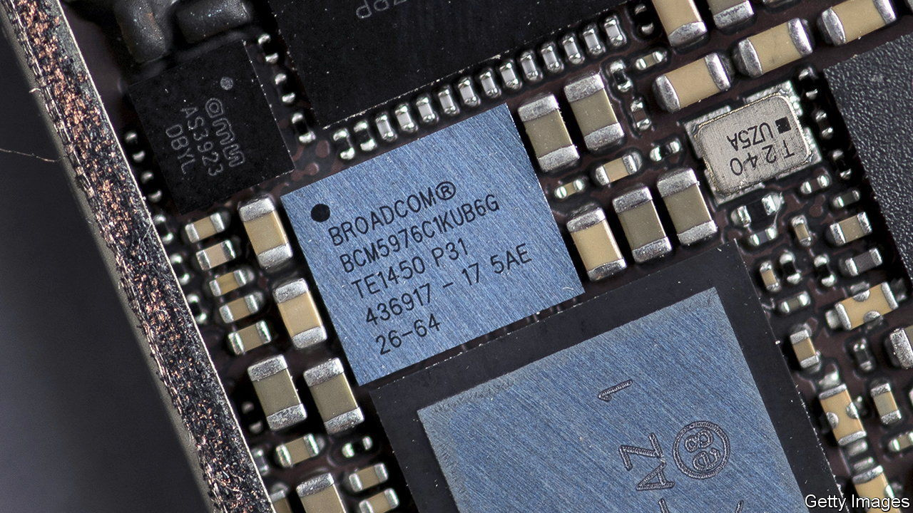

###### Broader still

# Will a chipmaking giant’s $60bn bet on software pay off? 

##### Cultural clashes and trustbusters could get in the way 

 

> May 26th 2022 

A market downturn is a good time for buyers. Look at the tech industry. The Nasdaq, a tech-heavy index, has fallen by 30% from its peak in November and a flurry of deals are under way. Microsoft is working on the $69bn purchase of Activision Blizzard, a videogame maker. Since March, Thoma Bravo, a private-equity firm, has spent $18bn on two enterprise-software firms. Elon Musk is—perhaps—about to purchase Twitter, a social network. 

The latest big tie-up looks unusual. On May 22nd Bloomberg reported that Broadcom, predominantly a semiconductor maker, worth $214bn, is planning to buy vmware, an enterprise-software firm. If the deal goes through, it could be worth $60bn. A chipmaker buying a software firm may seem strange. But Broadcom has done the same thing in the past with striking success. Can it repeat the trick?

Broadcom is an odd beast. It started life as Avago Technologies, a chipmaker based in Singapore. That firm bought a number of other chipmakers, including Broadcom, from which it took its name. In 2018 it tried to buy Qualcomm, a rival semiconductor firm, for $130bn. That would have been the biggest tech acquisition of all time. Donald Trump, then America’s president, eventually quashed the deal on national-security grounds because Broadcom was a foreign firm (even though it was in the process of moving its headquarters to America). 

After that, Broadcom changed tack. Later in 2018 it surprised the industry by buying ca Technologies, a software firm, for $19bn. The following year it snapped up Symantec, a cyber-security outfit, for $11bn. The motivation was not to link its semiconductors to its new acquisitions, but to run the software firms more profitably. Cost-cutting at both firms hurt future growth prospects but helped profits. Operating margins at Broadcom’s software units ballooned from about 30% before the takeovers to around 70% today.

This private-equity-style approach has transformed Broadcom into a tech conglomerate. Today 26% of its revenue comes from software. With vmware that figure could grow to 45%. The shift into software has also boosted Broadcom’s overall operating margins, which have grown from 15% in 2016 to 32% today, among the best in the semiconductor industry. Investors seem pleased. Broadcom’s share price has nearly doubled over the past two years, compared with a 60% increase for the phlx, an index of chip manufacturers. 

In many ways Broadcom’s most recent target resembles its previous success stories. Like ca and Symantec, vmware sells infrastructure software and controls a large share of that market. According to Gartner, a research firm, the company holds about 72% of the server-virtualisation market, a technology that it helped to pioneer. Another similarity is that its services are “sticky”, notes Stacy Rasgon of Bernstein, a broker. It is hard for existing customers to switch away because they are reliant on vmware’s software to run their server infrastructure.

But Broadcom may struggle to repeat its past successes. Antitrust regulators are ever more wary of big tech mergers. And even though the two firms do not compete directly, America’s Federal Trade Commission is already investigating whether Broadcom forced customers into exclusive agreements that make it difficult for them to shop around. Another risk is a cultural clash. Last year sas Institute, another enterprise firm, rejected Broadcom’s takeover bid. Part of the reason was that employees worried that its cost-cutting strategy would put an end to their office perks.

And some worry that Broadcom’s pursuit of profits will mean that vmware misses out on a bigger prize. It is in the middle of its own pivot, planning to grow its subscription and cloud arms from 25% of sales today to around 40% by 2025. In doing so, vmware “has a shot at being the layer on which most companies use the cloud”, argues Patrick Moorhead, a chip-industry analyst. Cutting investment and marketing would stifle such efforts just as cloud computing is booming. ■


