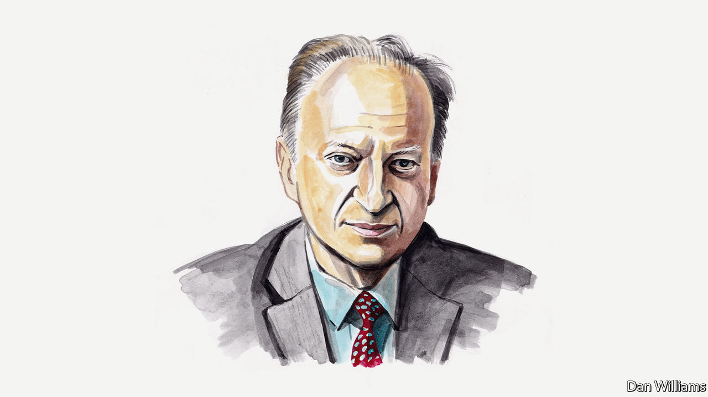

###### Russia and Ukraine

# Andrey Kortunov offers three scenarios for the end of the war in Ukraine 

##### The Russian political scientist sees it as a clash between societies as well as armies 

 

> May 20th 2022 

THE MILITARY confrontation between Russia and Ukraine is not an ethnic conflict: ethnic Ukrainians and ethnic Russians are fighting on both sides of the frontline. And radical nationalism is not the main —contrary to many of Moscow’s statements. Neither is it a fight about religion. Both Russia and Ukraine are essentially secular states, and the recent religious renaissance in the two countries is superficial. Nor is the fight mostly about territory, in my view (though related disputes remain a formidable obstacle to reaching a peace settlement).

The conflict concerns a clash between very different ways of organising social and political life within two countries which together once constituted a large portion of Soviet territory. It is also an intellectual and spiritual confrontation between two mindsets: two views on the modern international system and on the world at large; two opposing perceptions of what is right and what is wrong, what is fair and what is not, what is legitimate and what is illegitimate and of what national leadership should entail. 

It would be hard to argue that Ukraine has already emerged as a model of Western-style liberal democracy. But the country is persistently moving in this direction—slowly, inconsistently and with understandable setbacks and inevitable procrastination. Russia, in turn, is not a classical Asian or European authoritarian state, but it has been drifting away from the liberal democratic model for at least the past 20 years. Ukrainian society generally is organised from the bottom up, while Russian society has a top-down process at its core. Since independence in 1991, for example, Ukraine has elected six presidents. Each won power after highly contested (and sometimes very dramatic) elections. In the same period Russia has been ruled by only three heads of state. Each new leader was carefully selected and supported by his predecessor. 

Historians, cultural anthropologists and sociologists debate the reasons for this remarkable divergence. The most important thing, however, is that this fundamental incompatibility of the two models of social organisation has led not only to a horrendous fratricidal military confrontation in the very centre of Europe, but that it will also dictate how each side acts in the conflict. From personnel to propaganda and from strategy to statecraft, the two competing post-Soviet models are being put to the test. The outcome will have repercussions that go far beyond Europe.

In Kyiv they can argue that the terms of the encounter are not fair. Russia is bigger, wealthier and militarily more powerful than Ukraine is. On the other hand, Ukraine enjoys international sympathy and almost unlimited defensive, economic, humanitarian and intelligence assistance from the West. Russia can rely only on itself and is exposed to the pressure of increasingly painful sanctions. 

Many Russian experts are used to saying that the massive Western military and other support is the only reason why Ukraine has not yet crumbled or surrendered. But this narrative does not explain the sources of Ukraine’s motivation. Consider Afghanistan, where all the long-term large-scale military support from America and its partners did not prevent the Taliban’s unstoppable offensive last year. Though the two conflicts cannot be compared directly, the reality on the ground seems clear: whereas Afghans in 2021 were no longer motivated to fight for their country and for their values, Ukrainians in 2022 clearly are. 

The stakes in the conflict could hardly be higher. It is about the future of the international system and about the future of the world order. Most important, it is about our understanding of modernity itself and, consequently, about our preferred models of social and political development.

There are three scenarios for how the war ends, and each would have enormous geopolitical consequences. If the Kremlin were to lose decisively in this epic standoff, we would probably see a re-emergence of the unipolar moment—the remaining opposition to this arrangement by Beijing notwithstanding. Although Ukraine might be unfinished business for Mr Putin, Russia’s status is itself unfinished business for many in the West. Triumph for Ukraine might lead to a tamed and domesticated Russia. A quiet Russia would allow the West to cope more easily with China, which would be the only major obstacle to liberal hegemony and the long-awaited “end of history”. 

If the conflict results with an imperfect but mutually acceptable settlement, the final outcome of the collision between the Russian and the Ukrainian models will be postponed. Fierce competition between the two models of social organisation will continue, but, I hope, in a less brutal mode. A less-than-perfect compromise between the West and Russia might be followed by a more important, and more fundamental, compromise between the West and China. If a deal with Mr Putin is possible, a deal with Xi Jinping would be a logical continuation. A rapprochement between China and the West would require more time, energy and political flexibility from the West, however. That would lead to a reformation of the global order, with major changes to the UN system, archaic norms of international public law and recalibrations at the IMF, the WTO and other bodies. 

If there is no agreement on Ukraine and the conflict endures through cycles of shaky ceasefires followed by new rounds of escalation, expect decay in global and regional bodies. Inefficient international institutions may collapse amid an accelerating arms race, nuclear proliferation and the multiplication of regional conflicts. Such change would lead only to more chaos in the years ahead.

Assessing the probability of any of the three scenarios is extremely difficult—too many independent variables could influence the outcome of the conflict. I consider the reformation scenario, in which an agreement is made to end the war, to be the best option for all. The others either will introduce change too quickly or block badly-needed change; in both cases political risks will multiply. If the conflict triggers a gradual, orderly and non-violent transition in which the global order becomes more stable, it would mean that humankind has not let Ukraine’s sacrifices go to waste. ■

_______________


