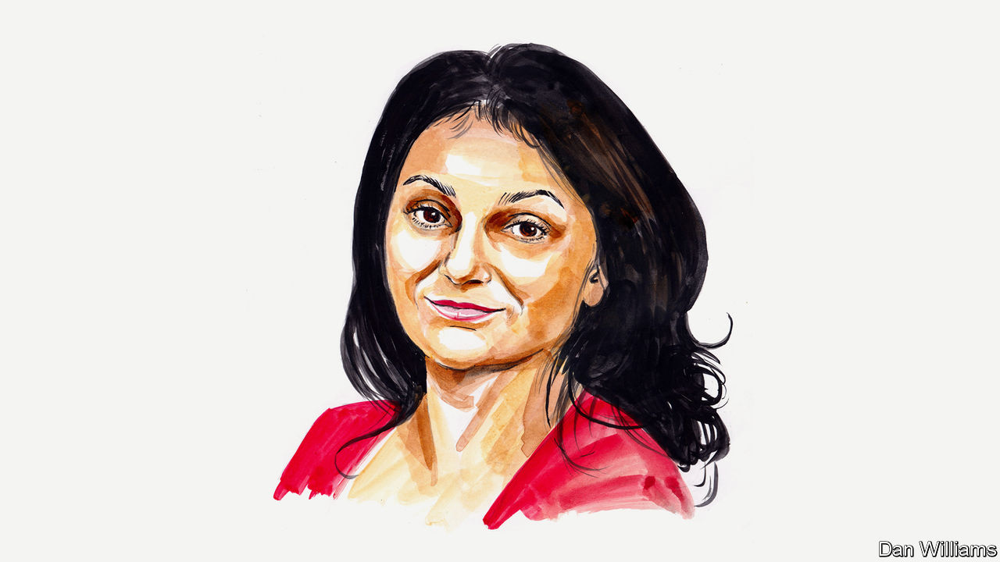

###### Finance and economics

# Sonal Desai says the Fed has kept monetary policy too loose for too long 

##### The investor reckons its plan to tackle inflation rests on two shaky assumptions 

 

> May 23rd 2022 

INFLATION AT 40-YEAR highs poses the toughest of policy challenges. Yet America’s Federal Reserve still hopes to meet it with an easy solution: bring the policy rate close to 3%, and as adverse supply shocks fade inflation will revert to the Fed’s 2% target. No need for a sharp monetary tightening à la Paul Volcker. No need to risk a recession or to trigger a significant rise in unemployment. 

Its hope rests on two shaky assumptions. First, it insists that the neutral rate of interest stands between 2% and 3%. (The neutral rate is defined as the rate at which monetary policy would be neither expansionary nor contractionary, when inflation is at the Fed’s 2% target and the economy is at full employment.) This implies that in real terms—subtracting inflation—the neutral rate is at 0-1%. 

Yet this assumption might be well off the mark. Economists Thomas Laubach and John C. Williams have estimated that the real neutral rate of interest averaged around 2.5% during the 1990s and 2000s, before dropping to a 0-1% range after the financial crisis of 2007-09. A drop in America’s productivity growth and higher demand for safe financial assets may explain the decline. Productivity growth, however, has rebounded and averaged 2.4% during 2019-21—the same as the average of 1991-2007.

Quantitative easing, by the Fed’s own admission, is on its way out. This reduces demand for safe assets. So the real neutral rate of interest might be significantly higher than the Fed assumes—closer to a 2-3% range than 0-1%. Once inflation drops back to 2%, the nominal neutral interest rate should then be in a 4-5% range, not the 2-3% the Fed is aiming for. (And inflation is still a long way from 2%.) If that is the case, the Fed’s targeted long-term policy setting would still be expansionary. The current inflation problem has been caused partly by the Fed keeping monetary policy too loose for too long. Maintaining an expansionary policy seems more likely to entrench high inflation than to bring it back to target. 

The second of the Fed’s shaky assumptions is that inflation expectations are still well anchored and that there is no sign of a wage-price spiral. In this telling price growth reverts to a “healthy” pace once exogenous shocks have dissipated. But much evidence already points in the opposite direction. Although wages have not kept up with surging inflation, they are growing at the fastest pace in 40 years, about 4-5%. Employers face persistent labour shortages in an extremely tight market; new employees can secure substantial wage premiums. Companies in turn respond to rising wage and input costs by exercising their pricing power more aggressively. 

Increasingly, surveys indicate that inflation expectations have moved up. Consumers and businesses do recognise that recent inflation has been charged by temporary supply shocks, and they do not expect inflation to stay at 8-9%. But they reckon that on a three-year horizon, it is more likely to run at around 4% than 2%. Inflation expectations, in other words, are already lodged on a higher plateau. The longer inflation remains elevated, the more firmly these will become entrenched and self-sustaining. The demise of supply shocks, then, will not suffice to bring inflation back to 2%. 

If these premises are correct, the Fed’s current stance and messaging could damage its credibility—which could affect inflation expectations in turn. Financial markets already expect this hiking cycle to be moderate and short. They anticipate that as soon as economic growth flags, the Fed will promptly ease policy again, following the playbook of recent decades. This might have seemed relatively costless when inflation remained subdued. No longer. The Fed kept policy too loose as America’s economy roared back from covid-19 shutdowns and enjoyed massive fiscal stimulus.

The Fed needs to tighten decisively both because the equilibrium interest rate is most likely higher than it thinks, and because the policy rate will need to rise above this level in order to bring inflation, and inflation expectations, back to target. The Fed must explain all this openly and rebuild credibility by pushing monetary policy to a truly restrictive setting. Failure to do so will cause high inflation to persist and inflation expectations to drift higher, meaning a deeper recession would become the only viable path to price stability.■

_______________


