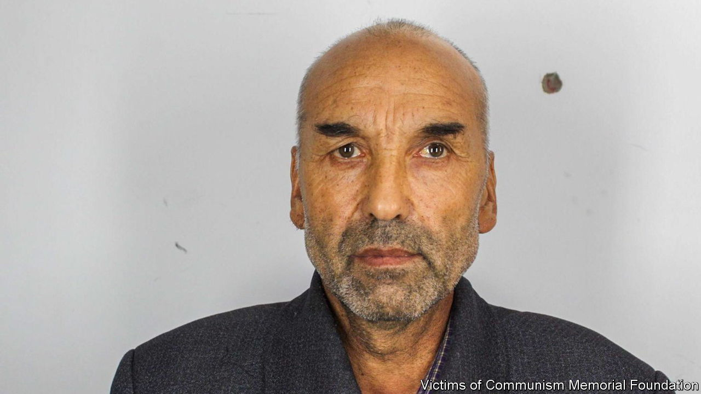

###### A timely reminder

# Hacked files reveal more details about Chinese abuses in Xinjiang 

##### They come as the UN’s human-rights chief tours the region 

 

> May 26th 2022 

Thousands of documents and photographs shed new light on China’s abuses in the region of Xinjiang, where it is accused of detaining some 1m Uyghurs and other minorities. The cache includes mugshots of detainees, some as young as 14, and security protocols that describe a shoot-to-kill policy (after a warning shot) for anyone trying to escape from the government’s “re-education” camps. The files, which date from 2018, were reportedly hacked from police computer servers and released by the Victims of Communism Memorial Foundation in Washington. The leak came as Michelle Bachelet, the un’s human-rights chief, began a highly choreographed tour of Xinjiang.

 


 


 


 


 


 


 


 


