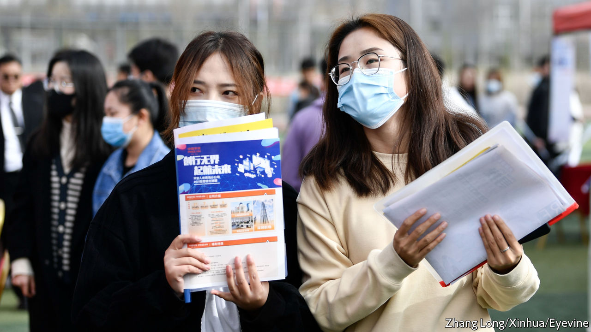
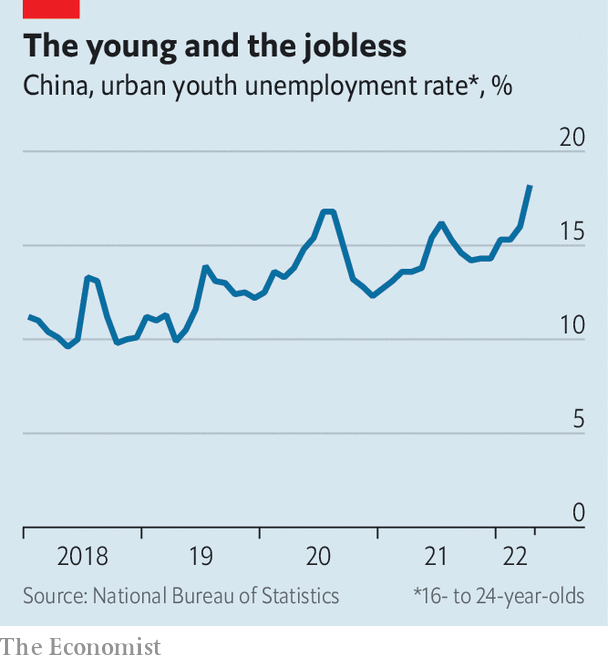

###### Testing out of unemployment

# Many young Chinese choose graduate school over a grim job market 

##### Covid lockdowns and regulatory crackdowns have inhibited demand for graduates 

 

> May 26th 2022 

Marriage, according to a French proverb, is like a fortress besieged. Those outside want to get in; those inside want to get out. That thought, immortalised in the title of a novel by Qian Zhongshu from 1947, has more recently been applied to China’s graduate schools. At the end of last year, a record 4.6m people tried to storm these fortresses by taking the postgraduate admissions exam, an increase of over 21% from the previous year.

Some of these test-takers may have an abiding thirst for knowledge. But more than a few are probably keen to delay their entry into China’s labour market. The urban unemployment rate for young people aged 16 to 24 averaged over 14% last year. In April it rose to 18.2%, its highest level since the survey began in 2018 (see chart). Earlier this month Li Keqiang, China’s prime minister, described the employment situation in China as “complex and grim”. One of his potential successors, Hu Chunhua, identified college graduates as a group of key concern.

This group will be unusually big this year: 10.8m, about 18% more than in 2021. Less than half of those wanting to start work after they graduate have already received a job offer, according to a survey last month by Zhaopin, a recruitment firm. That compares with over 60% at this time last year. They have also settled for lower pay. Their average monthly salary was about 6,500 yuan ($970), compared with almost 7,400 last year. 

Their plight is easy to explain. The increased supply of university-leavers has met faltering demand. The economy is shrinking thanks to China’s strict “zero-covid” policy, which has locked down some of the best-educated parts of the country, such as Shanghai and areas of Beijing. China’s services sector, which employs many college graduates, contracted by over 6% in April, compared with the previous year.

 


Even before China’s covid lockdowns, its regulatory crackdowns had inhibited demand for college graduates. The government has imposed fines, limits and new obligations on China’s technology companies. For example, a nine-month freeze on new licences for video games damaged Tencent, China’s most valuable private firm. It is scheduling lay-offs. “Winter is coming,” says the company’s chief, Pony Ma, according to , a magazine.

A bleak season has already arrived for China’s edtech firms. Under what is known as the “double-reduction policy”, the government has tried to cut the burden of homework and private tutoring on children and their parents. Many of the 4.6m people competing to enter graduate school to consume more education might once have joined an edtech firm producing it. In this way a policy to lighten the burden of education on the young has extended the education of the slightly less young.

When job prospects turn precarious, job aspirations turn conservative. College-leavers now crave stable jobs over dynamic ones. State-owned enterprises are their first choice, preferred by 44%, according to Zhaopin. Private enterprises lost popularity. Young people also seem keen to join the civil service. They have displayed a similar enthusiasm for the civil-service entrance exam (or ) as they have shown for the postgraduate test. There were 46 civil-service test-takers per opening in the most recent exam, according to the government. Luo Zhiheng, an economist at Yuekuai Securities, describes the rush to take the test as “ fever”. He contrasts it with the confidence with which civil servants quit their safe, dry jobs in the 1990s to dive “into the sea” of private employment.

China’s restrictions on travel, and its success last year in containing covid, persuaded many young Chinese who had been studying abroad to come home. The number returning may have exceeded 1m, according to the State Information Centre, a government think-tank, adding to the pressure on the labour market. China’s draconian lockdowns this year may cause some to regret their choice. 

The hapless protagonist of Qian’s novel also returns to China at a difficult juncture in its history, after a spell studying in Europe. In this tale, his foreign education is not much of an asset. After finding work at a Shanghai newspaper, he confesses to his appalled parents that his wife, who works at a factory, earns twice as much as he does. The fortress of his marriage, heavily besieged, swiftly crumbles. ■

