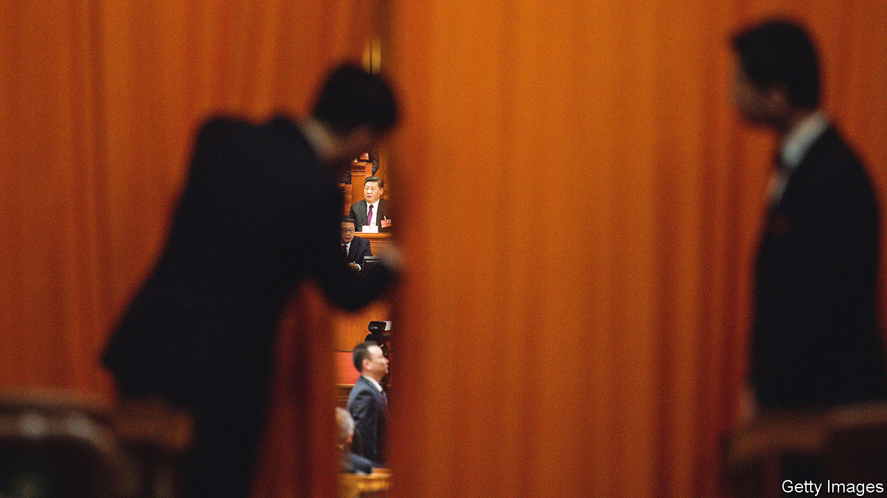

###### How to see Xi

# Rumours emerge of disharmony within China’s leadership 

##### But little evidence suggests Xi Jinping faces a challenge 

 

> May 26th 2022 

Amid their frantic efforts to halt the spread of covid-19 and revive a sputtering economy, officials around China have also had to attend some routine meetings. They involve lectures on the need for absolute loyalty to the country’s leader, Xi Jinping. “Turn your hearts to the general secretary”, rural bureaucrats were instructed at one such gathering this month in south-western China. Later this year Mr Xi is expected to be anointed for another five years as Communist Party chief. The strong unspoken message of these meetings is that no one else can do the job. 

Few analysts doubt that Mr Xi will begin an unprecedented third term after the party’s 20th congress, which will probably be held in the autumn. But it is safe to assume that his “zero-covid” policy, which this year has resulted in widespread lockdowns and swingeing damage to the economy, is causing political stress. Even on China’s censored social media, it is clear that public anxiety about the government’s handling of the pandemic is growing. 

Such a climate naturally breeds speculation about disharmony within the leadership. In recent days rumours have spread—not least through Chinese-language media abroad—of divisions in the party and high-level opposition to Mr Xi’s career plans. Though flimsily sourced, they deserve attention—not as indicators of any real impediment to Mr Xi’s extended rule (the loyalty meetings strongly suggest he is well on track for that), but as reminders of how handicapped outsiders are in their study of China’s ruling elite. 

Analysis is not made easier by wishful thinking. There are probably many in the party and business elite who would like to see the back of Mr Xi. His anti-corruption campaign has targeted some 4m officials, including about 400 at or above the rank of deputy minister. Many intellectuals resent Mr Xi for tightening ideological controls and for his ruthless crushing of dissent. Among ordinary Chinese Mr Xi is widely admired as a strongman who has boosted China’s global clout. Many also remain convinced that the West's handling of covid is a death-stalked disaster. Still, Mr Xi's pandemic controls are brutal for a growing list of cities and business sectors. 

In such an oppressive political environment, any leader who appears less harsh than Mr Xi attracts attention. The party’s second-highest-ranking member, Li Keqiang, the prime minister, is one such—an economic reformer who, unlike Mr Xi, appears at home with Westerners (and speaks good English). A few years before Mr Xi took over as ruler in 2012 there was speculation that Mr Li was in the running for the job. Those who crave a return to warmer relations between China and the West, and less of a role for the party in China’s economy, are naturally disposed to seize on signs that Mr Li—a distant number two to Mr Xi—is gaining political ground. 

Much of the recent rumour has focused on Mr Li’s visibility in state media, his warm words to businesspeople (who have been quivering, following a crackdown on China’s tech giants) and his forthright remarks on China’s economy. On May 25th Mr Li said China’s economic difficulties were greater “in some aspects” than the initial impact of the pandemic in 2020. Could this signal a shift, some wonder, away from Mr Xi’s ideologically driven campaigns that have spooked investors? Earlier this year Mr Li confirmed that he would step down as prime minister when his two terms—the maximum allowed by China’s constitution—are up next March. (In 2018 Mr Xi engineered the scrapping of the two-term limit on his own concurrent job as state president, thereby making it easier for him to stay on as party chief, the state and party positions normally being held by the same person.) But Mr Li could still influence the choice of his successor. 

Evidence of a Xi-Li struggle is thin, though. Mr Xi remains far more prominent and very much in charge. State media still gush about the president as well as policies closely linked to him, such as the zero-covid strategy. On May 21st the armed forces were reminded to include the “two establishes” in their political-training programmes—shorthand for the party’s decision to establish Mr Xi as its core, and his thought as part of its guiding ideology. On May 24th state media began serialising fawning accounts of Mr Xi’s trips around the country during the past ten years. China Media Project, a research group in Hong Kong, notes that occasional absences of Mr Xi from the front page of the , the party’s main mouthpiece, are in line with historical trends. 

At times of great stress, such as that China’s economy is now facing, it is not unusual for Mr Xi to push others to the fore. In the early stage of the pandemic, in January 2020, Mr Li was the first central leader to visit the city of Wuhan, where covid was discovered. In August last year Mr Li, not the president, paid a visit to Zhengzhou after flooding killed hundreds in the city. China’s paramount leaders have a record of working with prime ministers who cultivate an image of being in tune with public suffering. Zhou Enlai played such a role under Mao Zedong. Wen Jiabao did so under Hu Jintao, Mr Xi’s predecessor. No obvious power struggles were involved. 

There are certainly fewer whiffs of one today than ten years ago, in the build-up to the handover of power to Mr Xi at the party’s 18th congress. Early in 2012 a member of the ruling Politburo, Bo Xilai, was arrested after what officials later described as an attempt to stage a coup. Months before the 13th congress, in 1987, a struggle between conservatives and reformers led to the toppling of a general secretary, Hu Yaobang (a subordinate of Deng Xiaoping). 

The fear that Mr Xi has struck in the bureaucracy with his purges and campaigns, and his stranglehold on the media, would make it more difficult today to detect such splits. Inside information about the party has fewer channels through which to spread. Even before the pandemic, China was expelling record numbers of Western journalists; covid has made it even less eager to issue visas. Mr Xi has not met the leader of any g7 country face-to-face since the pandemic began. The signals he and his system are sending may not yet convincingly suggest that serious fractures are forming. But given these challenges, as the 20th congress approaches, even the faintest of signals will need close attention. ■

