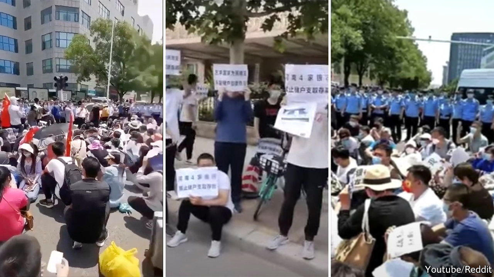

###### Corruption and disruptions

# Trouble at the top and bottom of China’s financial sector 

##### The government is cracking down on crooked bankers 

 

> May 26th 2022 

The protesters gathered outside the office of the banking regulator in Henan province have a simple demand: “Return our deposits.” Thousands of customers of three rural banks in the region recently discovered that they were unable to withdraw their funds. They have been cut off from at least $178m, according to Reuters, a news agency. Met with silence from local officials, many aggrieved customers descended on Zhengzhou, the provincial capital, carrying signs and chanting slogans. Videos that have circulated on Chinese social media show dozens of people kneeling in the middle of a road, disrupting traffic as they beg for their money to be returned (pictured).

Such scenes resonate beyond provincial borders. Central regulators in Beijing, the capital, often view incidents like this as threats to social harmony. China’s leader, Xi Jinping, sees financial stability as underpinning the Communist Party’s rule. But bank runs and other signs of distress at small lenders are on the rise. And there is trouble at the top of the sector, too. 

The details are fuzzy, but a spate of recent investigations, part of a months-long crackdown on corruption, has ensnared several prominent bankers and officials. Wang Bin, the former head of China Life, a state-owned insurer, was arrested in January. Wang Ye, the former president of the Shenzhen branch of China Construction Bank (ccb), a state lender, was detained in April. Shortly thereafter, a probe into Tian Huiyu, then president of China Merchants Bank (cmb), a large commercial lender, was announced.

Regulators have also been targeted. Sun Guofeng, a former senior official at the central bank, and his wife were detained on May 18th. Zeng Changhong, a former official at the China Securities Regulatory Commission, was arrested in April. More than 40 finance officials have been investigated or penalised since October, reckons Bloomberg, a news agency.

China’s financial system is notoriously opaque. So the damage wrought by crooked bankers often goes unseen, sometimes for years, before exploding into the open in the form of enormous losses for investors. Corruption can lead to bad investments, toxic debts and capital outflows, says Zhu Jiangnan of the University of Hong Kong. These can quickly become threats to financial stability.

The arrest of officials sometimes portends years of chaos at state firms. Take the troubles of Huarong, a state-owned investment group that required a $6.6bn bail-out in November. Its chairman, Lai Xiaomin, was detained suddenly in 2018 and accused of extraordinary graft and debauchery. It was later revealed that Lai was at the centre of a web of bad loans and unrecoverable investments that pushed Huarong to the brink of collapse. That, in turn, posed a threat to the financial system. Lai was executed for his crimes in January 2021.

Loans among friends

With many of its cities facing pandemic-related restrictions, China’s economy is struggling. That has heaped pressure on poorly run companies and laid bare dodgy lending. A crisis in the property sector appears to explain at least some of the problems at banks. Those in trouble often have relations with land developers and other firms that are far too cosy. The three banks in Henan are majority-owned by developers (a common arrangement in China). The authorities there are chasing several people connected to the deposit crisis, including a businessman who has fled abroad, Chinese media reported.

The detained officials from cmb and ccb are said to be linked to loans granted to a property company, Tahoe Group, that has since defaulted on its debt. Tahoe was also a customer of Huarong. With the economic situation expected to get worse, dirty dealings by other senior bankers will probably come to light. Mr Xi, meanwhile, is looking forward to a crucial party congress later in the year, at which he is expected to launch a third term as party chief. Stability is the key, say officials. Expect the government to continue upholding its promise, made in January, to “show no mercy” in its fight against corruption. ■

