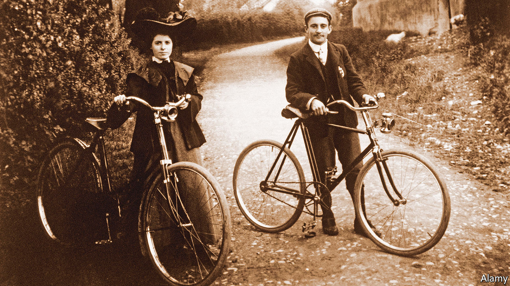

###### Handlebars of history

# The bicycle is humanity’s most underrated invention 

##### So says Jody Rosen in “Two Wheels Good” 

 

> May 26th 2022 

 By Jody Rosen. 

In 1896 one of Joseph Pulitzer’s most influential newspapers, the reported a classic tabloid story about a broken home. “Henry Cleating and his wife once lived happily together…but now they have gone to the divorce court,” the paper relayed, “and all on account of her bicycle and bright red bloomers.” Cleating was upset because his wife was “taking long bicycle rides and neglecting her household duties”. Eventually, after she returned from an especially long jaunt, her husband “got an axe, and smashed the bicycle into a snarl of bent spokes, gashed tyres and ruined tubing”, bringing the marriage to an end. The bloomers “will serve as exhibits in the divorce suit”.

This excerpt comes from a collection of clippings from the late-19th and early-20th centuries assembled by Jody Rosen, a New York-based journalist, for his new book about the bicycle. He promises to reveal “the history and mystery” of the most popular form of transport ever known to humankind except for its own two feet. For that is what the bicycle is. More are manufactured each year in China alone than automobiles are made worldwide. Globally, almost half of households own a bicycle, far more than have a car. As Mr Rosen argues, “the cities and towns we inhabit, our economies, our laws are designed for cars; we hop between continents on airplanes. Yet we live on a bicycle planet.”

Nevertheless, though every business student knows how Henry Ford brought motoring to the masses, and how that development changed society, far fewer people realise quite how transformational the bicycle has been. At the end of the Victorian age, for instance, it allowed young women to get about alone, permitting an age of sexual liberation long before the pill. 

As Mr Rosen recounts, bicycles also transformed warfare. During the Boer war Afrikaner scouts pioneered their use in hit-and-run attacks against the British; 70 years later, the Viet Cong relied on them to move supplies through the jungle to defeat America. In Tiananmen Square in 1989, protesters carried banners on bicycles. In response, the Chinese Communist government crushed hundreds of wheels under tank tracks. Shortly afterwards China switched to encouraging four wheels over two. 

Road-hogging, fume-spewing motorists may not realise it, but they too owe their preferred means of travel to cyclists. Air-inflated rubber tyres were first invented to be used by bicycles, not cars. Ford’s first car was called a “quadricycle”, and it was the League of American Wheelmen that pushed for the first nationwide network of roads in their country. Mr Rosen’s book ranges across this history, as well as into more niche topics such as Nepal’s cycling king, the bike-porn fetishists of Portland, Oregon, and Danny MacAskill, a genius Scottish stunt cyclist. 

Readers hoping for a sustained argument as to why the bicycle deserves a more glorious reputation may be left a little unsatisfied. Love for two-wheeled transport runs through every sentence in the book, but its structure is often frustratingly scattershot, and the most exciting elements are underplayed. In particular, Mr Rosen could have said far more about the inventors and popularisers of cycling, and the impact of their innovation on the world, and somewhat less about bikes and sex.

Meanwhile the hostility of non-cyclists towards the contraption—the late P.J. O’Rourke called the very existence of the bicycle “an offence to reason and wisdom”—is laid out but left unexplored and unexplained. Still, anyone who goes about mostly on two wheels, in defiance of the ever larger, ever more numerous powered vehicles on the road, will enjoy this entertaining ride. 

