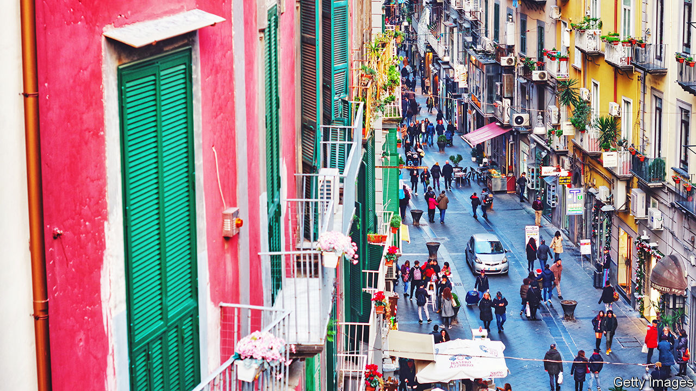

###### Urban adventures

# The charm and peril of Naples 

##### Marius Kociejowski captures both in his new book 

 

> May 26th 2022 

By Marius Kociejowski. 

“Finding himself under increasing scrutiny from no fewer than seven cardinals,” Raimondo di Sangro, prince of Sansevero in the 18th century, “had them killed and from their skin and bones ingeniously fashioned seven chairs.” It is, as Marius Kociejowski soon concedes, “terrible to begin a chapter on a lie or what may be construed as a cheap ploy in order to grab the reader’s attention”. The same doubtless applies to the start of a review. Mr Kociejowski at least has a purpose: to illustrate the “black legend” surrounding one of the many extraordinary characters who flit through the pages of his equally extraordinary book.

A Neapolitan alchemist, Freemason and inventor, di Sangro mastered eight languages, made fireworks that for the first time included “several shades of the colour green” and invented a waterproof cape, a double-barrelled arquebus and—why, oh why, did this not catch on before the advent of Twitter?—a punctuation mark to denote that the preceding sentence is to be taken ironically. He also dabbled in palingenesis (the reconstruction of bodies from their ashes), one of several reasons for the belief that there was something supernatural behind the astonishing, veiled statues he commissioned for his family chapel, the Cappella Sansevero.

To write about Naples, you really need to be a poet—or, even better, an antiquarian bookseller. Mr Kociejowski is both and has produced a delightful work that is as eclectic, labyrinthine, ironic and shocking as the city itself.

The idea of “a door leading to another door and yet another serves perfectly as a way to understand Naples”, he remarks. And that is what, metaphorically, awaits his readers. “The Serpent Coiled in Naples” opens with a discussion of an utterly futile tome. “De Regia Theca Calamaria” (“On a Royal Inkpot”) was published in 1756 by Jacopo Martorelli, a Neapolitan professor who devoted 738 pages to the said inkpot before it was shown unequivocally to have been a jewellery box—a discovery that unsurprisingly tipped him into a “profound existential crisis”.

That is merely the first of Mr Kociejowski’s doors. Others introduce readers to the theory that “much of what we take to be Greek culture was in fact exported from ancient Italy”; to a rap band that has compressed into a five-minute song the entire history of Naples; and to the incisions in the façade of the church of Gesù Nuova that are claimed to be Aramaic letters used in the 15th century to represent musical notes. The score they produce yields a 45-minute piece that apparently, and rather disappointingly, sounds like “the soundtrack to a low-budget horror film”.

There is perhaps no city in Europe in which the living and the dead co-exist so intimately as in Naples, none in which paganism is so inextricably entwined with Christianity, and none in which the past—including the very remote past—is so much a part of the present. Among the places Mr Kociejowski visits is another church, San Pietro ad Aram. The current structure was built in the second half of the 17th century. But “it replaced an earlier church built in 870 or thereabouts. This in turn was erected over an earlier paleo-Christian church and, beneath that, an ancient Greek temple.”

That paleo-Christian church leads Mr Kociejowski to the first bishop of Naples, St Aspren, to whom believers pray to fend off migraine. Bayer, a German pharmaceutical firm, adapted the saint’s name for its wonder drug, aspirin—or so Mr Kociejowski avers. But the headache-relieving divine does not feature in Bayer’s explanation of its product’s name, which it says comes from the Latin name of the plant from which salicylic acid, the aspirin precursor, is derived. Nor was Raffaele Piria, the chemist who first isolated salicylic acid, a Neapolitan, as the author states. Rather, he was born in Calabria. Every so often, the romantic in Mr Kociejowski gets the better of the rigorous (indeed, heroic) researcher.

To write his book, he lived in Forcella, one of the dodgiest districts in the hometown of the Camorra, the Neapolitan Mafia. Forcella means “fork”, as in “bifurcation” or “Y”. “Dig deeper and what comes up is the symbol of the Pythagorean School that was located somewhere in the area,” he writes. A digression on the use of the Y-cross in medieval art (and on the priest’s chasuble) arrives at a group of stones near a division in the road in Forcella, probably dating from the 3rd century bc, when they formed part of the ancient wall of Greek Neapolis or an equally venerable gate. On a railing around the stones hangs a sign “calling upon passers-by to remember Maikol Giuseppe Russo, a young father of two, who became yet another innocent bystander fallen to random gunfire.”

Naples is populated by Italy’s friendliest, cheeriest, most welcoming citizens. It is a magically seductive place in which it can often feel as if the wisdom of an older, emptier world is tantalisingly within reach. Yet it is also a city in which you can find, as Mr Kociejowski did one night on the main thoroughfare, the body of a drug addict shot dead through the eye.

As he notes, it is quite possible to become Neapolitan. “Whether it is to be recommended is another matter.” ■

