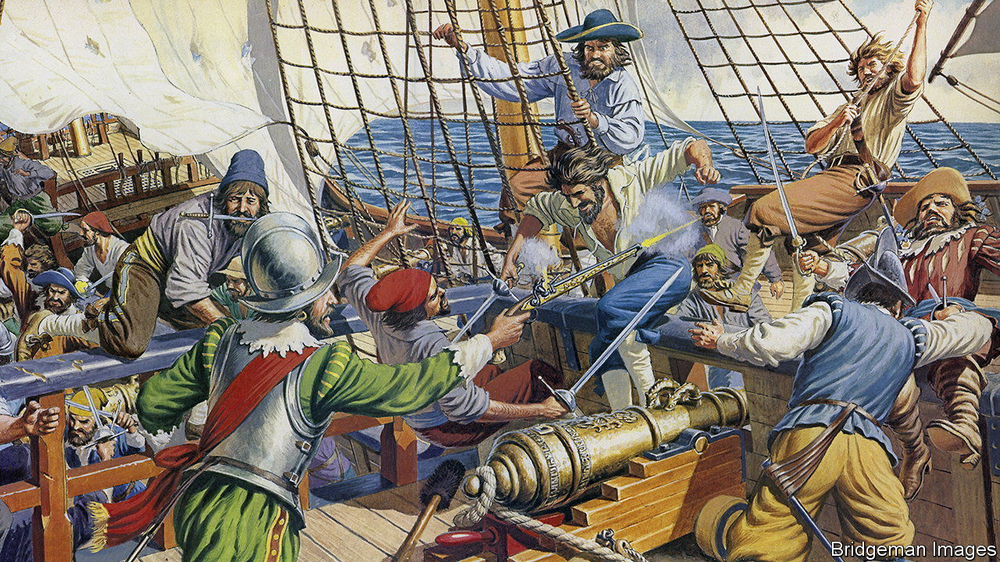

###### Shark bait

# “A merry life and a short one”: the pirate motto was half-true 

##### Keith Thomson explains why in “Born to be Hanged” 

 

> May 26th 2022 

 By Keith Thomson. 

Two decades ago a famous sociology paper by Steven Levitt and Sudhir Venkatesh analysed the economics of drug-selling gangs in America. It argued that, despite the supposed glamour and mythical rewards of the career, most dealers were enticed more “by the prospect of future riches” than the presence of current ones. Most earned a bit above the minimum wage—a top-up more than paid back in the risks they ran.

Reading “Born to be Hanged” by Keith Thomson, it is hard to suppress the feeling that the pirates he chronicles would have benefited from a thorough perusal of that paper when choosing their vocation. Even without the gold teeth, the two groups had notable similarities. Both faced terrible perils; both were drawn on by the lure of distant jackpots. And for both, the outcomes were usually disappointing.

The pirates in this book depart for the New World towards the end of the 17th century to find treasure. Rarely do they succeed. Loitering around the coast of South America, they fail in one way then another. Boats sink; they are burned on pyres; gold is elusive; almost everyone gets scurvy. The pirate motto promises “A merry life and a short one.” The second part frequently comes to pass; the first—as Mr Thomson’s title implies—much less so. His book is rich in such phrases as “their blood ran down the decks in whole streams”, “he took up the amputation knife” and “itt fester’d so that itt pleased god he died.” 

Part of the problem was that “me hearties” were often much less than hearty. For all the famed drama of the pistols and cutlasses, Mr Thomson points out that “scurvy killed more sailors than storms, shipwrecks and combat combined.” These pirates spend much of their time suffering from a panoply of repulsive conditions. Poisonous plants sting them. Insects lay eggs in them. Their gums turn purple and “soften to the consistency of a sponge”.

But they are pleasingly piratical. In an era of historical revisionism, in which the Dark Ages are to be considered enlightened, the Vikings seen as unfairly maligned and Nero as quite nice after all, it is reassuring to find historical characters who conform so closely to stereotype. They are almost the Platonic form of the species. They drink themselves to death, lose legs, get stuck in the doldrums and even possess parrots—which, naturally, can be bought and sold for pieces of eight. The only disappointment is that they do not say “Arrrrggghh!” Real pirates apparently preferred “Damn” or “Huzza”. Those sound a lot less menacing, which is perhaps why in 1950 the film version of “Treasure Island” discarded both and opted for “Arrrrggghh!” instead.

There are some surprising moments. Some of the pirates could be thoughtful, even literary. One called William Dampier wrote an account of his trip that became an instant bestseller. His description of the New World was so rich in new terms that the Oxford English Dictionary credits Dampier for having introduced around 1,000 words into the language. It is a pleasing irony that many vegan-cookbook staples were first itemised by a pirate. The next time you smash an avocado, stir-fry a cashew or dip a finger into guacamole, raise a toast to Dampier, as all were recorded by his pen.

Despite its seasoning with such details, the book can lag. The paper on drug-dealers queried whether they were all that good at “optimising decision-making”. Mr Thomson is an engaging and enthusiastic writer, but these pirates are so hopeless that his narrative can feel less like a well-structured story with a point, and more of a litany of dreadful decisions.

But then the book changes course and you come across a literary pirate like Dampier, or a successful one. For those who do not die, at least, do finally find that gold—enough, in fact, that earning it in a normal job would have taken them “five years on the straight and narrow”. Huzza, as they once said on the high seas. ■

