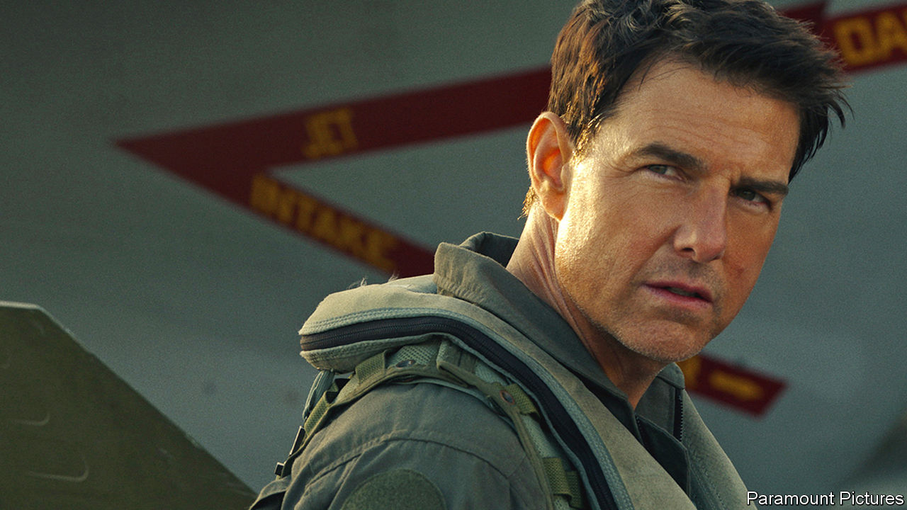

###### Back Story

# “Top Gun: Maverick” feels the need to speed into the past 

##### In the sequel to the cold-war classic, Tom Cruise’s real enemy is the passage of time 

 

> May 26th 2022 

He is back, and so are his accessories—the motorbike, the fur-collared jacket worn in the Californian summer, the Ray-Ban shades which, after “Top Gun” came out in 1986, were as trendy as its soft-rock soundtrack. To recap the plot for the uninitiated: against his commander’s better judgment, Pete “Maverick” Mitchell, a wild-card naval pilot played by Tom Cruise, was sent to an elite aerial-combat school in Miramar. Much of the dialogue was a variation on “Goddammit, Maverick!” or “Damn, this kid’s good!” His buddies loved him, his superiors forgave him, he earned his rivals’ respect. After some high jinks, he won the dogfight and got the girl.

It isn’t just the cold-war fashion sense and Mr Cruise that return in “Top Gun: Maverick”, a much-delayed follow-up released this week. So do the nosebleed-inducing cockpit footage, the haze above the runways, the sweat on anxious faces in the blue-lit control rooms. Maverick again races a fighter jet on his bike; his new girlfriend seems to live in the same neighbourhood as his old one. The lost element is his best pal, Goose (Anthony Edwards), who died in the original. But Goose’s son, Rooster (Miles Teller), is one of the whizz kids whom Maverick, back in Miramar against everyone’s better judgment, must train for an impossible mission in an unnamed rogue state. After some high jinks, he faces a dogfight and—you get the picture. 

As in many film franchises, “Top Gun: Maverick” is both sequel and homage, sampling its predecessor’s catchphrases and remixing vintage motifs and scenes. But amid the mimicry there are differences, and they are telling: about then and now and the distance in between. 

Maverick’s Eighties-style courtship technique, for instance, looks like harassment today. Glimpsing his love interest, played by Kelly McGillis, in a nightclub, he bet Goose $20 that he could have sex with her on the premises. Rebuffed, he chased her into the ladies’ room; she was soon charmed. In what seems a kind of apology, when latter-day Maverick visits a bar, two young pilots are making another $20 bet—over a harmless game of darts.

But the relationships at the heart of both films are between the testosterone-addled fly-boys. Both are stories about men growing up, in the process learning to be nice to each other. Electrifying the first, however, was the friction between Maverick and his fellow hotshot Iceman (Val Kilmer), who traded entranced stares in the locker room as they vied to be number one. Their embrace on the deck of an aircraft carrier was the drama’s real climax. The new movie has a game of beach football in place of a memorably oily volleyball match, but the tingle of homoeroticism is gone. 

As for headline politics: “Top Gun: Maverick” tries to glide over them and through an airtight world of entertainment. Yet recent history is visible as a negative impression, like the shadow of an enemy jet on the clouds.

Famously, in 1986 navy recruiters waited at American cinemas to sign up the would-be Mavericks and Icemen whom “Top Gun” inspired. The adrenalin and elation of the new film are again infectious. Watch it, and when you next bring home the shopping, you half-expect your family to erupt in cheers, like crewmen high-fiving over Maverick’s landings. In Goose’s tear-jerking death, though, the original let darkness in on the idyll. Its successor offers the same simple vision of heroism, the same fantasy of benign American power, only even more innocently, as if answering a deeper need for reassurance.

Changes were inevitable: nostalgia, after all, is another name for loss. Nobody, not even Maverick, can jump into the same cockpit twice—though, come to think of it, he does. As the new story begins he is test-piloting a hypersonic jet, after which his rides become ever-more antiquated. He makes a getaway in a plane from the Eighties and winds up in one from the second world war, borne back ceaselessly on the wings of the past. 

His real enemy now is the passage of time, with all its barely mentioned but inescapable wars, failed leaders and political rancour, all the accumulated disillusionment with America, its heroes, even its fading movie stars. Sequels, of course, always have an eye on the rear-view mirror. So, in fact, did the original “Top Gun”, glancing back to Vietnam where Maverick’s father had died. Yet in 1986 Maverick outflew history and the future opened out on the horizon. Now history is his destination. “Let go,” he is told, and replies, “I don’t know how.” He is not alone. 


