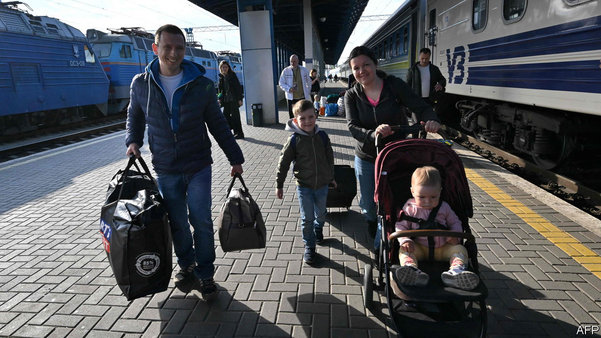
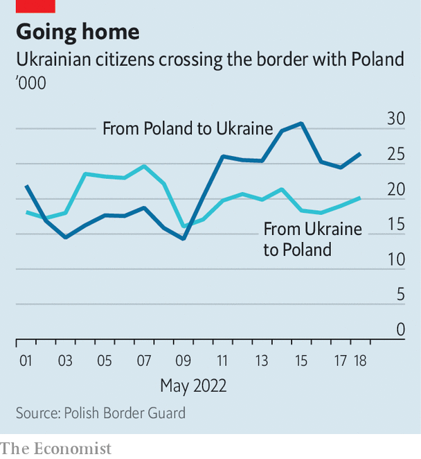

###### The tide turns

# As Russia’s invasion stalls, Ukraine’s refugees return home 

##### More Ukrainians are leaving Poland than entering 

 

> May 24th 2022 

Valeria, a fashion consultant, and her mother, a housewife, escaped to Poland in early March, a week after Russian missiles began falling on Kyiv, their home town. Three months later they are returning. “It’s hard to live a normal life when all you think of is your country,” Valeria says, standing alongside a bundle of bags, and hundreds of other Ukrainians, at a train station in Warsaw, the Polish capital.

With Russian troops  from the outskirts of Kyiv and Kharkiv, Ukraine’s two biggest cities, many refugees reckon it is safe, or at least safer than before, to come back. In the two weeks to May 23rd, the number of Ukrainians heading back home from Poland (345,000) exceeded the number of those entering Poland (253,000). Neighbouring countries are seeing a similar trend. Many of those returning say they simply want to see loved ones. Men of fighting age have not been allowed to leave Ukraine. As a result, 94% of the refugees in Poland are women and children. “I’m a bit scared,” Valeria says, “but I need to see my dad and my grandma.” 

Poland has taken in  from Ukraine since the start of the war, more than all other eu countries combined. Hundreds of thousands of the newcomers have moved farther west or returned home, but Poland’s resources are still stretched to the limit. Large cities and towns near the border, where most of the Ukrainian refugees have settled, are . A plan drawn up a few years ago by municipal officials in Warsaw had predicted that the city’s population would grow by up to 250,000 by the end of this decade. It expanded by as much after three weeks of war in Ukraine. 

 


As many as 600,000 Ukrainians are staying with Polish families. The rest live with friends or relatives, in dormitories, hotels and resorts or on their own. But problems are surfacing. In urban areas the influx has compounded a housing shortage and driven up prices. Rents in Warsaw are up by an average of more than 40% compared with a year ago, over three times the current rate of inflation. The supply of rental properties has plunged. Apartments listed one day are snapped up the next. 

Municipal officials are desperately looking for new housing. Office buildings have been converted into temporary refugee shelters. Last month the city seized a hulking apartment block, which once housed employees of the Soviet embassy, from Russia. Warsaw’s mayor says he plans to use the compound—popularly known, in honour of its former occupants, as Szpiegowo, or Spyville—to accommodate displaced Ukrainians. 

The housing problem may worsen in the coming months. Polish host families and their Ukrainian guests may soon tire of sharing the same bathroom and washing machine. Once resorts or youth camps reopen for the summer-holiday season, the hundreds of thousands of Ukrainians living in them may have to look for other places to stay. With housing scarce and expensive, they risk finding none.

Jobs are not a big problem. Poland’s economy grew by 8.5% in the first quarter of this year, compared with a year earlier. Unemployment is at 3%, the third lowest in the eu. At least 145,000 Ukrainians, and perhaps as many as 200,000, have already found work. “If you want a job, you can find one,” says Ludmila, feeding ducks at a pond overlooking the derelict Szpiegowo compound; she now works at the hostel where she stayed after arriving in Warsaw.

Yet language barriers and bureaucratic obstacles to getting skills and diplomas recognised mean that refugees who held white-collar jobs back home are often pushed into low-paid work, says Myroslava Keryk of Ukrainian House, a group helping Ukrainians in Poland. The war has caused a shortage of workers in sectors like industry and construction. Of the 110,000 Ukrainian lorry drivers who worked in Poland before the war, some 40,000 have gone home to fight. At least some Ukrainian women may end up taking up jobs previously held by Ukrainian men.

Many Ukrainians do not want to get tied down, however, because they hope to go back soon, says Mrs Keryk. Only 17% of the refugees say they want to settle in Poland for good, according to one survey. Less than half have enrolled their children in . The remainder continue to study, remotely, at Ukrainian ones. At least 500,000 Ukrainians have not applied for a Polish identification number. This would entitle them to social assistance, including a monthly allowance of 500 zlotys ($114) per child, the right to open a business, and health care.

But even those heading back to Ukraine acknowledge they may need to escape Russian bombs once again. “I know I might have to come back here in two days,” says Natalia, a cosmetician, preparing to board the train to Ukraine. “But who knows?” For now, hope seems to be prevailing over despair. Tickets for the only direct train to Kyiv are sold out for the next month. ■


