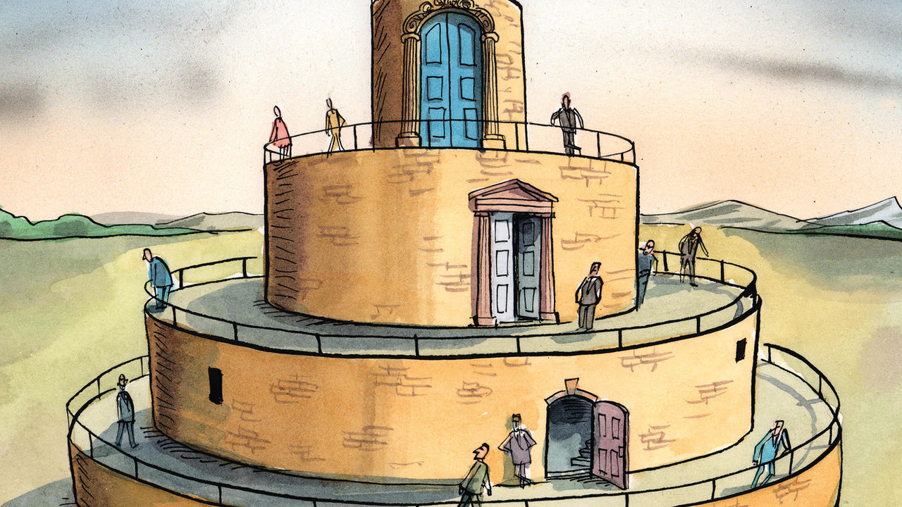

###### Charlemagne

# Reheated plans for a multi-tiered Europe revive familiar suspicions 

##### Nobody wants to join a diluted eu 

 

> May 26th 2022 

No sporting trophy is of as dubious value as the uefa Cup, handed to the club whose quest for European footballing glory started with failure to qualify for the more prestigious Champions League. Recalling who won this year’s lesser tournament is already the stuff of pub quizzes (Eintracht Frankfurt this month beat Glasgow Rangers on penalties: ten points). In contrast, hundreds of millions across the world will watch Real Madrid and Liverpool vie for one of football’s top prizes on May 28th. Triumph in the Champions League is a career highlight for even the most adulated player. Winning the uefa Cup is an invitation to do better in future: beyond an oversize trophy, Frankfurt’s greatest reward for its success is the right to play in the Champions League next year.

Tiers are a brutal necessity to keep football tournaments manageable in Europe, home to over 1,000 professional clubs from Reykjavik to Donetsk. Now something similar is being mulled to help organise the continent’s politics. Depending on where you draw the line, there are 40-50 countries in Europe. Each is either qualified for the main show in town—the eu, with 27 members plodding towards ever-closer union—or sits outside it. France’s President Emmanuel Macron and Charles Michel, a Belgian who chairs meetings of eu leaders, are among those pushing for a looser continental grouping that could include all those currently outside the bloc. Plenty fear this “European Political Community” would be a uefa Cup-style consolation prize for countries still pining for the top tier. Diplomats are mulling the question ahead of a European summit in June, where Mr Macron will flesh out the idea in France’s last few days in the bloc’s rotating presidency.

Proposals to split Europe into concentric circles have a long pedigree. After the Berlin Wall collapsed, François Mitterrand, another French president, suggested eastern European countries formerly under Soviet control might join a looser “European confederation”—the subtext being that they would not soon be welcome into the inner sanctum. (Most putative members demurred and countries such as Poland and Romania held out for membership of the union proper.) Some organisations cover the whole continent, but focus on specific things, like singing competitions (Eurovision), football (uefa) or monitoring human rights (Council of Europe). Tiers within the union have also emerged over time. A majority, but not all, of eu countries use the euro or allow passport-free travel, for example. Take these different concentric rings together and the continent’s arrangements start looking like a towering wedding cake, or something out of Dante.

The recently re-elected Mr Macron is keen on adding levels both within and outside today’s eu. On May 9th he spoke of integration being forged by countries in “avant-garde circles”, a phrase more often used by art historians describing groupings of louche painters. Selective deeper integration is broadly fine with everyone, not least because such pioneering schemes usually struggle to get off the ground. More contentious is the idea for an outer tier. Many in eastern Europe see a diluted extended circle as a replay of the ploy that aimed to keep them out a generation ago. 

Part of the problem is the messenger. As Mr Macron floated the idea of a wider community, he also suggested it would take decades for Ukraine to qualify for full eu membership. Its putative accession is the source of tensions within the bloc. Eastern Europe is pushing for Ukraine’s courage under fire to be recognised with rapid membership, or at least formal candidate status. France has long been dubious about enlargement, which in its eyes makes the bloc unwieldy and incapable of further integration.

As in the 1980s, the problem with outer tiers is that nobody wants to be in them. In theory this new community would be separate from the eu, perhaps with its own headquarters far from Brussels. In practice whatever was decided by those in the continent’s inner core would have to be accepted by everyone else. 

And who would agree to that? Three groups of countries would be obvious candidates for Mr Macron’s uefa Cup tier. The first is those who are outside the eu but don’t fancy joining, for example Norway (a member of the eea, through which some small countries attach themselves to eu decisions) or Switzerland. But their arrangements for dealing with the eu are tailor-made and work well. The second is Britain, the only member ever to have left the union, and to which Mr Macron alluded specifically as a potential outer-tier member. Its relationship with the continent is still a movable feast, and it has said it is not interested. Third, and most numerous, are countries that want to join the eu, from the Balkans to Georgia and Ukraine. They are being egged on by eastern Europe to stick to their demands for full membership, some of which have been in the works for years. Volodymyr Zelensky has said Ukraine would not “compromise” on joining the eu proper.

Offside!

Making an outer tier attractive to outsiders will be tricky. One possibility is to turn the wider grouping into an on-ramp to the eu instead. As things stand, membership of the bloc is binary. Countries work for years to join but only enjoy the fruits of their success—free movement of their citizens, university exchanges and so on—once the process is finished. Mr Michel has suggested that countries within the outer tier that had, say, reformed their energy markets, could then take part in summits of eu energy ministers. Fail to keep up reforms and you would get booted out.

That will raise concerns among some member states, particularly those like Hungary that constantly clash with the club over falling short of eu standards. For a rejigged European political space with lots of different tiers is one where the possibility of being booted from one tier to another will surely come up. Currently being a member of the club is like a guaranteed berth in the Champions League year after year. For existing eu members, the idea of relegation is best left to sporting competitions. ■


