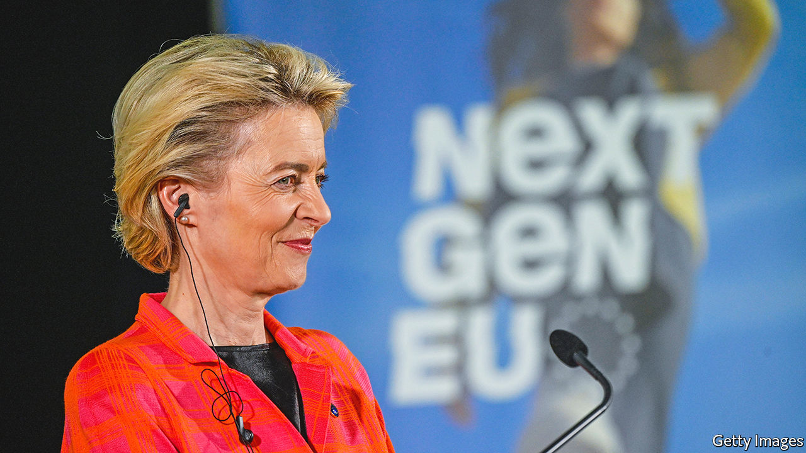

###### So far, so good

# The EU’s covid-19 recovery fund has changed how Europe spends money 

##### But there are further tests to come 

 

> May 26th 2022 

The adage that Europe is forged in crisis may be about to acquire a refinement. By the time a response to any given crisis is operational, which takes a while in a 27-country bloc, there is a good chance that the crisis will be more or less over. But the response might well turn out to be just in time for the next one.

Take the eu’s covid-19 fund, the Next Generation eu or ngeu for short. It was set up in the second half of 2020 to help weaker countries in eastern and southern Europe make a full recovery from the pandemic. There are several novel elements. For starters, it is big, at €807bn ($958bn) in 2021 prices, almost half of which is paid out as grants (the rest as cheap loans). It is debt-funded rather than coming out of member states’ existing budgets, adding a considerable stimulus (see chart). And most of its money is to be paid out only once countries have taken agreed reform steps and met investment targets, rather than as a simple transfer from richer to poorer regions.

This makes it a test of how the eu could operate in the future. So far, even generally hawkish members, such as the Dutch or the Germans, are uncharacteristically upbeat. The reform and investment plans are substantive, according to European Commission officials. Even in Poland the power of money seems to work: difficult reforms to the judicial system are expected to be built into the Polish programme, due to be finalised shortly. Some reforms, such as the labour market ones enacted by Spain at the end of last year, are already showing signs of success in generating more permanent jobs and fewer precarious ones. 

But many of the early milestones in the plans are comparatively easy to pass; they typically include such things as opening tenders or starting legislative processes. Some of them are even retrospective: relevant projects that were started as far back as February 2020 can be included, even if already completed. It is only when the implementation gets harder, costs overrun or governments with different priorities come into office that the recovery fund’s governance will really be challenged. 

 


Italy may well become a test. Voters will have to go to the polls some time in the spring of 2023, bringing to an end the government of national unity currently led by Mario Draghi, whose core policy is the implementation of the programme. The next government may be less enthusiastic about the plans. The disbursement schedule for Italy seems to expect trouble: the three biggest chunks, of €11.5bn each, are scheduled to be paid out before the election. The current impasse over a competition reform, held up on—of all things—the liberalisation of bathing establishments, foreshadows how easily reforms can get stuck, in Italy and elsewhere. The commission has the task of judging compliance. Like the southern European countries that are getting most of the cash (see chart), the commission has an interest in making the recovery fund work, so as to act as a model for future plans like it. Bend the rules too much, though, and the support of the flinty northerners will vanish.

Implementing the current plan is only part of it. Another issue is whether the fund can be adjusted to tackle today’s most pressing issues: the war in Ukraine; the resulting dash for alternative sources of energy to Russia; and inflation.

Start with the last of those. The number-crunchers in Brussels had assumed 2% inflation when drawing up the fund. With annual price increases for many raw materials and energy well into double digits, some countries’ agreed investment targets may already be out of reach. Rewriting the plans is possible (under strict conditions) but considered a last resort. The commission is hoping that national governments will use their own funds to plug the gaps, or employ unused European money already at their disposal. 

Whether the scheme is contributing to inflation or helping to curb it is a tricky question. Some argue that recovery-fund investment, combined with competition-enhancing reforms and digitalisation, will reduce price pressures over the medium term. But at the same time the additional European money allows recipient countries to spend more on supporting the economy, which could add to inflation.

The energy crisis is the second challenge. Climate change featured heavily in the fund’s original mandate, and at least 37% of each country’s allocation has to be spent on “green” projects (many countries are going higher). But the Russian assault has changed priorities: energy security now comes first. Many of the approved green projects, such as home insulation or renewable energy, will also make Europe less dependent on foreign fossil fuels. But others that are needed to boost energy security, such as lng terminals, are difficult to square with the fund’s guidelines. 

In response to the war, the commission has put together a new programme, called repowereu. Countries are being invited to add a new energy-security chapter, for which looser standards apply, to their plans. The problem is how to fund it. The commission cannot simply borrow when it wants to, as a sovereign government can. Instead, it has to “mobilise” money—Brussels jargon for either reshuffling existing funds or using small amounts as leverage for raising private investment. The loan compartments of the recovery fund have so far been requested by only seven countries, leaving €225bn in the pot. Redirecting that money to the energy-security chapters offers one way out. 

The third challenge is the war itself. The eu’s treaties do not allow the bloc to spend eu money directly on defence. But there are ways around that. If research or the strengthening of the internal market is involved, the eu can contribute to defence-linked projects. In response to the war, the commission has proposed bolstering joint European procurement, but with just €500m over the next two years. 

What eu treaties fully provide for is financial assistance to third countries. In other words, for rebuilding Ukraine. The commission is considering a new reconstruction fund for Ukraine based on Europe’s own recovery fund, and has suggested commonly issued bonds as one funding option. National capitals are not all in favour, but the scale of the problem may well call for a European response. Jacob Kirkegaard of the Peterson Institute for International Economics, a think-tank, argues that there is now a European scale of severity of crises. “Europe will use common, debt-funded spending at scale if a certain crisis threshold is reached. And Ukraine will be such a threshold, just as the pandemic was.” ■


