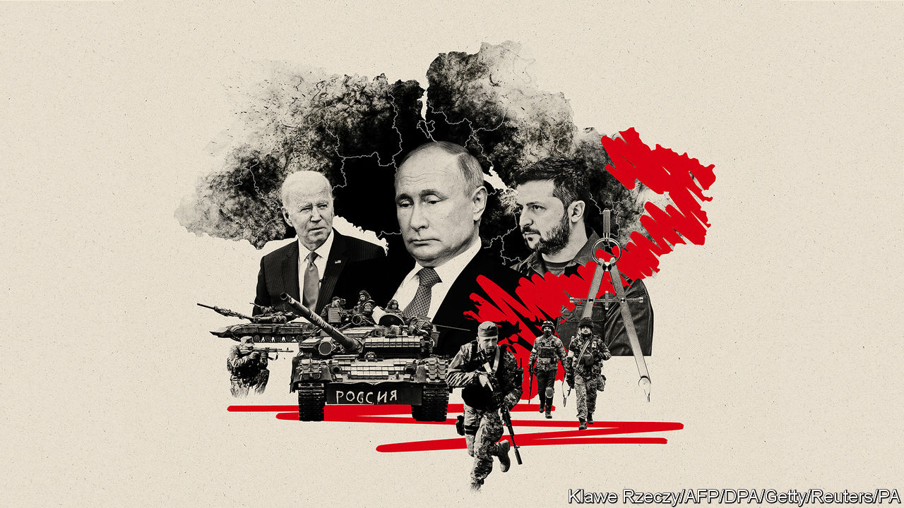
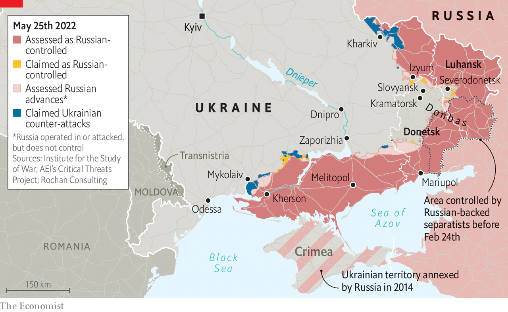

###### Thinking about the endgame

# When and how might the war in Ukraine end? 

##### Western allies are starting to split over the conditions for a peace 

 

> May 26th 2022 

The war in Ukraine, says its president, Volodymyr Zelensky, will be won on the battlefield but can end only through negotiations. When to stop fighting, and on what terms? The West says that is for Ukraine to decide. Yet three months into the war, Western countries are staking out positions on the endgame.

They are splitting into two broad camps, explains Ivan Krastev, of the Centre for Liberal Strategies, a think-tank in Sofia. One is the “peace party”, which wants a halt to the fighting and the start of negotiations as soon as possible. The other is the “justice party”, which thinks Russia must be made to pay dearly for its aggression.

The argument turns in the first instance on territory: let Russia hold on to the land it has conquered thus far; push it back to its starting line on February 24th; or try to shove it even farther back, to the international border, to recover territories it seized in 2014? The debate revolves around much else besides, not least the costs, risks and rewards of prolonging the war; and the place of Russia in the European order.

The peace camp is mobilising. Germany has called for a ceasefire; Italy is circulating a four-track plan for a political settlement; France speaks of a future peace deal without “humiliation” for Russia. Ranged against them stand mainly Poland and the Baltic states, championed by Britain. 

What of America? Ukraine’s most important backer has yet to set out a clear objective, beyond strengthening Ukraine to give it a stronger bargaining hand. America has spent nearly $14bn on the war so far, and Congress has just allocated a further $40bn. America has rallied military donations from more than 40 other countries. But this help is not unlimited. It has delivered artillery, but not the longer-range rocket systems that Ukraine is asking for. 

Remarks by Lloyd Austin, America’s defence secretary, add to the ambiguity. After visiting Kyiv last month he embraced the justice party, saying the West should help Ukraine “win” and “weaken” Russia. Three weeks later he seemed to tack to the peace camp, calling for an “immediate ceasefire” following a phone call with his Russian counterpart, Sergei Shoigu. The Pentagon insists there is no change of policy.

Another blow to the justice party was an editorial in the arguing that the defeat of Russia was unrealistic and dangerous. Then Henry Kissinger, a former secretary of state, said negotiations should start within two months to avoid “upheavals and tensions that will not be easily overcome”. There would ideally be a return to the line of February 24th; “pursuing the war beyond that point would not be about the freedom of Ukraine, but a new war against Russia itself,” he declared at the World Economic Forum, a talkfest in Davos. Russia, he said, had an important role to play in Europe’s balance of power; it should not be pushed into a “permanent alliance” with China.

For now, such cracks in the West are contained by the mantra that the future is for Ukrainians to decide. Yet Ukraine’s choices are in turn shaped by what the West will provide. “Europe, the world at large, should be united. We are as strong as you are united,” Mr Zelensky told a meeting at Davos. He said that “Ukraine will be fighting until it gains all its territory back.” But he also seemed to leave himself space for compromise. Talks with Russia, he said, could begin once it withdraws to the line of February 24th.

America, Europe and Ukraine have to keep adjusting their positions according to what each thinks the other will accept. “The Ukrainians are negotiating with their Western partners as much as, and probably more than, they’re negotiating with the Russians,” says Olga Oliker of the International Crisis Group, a think-tank. The fuzziness also reflects the uncertainties of war. Is Ukraine winning, because it saved Kyiv and pushed Russia back from Kharkiv; or is it losing, because Russia has taken Mariupol and may soon encircle Severodonetsk? The peace party worries that the longer the fighting goes on, the greater the human and economic cost to Ukraine and the rest of the world. The justice camp retorts that sanctions on Russia are just starting to bite; with more time and more and better weapons Ukraine can win. 

 


Behind all this lie two contradictory worries. One is that Russian forces are still strong and will prevail in a grinding war. The other is that they are brittle. If routed, Russia could lash out at nato, or resort to chemical or even nuclear weapons to avoid defeat. In the long term, says Emmanuel Macron, the French president, Europe will need to find a way of living with Russia. Estonia’s prime minister, Kaja Kallas, retorts, “It is much more dangerous giving in to Putin than provoking him.” American and European officials have quietly been helping Ukraine develop negotiating positions. One point is its demand for security guarantees from the West. Short of a promise to defend Ukraine directly, ideas include the ability to “snap back” any sanctions on Russia that are lifted; and rearming Ukraine quickly if it is attacked again.

Right now, Ukraine is reasonably optimistic. It has denied Russia an easy conquest, and new Western weapons are appearing on the front lines. But speaking from the sandbagged presidential headquarters, Mykhailo Podolyak, Mr Zelensky’s chief negotiator, says he is increasingly concerned by the “fatigue” in some European countries. “They don’t say it directly, but it feels like an attempt to force us to capitulate. Any ceasefire means a frozen conflict.” He also complained of “inertia” in Washington: weapons are not arriving in the quantities Ukraine needs.

When the war ends will depend in large part on Russia. It is in no hurry for a ceasefire. It seems determined to conquer all of the Donbas in the east, and talks of taking more land in the west. “The paradox of the situation is that both sides still believe they can win,” says Volodymyr Fesenko, a political analyst in Kyiv. “Only if we really reach a stalemate, and Moscow and Kyiv recognise it as such, can any talk of compromise be possible. Even then, it is likely to be temporary.” ■


