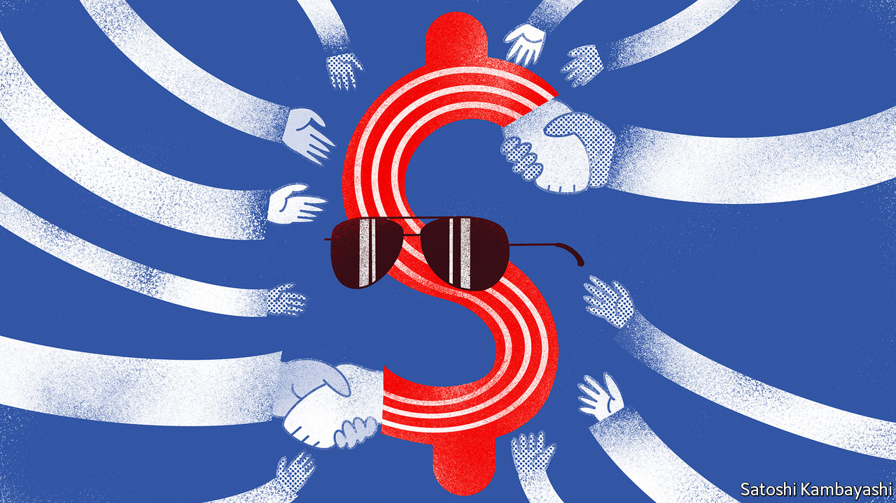

###### Reframed work

# America’s new Asian economic pact: just don’t call it a trade deal 

##### And China is not invited 

 

> May 24th 2022 

A mere three days after being sworn in as president in January 2017, Donald Trump signed an executive order withdrawing America from the  (tpp), a 12-country free-trade deal he had railed against on the campaign trail. On May 23rd, 488 days after his own swearing-in, President Joe Biden tried to reverse some of the damage by , the 13-country Indo-Pacific Economic Framework (ipef). That Mr Biden took so much longer to launch his Asian trade policy illustrates one basic truth: it is far easier to tear up agreements than it is to craft them anew.

Inevitably, one way to look at the ipef is by way of comparison to the tpp (which lives on in reduced form, absent America). Some bits sound rather familiar. One selling-point for the tpp was that it was a “21st-century trade agreement” complete with high standards for workers’ rights and e-commerce rules. The ipef is also “a 21st-century economic arrangement”, according to Jake Sullivan, America’s national security adviser. The original tpp members accounted for nearly 40% of global gdp, roughly the same share as the current ipef partners. Most crucially, China is still excluded. The ipef, like the tpp, is an attempt to build a trading structure in Asia that enshrines both America’s economic principles and its economic power—welcomed by many in the region as a counterbalance to China’s heft.

That, however, is where the similarities end. Mr Trump’s success in winning support with his calls to stop countries “ripping off” America has made many in Washington leery of ambitious free-trade deals. So rather than starting work on a pact that would require approval from Congress, Mr Biden’s team has designed a framework that is more malleable and may avoid that political death-trap. In announcing the launch, Katherine Tai, the United States Trade Representative (ustr), pledged to “keep Congress close” in shaping the ipef—a far cry from putting it to a vote.

Malleability has a few big downsides. It limits what America can offer. A cut in tariff rates, a plank of most free-trade deals, is a non-starter because it would require congressional support. America still vows to push for strong labour and environmental standards but, unable to offer more access to its vast market, it lacks a key bargaining chip. The durability of the ipef is also in doubt. Were Mr Trump to return to the Oval Office in 2024, he would not need three days to ditch the framework.

The Biden administration has tried to make a virtue of these limits. Rather than conceiving of the ipef as a conventional deal, it has declared that the pact will rest on four pillars, with trade promotion just one. The other three goals are to make supply chains more resilient; to promote infrastructure investment and clean energy; and to form new rules on taxation and anti-corruption. It is tempting to dismiss such a wide-ranging agenda as too vague to amount to anything. But paradoxically, a near-stumble at the launch of the framework illustrated that it could, in theory, have force to its contents: America had to tone down the language in its founding documents, otherwise some in Asia would have balked at signing them.

Matthew Goodman of the Centre for Strategic and International Studies, a think-tank, notes that the focus on topics such as digital trade, competition policy and bribery makes for a good menu for the ipef. “These are issues that are very much in the interest of our partners in the region,” he says. At the same time, breadth poses a challenge. Instead of just having the ustr as the lead negotiator, as in normal trade talks, the Commerce Department is in charge of the non-trade portfolio. That risks turning it into a multi-headed beast.

For now, many in the region are most pleased by the symbolism. The wounds from America’s tpp exit are still raw. Since Mr Biden’s election victory, allies have waited and waited for America to devise a new Asian trade strategy. At last it has arrived, even if it is more notable for its political constraints than its economic potential. “We are just happy to have them at the table,” says one Australian official. ■


