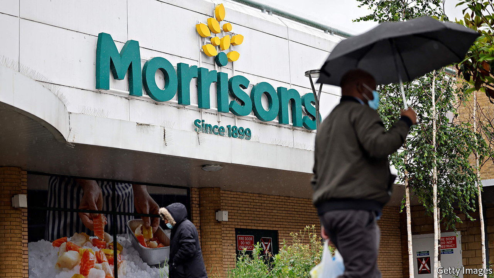
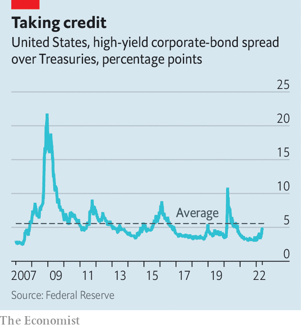

###### Bloody but unbowed

# The credit market hasn’t cracked yet 

##### It is undergoing a painful repricing, but not veering into dysfunction 

 

> May 26th 2022 

At their best, capital markets hold up a mirror to the real economy. They rise and fall in tandem with companies’ fortunes, encouraging investors to direct money towards the firms most likely to make a return on it. But the arrow of causality can also fly the other way. A dysfunctional market can choke off the supply of capital even to healthy firms, forcing them into default for no better reason than that financial conditions have tightened.

The worst instances of this occur when the credit market comes unstuck, as it did in the financial crisis of 2007-09. That adds an ominous ring to the unusually sharp losses credit investors have endured recently. Based on total returns, American investment-grade bonds are down by 14% since September. European ones have dropped by around 10%, their worst peak-to-trough plunge. The credit spread, or premium paid by risky “high-yield” borrowers compared to Treasuries, has spiked from three percentage points in late December to nearly five, with around half that increase coming in May. Firms from Carvana, an American car retailer, to Morrisons, a British supermarket chain, have struggled to issue debt. Is it time to panic?

 


To understand why not, start with credit spreads. Those for American high-yield bonds began 2022 close to all-time lows. Even after their recent rise, they remain below their long-run average and far from the levels seen in 2008 and during the covid convulsion in 2020 (see chart). Jonas Goltermann of Capital Economics, a consultancy, says the tightening is more reminiscent of the growth scares of 2015-16 and 2018 than of a credit crunch.

A tsunami of corporate defaults remains unlikely. Few of the riskiest borrowers have to repay their debt in the next 18 months. Of America’s $1.5trn-worth of high-yield bonds, just 4.5% falls due before 2024; the figure is 6.4% in the euro zone. Most issuers need only worry about earning enough to meet their interest payments rather than finding new lenders to roll over their debt. Moody’s, a rating agency, reckons the global default rate will hit 3% over the 12 months to April 2023—higher than the 1.9% for the year to April 2022, but below the historical average of 4.1%.

Those firms that do need to refinance are likely to find a receptive market. A monthly survey by America’s National Association of Credit Managers found financial conditions in April to be slightly tighter than in late 2021, but looser than at any time before that going back to 2004. As the Federal Reserve starts winding down its $5.8trn portfolio of Treasuries from June 1st, some liquidity is likely to drain from the market. For now, however, cases like Carvana and Morrisons look like outliers.

Two risks remain. One is that corporate profits disappoint so much that borrowers are unable to pay even their interest. The bigger one is that risk-averse investors, perhaps spooked by fears of a recession, pull their money from bond funds en masse and hoard cash instead. That would leave such funds with less to lend to new issuers. Worse still, they may be forced to fire-sell existing debt to fund redemptions.

Should that happen, the experiences of Carvana and Morrisons point to a safety valve. Ultimately both firms managed to issue their debt by turning to private lenders and offering sweetened terms. Between 2008 and 2021 the assets managed by such lenders tripled, to $1.2trn. Unlike traditional bond funds, they don’t offer investors daily withdrawals, meaning they are less susceptible to swings in sentiment and more able to deploy capital when the market is stressed. They are sitting on more than $420bn of “dry powder”, or unspent cash. Daniel Lamy of JPMorgan Chase, a bank, does not expect them to hold fire for very much longer. ■


