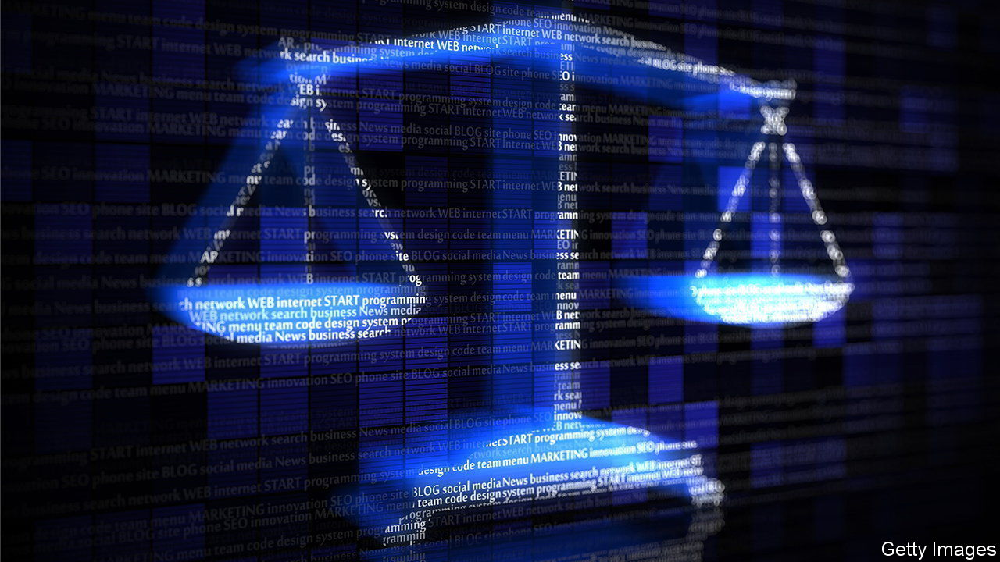

###### ”The safest place in the world”

# Britain should scrap its Online Safety Bill 

##### It is both illiberal and impractical 

 

> May 26th 2022 

Boris johnson’s government is up to its neck in short-term crises. Amid a great deal of sound and fury,  the fallout from a string of illegal parties in Downing Street and is pondering how to ease a nasty cost-of-living crunch. In the long run, though, it is usually the day-to-day business of government, passing laws, that matters more. One law in particular—the Online Safety Bill, a bumper piece of legislation that aims to fix almost everything that is wrong with the internet—could reshape life dramatically. 

Its aim is to make Britain “the safest place in the world” to use the internet. So says the government, and it is not just talk. Fed up with what it sees as the failure of big internet platforms to self-regulate, it has decided to lay down the law. The bill will require tens of thousands of internet firms, from foreign giants like Facebook and Google to niche web forums, to do more to protect their users, on pain of fines of 10% of their worldwide revenue, or even being blocked entirely. 

As with motherhood and apple pie, it is hard to argue against the idea of a safer internet. Few people would disagree that social media in particular can be a sewer. But Britain’s bill is illiberal and impractical. Even if it could achieve its goals—which is unlikely—it will do so at too high a price. The government should scrap it, and think again.

Start with the illiberalism. This newspaper believes that if restrictions are to be applied to speech, the bar should be high, and the rules should be applied carefully, frugally and narrowly. Instead, the Online Safety Bill hands the government a very big stick in pursuit of a great number of different aims. Because so much of life is now conducted online, the Bill has become a magnet for lobbyists, activists and those with an axe to grind. The government hopes to stamp down on, among other things, death threats, knife sales, assisting people to commit suicide, the glamourisation of anorexia, vaccine scepticism, fraudulent advertising and racist abuse directed at England’s football team. 

Some of these are illegal already. Others will be put in a category that has come to be known as “legal but harmful”, a newly invented sort of speech without precedent in British law. The government insists that this imposes nothing more than a duty of transparency on tech firms, which will be forced to announce explicitly whether they will allow such speech on their platforms. But it would naive to think that a list of topics that are officially disapproved of will not exert a chilling effect. Worst of all, it is impossible to know exactly what will end up in this category, for the legislation allows ministers to add things to it with minimal parliamentary scrutiny. 

As for practicality, the technological realities of enforcing the rules will make them even more burdensome. The bill proposes to delegate enforcement to the same tech companies that the government says have failed to police themselves properly in the past. When it comes to illegal content, they will be forced to scrub it from their services. For some posts, that will entail tricky legal judgments. But given the size of the potential penalties, firms will have strong incentives to block anything even remotely controversial first and ask questions later—or, more likely, not at all. 

That problem will be exacerbated by the awkward fact that the sheer quantity of stuff posted to social media every minute means that most of the time, humans will not be making those judgments at all. As the bill itself acknowledges, firms will have to rely on automated systems. Anyone who spends time on social media knows that such content-moderation algorithms are already arbitrary and inconsistent, banning some people for trivialities while leaving others untouched for flagrant breaches of the rules. The bill will expand their use to cover even more kinds of speech, backed up with the force of law. Over-blocking, arbitrary enforcement and the chilling of legitimate discussion is thus built into the legislation. 

Not everything in the bill is bad. Proposals to force firms to allow users to choose sanitised versions of websites and limit whose posts they see are a good idea, since participation is voluntary. Attempts to exempt smaller firms from the most onerous rules are welcome. But a few bright spots are not enough to save a fundamentally misguided piece of law. It is often said that free speech is the lifeblood of a democracy. That is true, but incomplete as a defence. Freedom of speech is also a good thing in its own right. As a general rule people should not be told what they can think or say, whether by politicians, policemen or priests. Exceptions should be rare, tightly defined and policed by the criminal-justice system, where alleged criminals can have their cases considered by judges or juries. The Online Safety Bill flouts those principles. The government should delete it. ■

