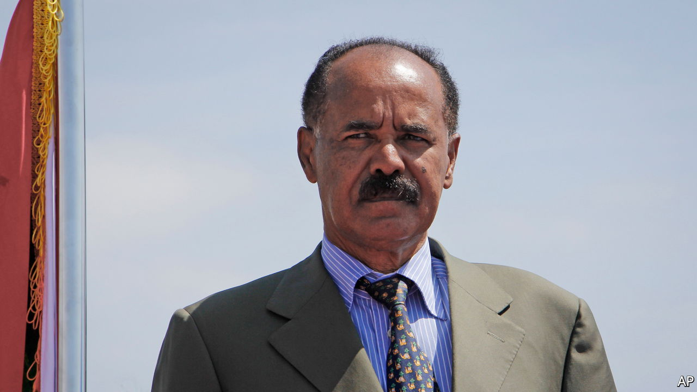

###### Kim Jong Understudy

# Containing Eritrea, the North Korea of Africa 

##### Sanctions should be reimposed on Issaias Afwerki’s regime 

 

> May 26th 2022 

Dictators seldom improve with age or time in office. As they grow accustomed to untrammelled power, they forget why restraint is a virtue. As they punish truth-tellers, they hear more lies. After years of tyrannising their own people, they wonder if they can get away with bullying foreigners, too. Vladimir Putin and Kim Jong Un are not the only despots who menace their neighbours. Eritrea’s Issaias Afwerki is equally malign. 

He is the only leader his country has known in three decades of independence. He has turned it into a hot, dusty prison camp. He has fought wars against two neighbours, stirred up trouble in several others and, in 2020, sent troops into Ethiopia’s civil war, where he is seen as the main obstacle to ending that bloody conflict. Restraining him would be a public good. 

Little is known about life in Eritrea under Issaias. His regime allows no free press and keeps out foreigners, particularly journalists. Travelling incognito, recently gained a rare glimpse inside the . Our reporter found a country that has taken an even grimmer turn after 19 months of war. Shops are almost bare. In Asmara, the capital, cafés that once buzzed are now empty. Young people are afraid to leave home, in case they are press-ganged into the army—a horrific prospect. 

Issaias rules by fear. Honest advice is unwelcome, much less criticism. Early in his rule soldiers complained that they had not been paid for two years and were unhappy that he wanted to withhold their wages for another four. He met them, heard their grievances, then locked up their leaders for 14 years. A few years later, when 15 senior members of his party signed a letter calling for democracy and human rights, Issaias tossed most of them into a secret prison. They have not been seen since. 

Torture is common. Political prisoners—or even people who follow religions other than the four that are officially recognised—are locked in shipping containers in the desert sun, often without food or water. Some are subjected to the “helicopter” (lying facedown with their hands and feet tied together behind their backs) or “8” (being tied to a tree) for up to 48 hours.

Conscription lasts indefinitely: some Eritreans are discharged from the army only after 20 years or more of building roads, digging ditches or fighting. The young are barred from leaving the country. Thousands sneak across the border to Sudan and then on to claim asylum, often in Europe. 

Eritrea also has a history of stirring up trouble with its neighbours by backing insurgents and proxies. In 1998 it fought a war with Ethiopia that cost perhaps 70,000 lives over a stretch of barren and almost uninhabited land. A decade later Issaias attacked tiny Djibouti to control the side of a disputed hill. He was also accused of arming al-Shabab, a militia in Somalia affiliated with al-Qaeda. These latter two actions provoked the un Security Council to impose an arms embargo on Eritrea in 2009 and financial sanctions on its political and military leaders. 

In the past decade Eritrea has released Djiboutian prisoners of war, signed a peace deal with Ethiopia and appeared to be mending relations in the region. As a reward the un lifted sanctions in 2018. Yet Issaias’s good behaviour did not outlive the sanctions. He is widely blamed for having egged on Abiy Ahmed, Ethiopia’s prime minister, to wage war on the Tigrayan People’s Liberation Front (tplf), an Ethiopian party-cum-rebel-group that Issaias has resented for decades. Eritrea is again thought to be supporting proxy forces in the region and it is building up forces on the borders of Tigray, where they threaten to wreck peace talks between Ethiopia and the tplf. “Everyone is beginning to arrive at the same conclusion: that if there is one spoiler in the region, it is Eritrea,” says a diplomat. 

Stopping Issaias’s mischief-making will require firm action. America has already imposed financial sanctions on his army and ruling party. The un should follow this lead and reimpose an arms embargo on his regime. This would make it harder for him to threaten his neighbours directly, or to arm proxies. Yet this alone may not be enough. Regional powers should apply pressure. The United Arab Emirates and Saudi Arabia have long given Eritrea money and fuel in exchange for influence and military bases. They have an interest in stability; they should make this clear to their belligerent client. Finally, the region should plan for the day when Issaias, who has allowed no potential successor to emerge, dies or is toppled. Unlike tyrants, contingency plans can improve with time. ■

