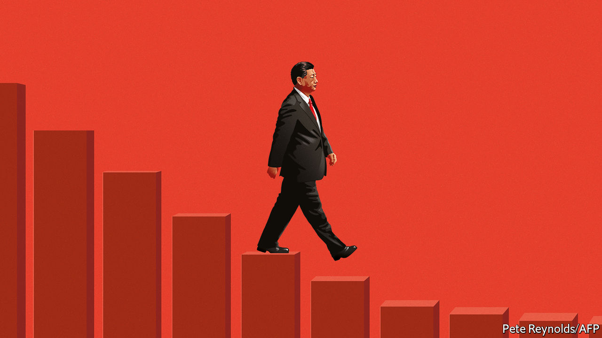

###### Ideology versus prosperity

# How Xi Jinping is damaging China’s economy 

##### Inflexible policies are trumping pragmatism 

 

> May 26th 2022 

Over the past 20 years China has been the biggest and most reliable source of growth in the world economy. It contributed a quarter of the rise in global gdp over that period and expanded in 79 of 80 quarters. For most of the period since China opened up after Mao’s death, the Communist Party has taken a practical approach to making the country richer, mixing market reforms with state control. Now, however, China’s economy is in danger. The immediate issue is its zero-covid campaign, which has caused a slump and may condemn the economy to a stop-start pattern. That is compounding a bigger problem:  to remake state capitalism. If it stays on this path China will grow more slowly and be less predictable, with big consequences for it and the world. 

After nearly two months the  is easing, but China is far from being covid-free, with fresh outbreaks in Beijing and Tianjin. More than 200m people have been living under restrictions and the economy is reeling. Retail sales in April were 11% lower than a year earlier and purchases of kfc, cars and Cartier are weak. Although some workers are living on factory floors, industrial output and export volumes have dipped. For the full year China may struggle to grow much faster than America for the first time since 1990, in the aftermath of the massacre near Tiananmen Square. For Mr Xi the timing is awful: after the 20th party congress later this year, he intends to be confirmed for a third term as president, breaking the recent norm that leaders bow out after two.

It is, however, Mr Xi who bears much responsibility for the twin blows to the economy. The first is his zero-covid policy, which has been enforced for 28 months. The party fears that opening up would lead to an exit wave that could kill millions. That may be true, but it has wasted precious time: 100m people over 60 are not triple-jabbed. It refuses to import more effective Western mrna vaccines. Instead the plan may be to push zero-covid into next year. China has backed out of hosting the Asian Cup, a football contest, in June 2023. There is talk of permanent testing stations and a standing army to swab nostrils for ever. Since Omicron is highly transmissible, more outbreaks and lockdowns are inevitable. But since the zero-covid policy is identified with Mr Xi, any criticism of it is viewed as sabotage.

That same ideological zeal is behind the second shock, a series of economic initiatives that form what Mr Xi calls his “new development concept”, which is meant to address “great changes unseen in a century”, such as the Sino-American split. The goals are rational: to tackle inequality, monopolies and debt, and to ensure that China dominates new technologies and is fortified against Western sanctions. Yet in all cases Mr Xi believes the party must take the lead, and implementation has been punitive and erratic. A blizzard of fines, new regulations and purges has caused the dynamic tech industry, which contributes 8% of gdp, to stagnate. And a savage but incomplete crackdown on the property sector, responsible for over a fifth of gdp, has led to a funding crunch—one reason why housing sales fell by 47% in April compared with a year earlier.

The government hopes a vast stimulus programme that is in the works will help it meet the official growth target of 5.5% for 2022 and calm nerves ahead of the congress. On May 19th Li Keqiang, the prime minister, urged officials to “act decisively” to restore growth, and the central bank cut mortgage rates. The party has tried to reassure terrified tech tycoons. A likely next step is a big bond-financed government infrastructure programme.

But more piles of debt and acres of concrete won’t obviate the need for draconian lockdowns or reduce the risks from Mr Xi’s economic model. It involves expanding the scope of the least productive part of the economy: the government-run one. China’s industrial policy has had formidable successes, for example building a dominant global position in advanced batteries. Mr Xi hopes that technology and a new cohort of state investment funds will make decision-making more agile. But don’t forget all the dismal failures, from rust-belt industries to microchips.

Meanwhile the incentives in the most productive part of the economy, the , have been damaged. You can see that in the financial markets, which have seen large outflows. The cost of capital has risen: Chinese shares trade at a 45% discount to American ones, a near-record gap. The calculations of investors and entrepreneurs are changing. Some fear that the financial upside for any business will be capped by a party that is suspicious of private wealth and power. Venture capitalists say they have switched to betting on the biggest subsidies, not the best ideas. For the first time in 40 years no major sector of the economy is undergoing liberalising reforms. Without them, growth will suffer.

Mr Xi’s ideological economy has big implications for the world. Though stimulus could gin up demand, more lockdowns are likely, imperilling a global economy flirting with recession. In business, China’s size and sophistication make it impossible for multinationals to ignore. But more will rebalance supply chains away from China, as Apple is reportedly doing. Chinese champions may dominate some industries of the 2030s, but the West is likely to become a warier importer of Chinese products. In diplomacy, a less ambitious and independent private sector means China’s presence abroad will be more state-led and political. It may become more malign, but also less effective, as our special report on China and Africa explains.

The perils of one-man rule

And what of life inside a more insular China? While people vent online about lockdowns and lost jobs, this is unlikely to translate into unrest thanks to surveillance, propaganda and broad support for the party’s goals. Some technocrats disagree with the country’s leftward shift but lack the power and courage required to object to it. And to the extent it can be discerned from the black box of elite politics, there is , who is 68. Yet in the run-up to a party congress that may see him secure power until at least 2027, the shortcomings of one-man rule in the world’s second-largest economy are glaring. ■


