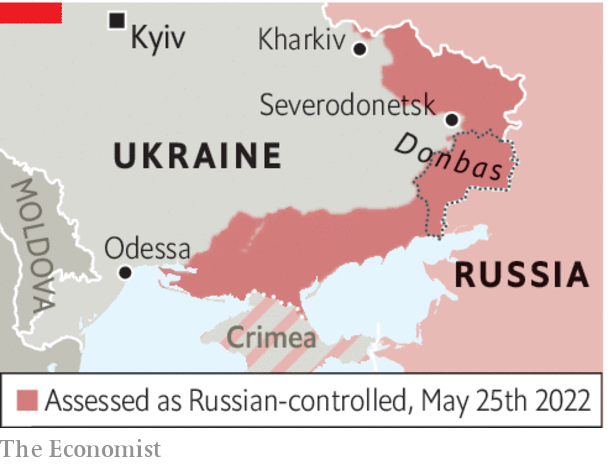

###### No time to go wobbly

# Ukraine needs support, not timorous advice 

##### Appeasing Vladimir Putin will not bring lasting peace 

 

> May 26th 2022 

Margaret thatcher supposedly admonished the elder George Bush that this was “no time to go wobbly” as the two leaders pondered their response to Saddam Hussein’s invasion of Kuwait. Were she still alive, she might very well feel the need to repeat her warning today. 

The war in Ukraine has entered its fourth month, and Vladimir Putin’s unprovoked aggression has met with a response that few imagined possible, especially from brave Ukrainians but also from the Western countries that have given them political, economic and material support. Russia’s large but incompetent army has been driven back across the north of the country, having failed to take the capital Kyiv, and from Kharkiv, Ukraine’s second city, in the north-east. But it still holds on to substantial gains in the eastern Donbas region and in the south, where it has seized a “land bridge” connecting the previously stolen Crimean peninsula with Russia itself. As the fightback continues, Ukrainian morale is cautiously optimistic, the flow of weapons from the West is increasing and America’s Congress has just authorised a $40bn package of support. 

However, there is a growing view among Europeans and some Americans that it is time to explore a . Some say the war would end sooner if Mr Putin were given an “off-ramp”, allowing him to claim some sort of victory at home. Such arguments have an emotional appeal. No one wants an endless war. The longer it lasts, the more people will die, the more homes will be destroyed, the more Ukraine’s economy will be ravaged, and the more perilously the supply of grain to the world will be interrupted. If allowing Mr Putin to save face saves lives, who could object?

 


Yet it is naive to imagine that Mr Putin is ready to make peace. Volodymyr Zelensky, Ukraine’s president, warned this week that talks would merely allow Russia time to dig in and regroup (as it has in the past), before attacking again. Ukraine’s objective remains to get “all its territory back”, said Mr Zelensky. He implored the West, as he has done repeatedly since the start of the conflict, to send more and better weapons so his country can repel the invaders. And he spoke of his concern that the West is not yet truly united in its support of Ukraine.

He is right on all counts. Great dangers lie ahead for the world if Mr Putin’s aggression is rewarded; that is, if he gets to keep the land he has occupied. Remember what happened in 2014. With little practical Western support, Ukraine in effect had to stand by as Russia annexed Crimea and then backed a separatist takeover of the eastern part of Donbas. Eight years later, nothing had been handed back; and Mr Putin, emboldened by this feeble response, decided to take a second, and much larger, bite out of a country he has repeatedly said is nothing but a 20th-century administrative invention.

If the West now reduces its support for Mr Zelensky and pushes him into premature talks, what would be the result? Most likely, that Russia would consolidate its gains; that it would swiftly break any undertaking that it gave; and that Mr Putin’s position at home would be buttressed by his victory. This is, after all, what has happened before. And sooner or later he would be tempted to try for a third bite at Ukraine, or somewhere else—such as Georgia, Moldova, or even one of the Baltic states. 

Furthermore, other despots in other parts of the world would conclude that warmongering pays, if you stick at it long enough. Faced with discontent at home, they would seek martial glory abroad to distract their people, confident that any pushback from the democratic world would be short-lived. 

No solution can be imposed on Ukraine without the consent of Ukrainians. Mr Zelensky is unlikely to remain in office if he pre-emptively surrenders territory in a vain attempt to appease his rapacious neighbour. Nor would the inhabitants of such territory submit meekly to oppressive Russian rule; they would fight a guerrilla war that could last for years. 

For now, the situation on the ground is fluid. Having pulled back from the north and the north-east, the Russians have upped the pace of their attacks in the east, targeting the Ukrainian-held city of Severodonetsk in Donbas, with the clear aim of cutting off Ukrainian forces and pushing on to Slovyansk and Kramatorsk in an attempt to secure the entire region. Where Mr Putin will stop is unclear, but unless he is soundly defeated he will continue to do all he can to cripple Ukraine. He sees an open, Western-facing democracy on his doorstep as a challenge to the inward-looking autocracy he has imposed on Russia. He will not let Ukrainians live in peace, so they have no choice but to stand up to him. The West must go on helping them until the job is done. ■


