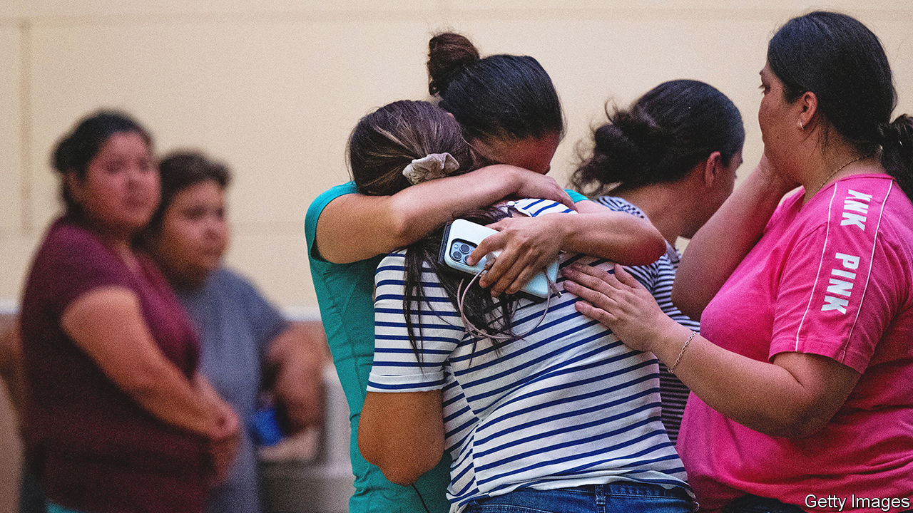

###### Learning from Uvalde

# Why America should make it harder to buy guns 

##### In many states, it is easier to own a gun than a dog. That is absurd 

 

> May 25th 2022 

The motives for mass murder vary. The teenager in Buffalo who on May 14th shot and killed ten people, most of them black, was driven by racial paranoia. The 68-year-old who killed one and injured five on May 16th in a Californian church hated Taiwanese people. What impelled Salvador Ramos to kill at least 21 on May 24th in and around a  may someday become apparent, though Mr Ramos is no longer alive to explain himself.

What these horrors have in common, though, is the murder weapon. Guns are simple, reliable tools for killing. A man with a gun and plenty of ammunition can kill more people, more quickly and with far less physical effort than he can with a knife, a blunt object or his bare hands. The weapon Mr Ramos used—a military-style assault rifle with high-capacity magazines—allowed him to keep shooting until someone shot him. That most of his victims were children makes the crime unusually horrific. But it resembles  in that the easy availability of guns made it deadlier than it might have been.

A robber who carries a gun is more likely to kill. Domestic quarrels are more likely to end in death if a firearm is handy. Suicide attempts with guns usually succeed. Police in England and Wales shot and killed only two people in 2021; American cops killed 1,055. The main reason for this vast disparity is not that English cops are gentler or less racist. It is that American police face a heat-packing public. Most of those they kill are armed; many of the rest are mistakenly believed to be so. The abundance of guns is also the main reason why the murder rate in America is four or five times higher than in a typical rich country.

By one estimate, Americans own 400m guns. If they were evenly distributed, each family of five would have six. In 2020 more than 45,000 people in America died from firearm-related injuries. Guns now kill more young people than cars do.

 believes it should be hard to own a gun. Farmers need them for pest control; hunters and other hobbyists may use them for sport. But each gun should be licensed and registered. Each owner should have to pass stringent background checks, and the process should be slow—no one should be able to buy a gun while in a fit of rage. Also, there is no good reason to let civilians own guns that fire rapidly, or magazines that let them kill a room full of people before reloading. 

In America such strict gun control is unthinkable. The Second Amendment guarantees a right to bear arms, and the National Rifle Association promotes a maximalist interpretation of it. Politicians who hint that they might make it a little bit harder to obtain a firearm face a well-organised bloc of single-issue voters. In Republican primaries, especially, few dare offend the gun lobby.

Hence the steady loosening of rules in places like Texas, where 21-year-olds can carry a handgun in public without training or a permit (both of which are needed to cut hair); and where 18-year-olds can buy a handgun if they come from a violent home (to defend themselves against abusive relatives); and where almost any adult can buy a rifle with minimal hassle. Mr Ramos bought two assault rifles legally as soon as he turned 18, and shot his grandmother before heading for the local elementary school.

This is not what most Americans want. Hefty (but dwindling) majorities favour some commonsense curbs, such as denying weapons to the mentally ill, creating a database to track all gun sales, and banning both assault-style weapons and high-capacity magazines. Congress is unlikely to deliver such things, thanks to the Senate filibuster. So cities and states should step in, though guns will always flow illicitly from lax jurisdictions to stringent ones. Voters should reward politicians who think a gun licence should be at least as hard to obtain as a driving licence. Not all gun deaths are preventable, but many could be. ■


