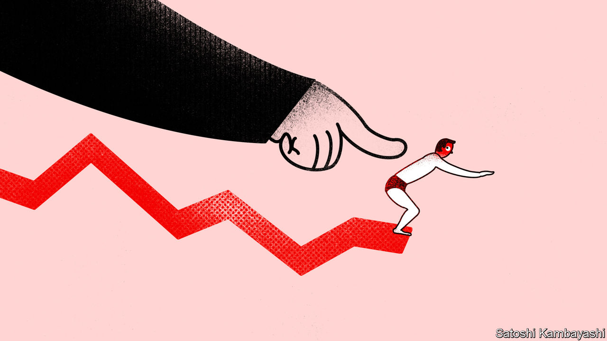
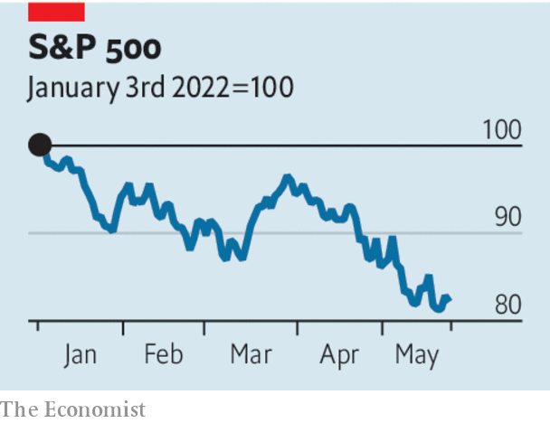

###### Prophets and profits

# Why investors are increasingly worried about recession in America 

##### And why the speed of the market correction offers a crumb of comfort 

 

> May 26th 2022 

So choppy has America’s stockmarket been this year that only a fool would predict mid-week (or even mid-Friday) whether prices will end the week up or down. At the market’s close on May 25th, the s&amp;p 500 index of leading American shares looked on course to break a seven-week losing streak—or to extend the rout to eight weeks. Thus far, at least, it has avoided (just) the 20% peak-to-trough decline that is the informal definition of a bear market. But there are signs that America’s markets are entering a new, more worrying phase.

From January until early May, falling share prices could be put down to the effect of rising bond yields, as fixed-income markets responded to guidance from the Federal Reserve that interest rates would be going up a lot and fast. Higher interest rates reduce the present value of a stream of future company profits. Shares were marked down accordingly, especially those of technology firms whose profits could be projected furthest into the future. But in recent weeks share prices have kept falling, even as bond yields have dropped back. This combination points to fears of recession. Indeed, the mix of Fed tightening, slowing gdp and rising production costs has the ominous feel of the later stages of a business cycle. The expansion is barely two years old. Yet investors are already worried that corporate profits are under threat. 

The world economy has been sideswiped by several big shocks. China’s gdp is likely to contract sharply in the current quarter, because of renewed lockdowns. Europe’s consumers are suffering a squeeze on purchasing power because of sky-high gas prices. America’s economy had seemed resilient. But parts of the economy that are sensitive to rising interest rates are faltering, even though the Fed has barely got going. Figures released on May 24th showed that new home sales fell by almost 17% between March and April. Any sign from corporate reporting that demand is flagging is seized upon. When Snap, the company behind Snapchat, a social-media app, said this week that its sales would be weaker than it had suggested as recently as April, its share price plunged by 43%. The share prices of Walmart and Target fell when the two retailers reported they had been left with piles of unsold stock after misjudging consumer demand.

 


Slower growth is one element of a textbook profit squeeze. A consequence of the mostly stable cost base of big businesses is that, when sales rise or fall, profits rise and fall by a lot more. This effect boosted profits considerably last year, but as gdp slows it goes into reverse. The other element of a profit squeeze is higher costs. A variety of bottlenecks have pushed up the prices of key inputs, notably energy. Debt-service costs are rising with interest rates. But the main worry is wages. The jobs market in America is tight. Pay rises have become more generous as a consequence. Corporate America finds itself in a double bind in this regard. If it passes on rising wage costs in higher prices, it will keep inflation high and force the Fed to raise interest rates more aggressively. If it absorbs rising costs, that will crush profits. 

Is any relief for investors in sight? Some soothsayers feel they are due a bear-market bounce. Their theory is that if a lot of traders have already sold stocks, there will be fewer potential sellers to drive prices down in the future. But a rally based on more balanced position-taking will not do much to change an awkward macroeconomic backdrop for equities. 

If consolation can be found in the present conjuncture it lies in the fact that financial markets have done a lot of the Fed’s heavy lifting for it. Since the start of the year, bond yields have risen sharply; mortgage rates have surged; spreads on corporate bonds have widened; the dollar has climbed; and share prices have slumped. In a counter-factual world in which financial markets had shrugged off the Fed’s two interest-rate increases so far, the risks of a hard landing for the economy would, paradoxically, be greater. Inflation pressures would keep building. But as things stand, interest rates may not have to go quite as high as they otherwise might have. Amid all the down days for the stockmarket, this is not a great comfort. But every little helps. ■


