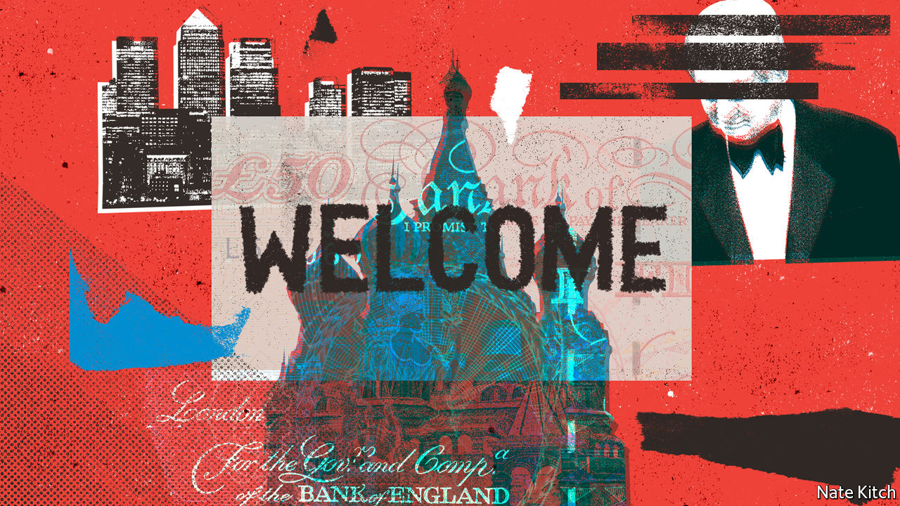
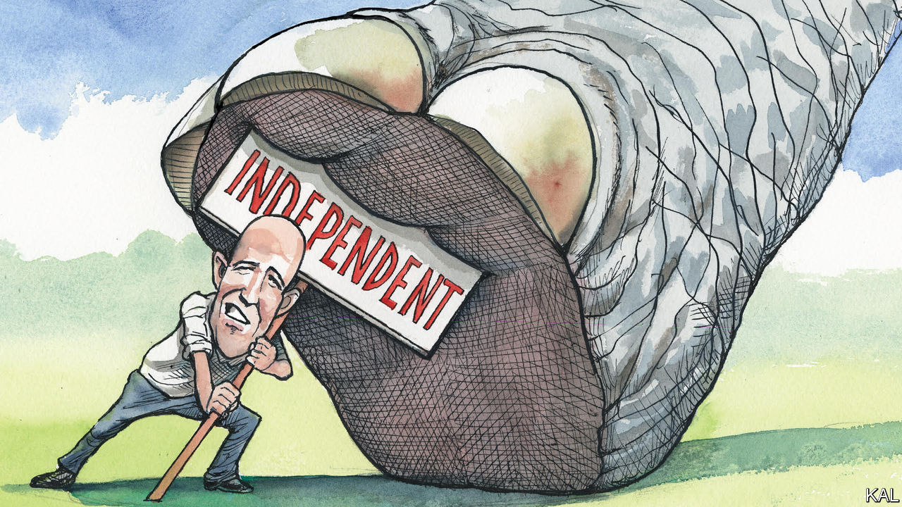
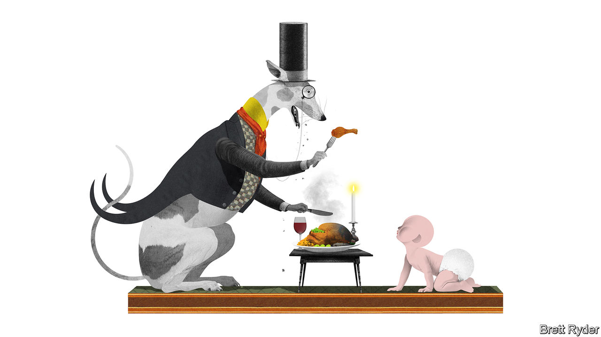
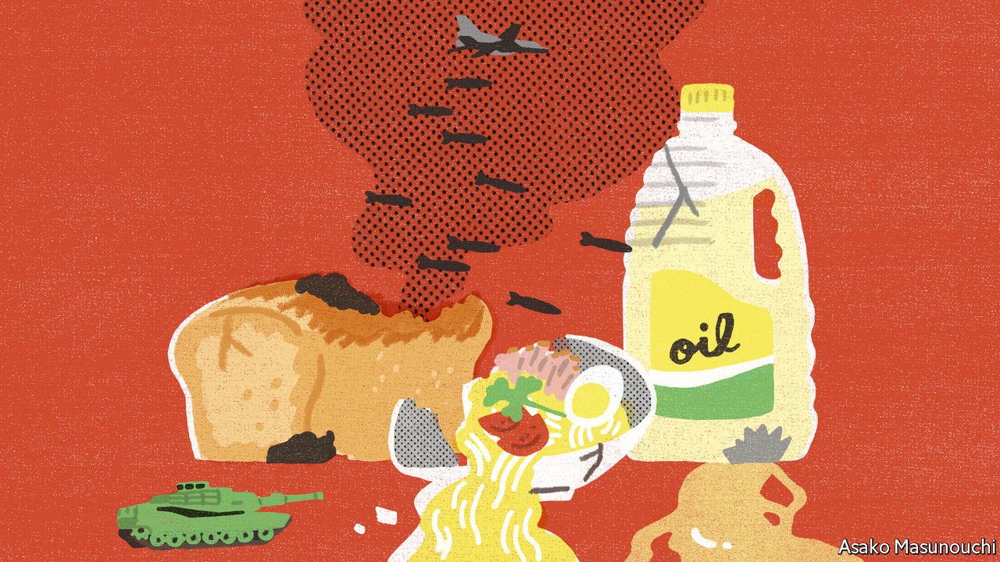
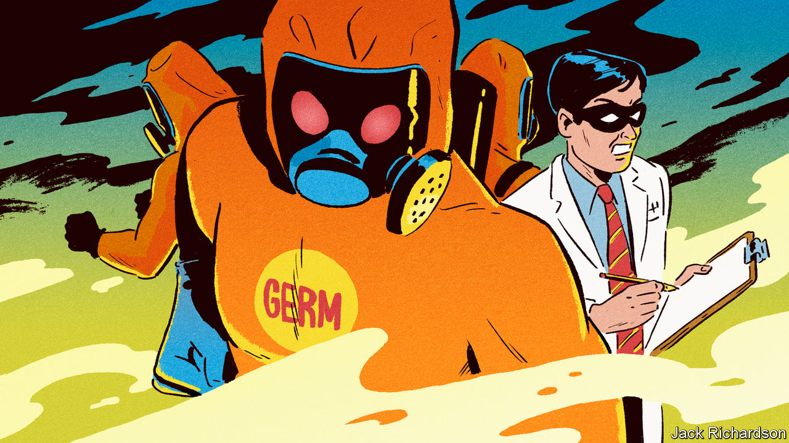
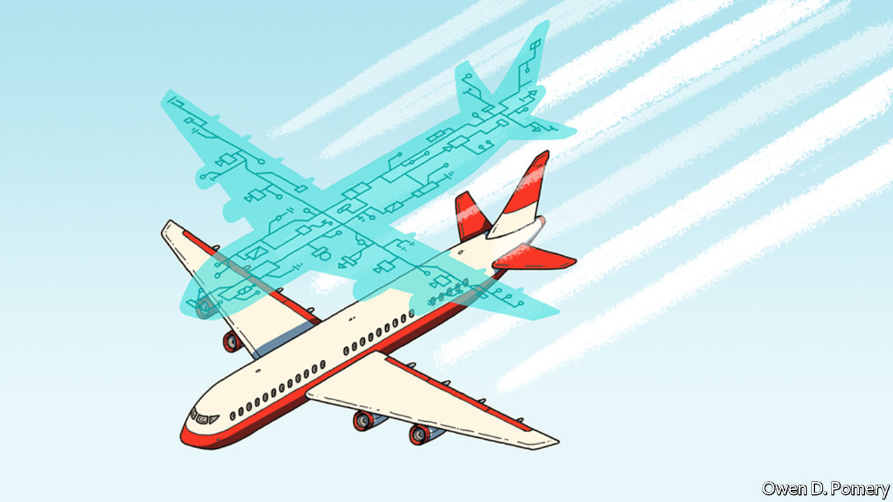

###### On money-laundering, medieval history, Utah, shrinkflation, food oil, pandemics, digital twins, football

# Letters to the editor 

##### A selection of correspondence 

 

> May 26th 2022 


Cleaning up London

Your article on tainted foreign money in London was timely, coinciding with the launch of our Economic Crime Manifesto (“”, May 7th). You cited four areas that require attention to drive out dirty money. We, too, have identified four pillars in the effort to tackle corruption: transparency, making it easier to identify the real owners of companies and assets; enforcement, properly funding the agencies charged with going after economic crime; accountability, making the bosses and enablers, such as the lawyers and estate agents mentioned in your article, responsible for their actions; and regulation, giving Companies House proper powers and funding to prevent its misuse.

The sheer size and success of the City and Britain’s financial industries have contributed to London’s status as a laundromat for dirty money. Our defences are overrun. The tainted cash that runs rampant threatens our very security. Prosperity must not be built on the ill-gotten gains of crooks and kleptocrats. Britain’s unique place in the global financial system presents an opportunity. The forthcoming Economic Crime and Corporate Transparency bill offers a chance for Britain to lead by example. 

dame margaret hodge mp

Chair of the All Party Parliamentary Group on Anti-Corruption and Responsible Tax

kevin hollinrake mp

Co-chair of the All Party 

Parliamentary Group on Fair Business Banking

House of Commons


I was glad to see you raise the issue of low pay in central government, particularly in reference to the salaries of investigators at the National Crime Agency. However, the nca is better paid compared with its sister organisations, such as the Home Office, where a typical investigator earns under £25,000 ($31,400). In the past 12 years pay is down by 30%, after accounting for inflation, on conservative estimates. It has now become impossible to hire any specialist staff. Turnover is higher than ever and the average time in a job is under two years. 

jesse raikes


 


The primitive Taliban

The Taliban is a byword for “medieval violence, bigotry and misogyny”, says Banyan (). Surely you don’t mean to suggest that the era of 500 to 1500 was so totally devoid of human accomplishment that it is comparable to how Afghanistan is run today? Where is the Taliban’s Eleanor of Aquitaine, Thomas Aquinas, or Hildegard of Bingen, let alone its Harun al-Rashid, Moses ben Maimon (Maimonides), Ibn Sina (Avicenna), or any of the other leaders, thinkers, authors, poets and scientists of that era, spanning three continents and dozens of civilisations? What new systems of banking has it invented lately? What schools of art have flourished under its patronage? Where are its cathedrals, mosques, universities and libraries? 

Yet again, your paper maligns a thousand years of human history by using the term “medieval” as a pejorative. Or perhaps you mean to suggest that of all the eras of history, the one dubbed "medieval" promoted the worst violence, bigotry and misogyny humankind ever invented. In that case, please look merely to the previous century, in which you can find violence, bigotry and misogyny on a level that far exceeds anything experienced by those who lived through the Middle Ages.

eva st clair


 


Republican regret in Deseret

If there is any deeply red state capable of shrugging off its infatuation with Donald Trump, it would be Utah. Yet I am far more pessimistic about Evan McMullin’s prospects as an independent Senate candidate than (May 7th). Even if it were possible to unite votes from moderates and Democrats, polls suggest that Mr McMullin would still lose to the unpopular incumbent, Mike Lee. Lexington mentioned that Mitt Romney has refused to endorse either Mr Lee or Mr McMullin, but most people here simply regard Mr Romney as a traitor to the Republican Party, and will be happy to replace him with a more hard-line candidate when his term ends in 2024.

ben murton


 


Horrible bosses

I enjoyed Schumpeter’s discussion of shrinkflation (), especially in light of your coverage of enticements to get staff to return to the office. The firm I work at provides free coffee to tempt workers back. As more and more people return, the coffee runs out earlier and earlier in the day. Management’s response to this of course is to provide smaller cups. 

harald anderson


 


From the frying pan

It is 2,345 miles (3,775km) from Jakarta to Dhaka, and yet that is the reach of the blow unleashed by Indonesia’s temporary ban on its export of palm oil (“”, May 7th). The ban has driven up the global price of edible oil, a big problem for importing countries such as Bangladesh. Indonesia surely did not have Bangladesh in mind when it took its decision, but it has cast a long shadow. Organisations such as the Global Alliance for Improved Nutrition will now have to delay work supporting the Bangladeshi government’s goal of fortifying edible oil with Vitamins a and d, given that local food-oil manufacturers are faced with huge price uncertainty. This will deprive at least a quarter of the country’s 168m people of the nutrients they need to avoid premature mortality and preventable morbidity. 

Food needs to keep flowing across borders and oceans if catastrophic increases in hunger and malnutrition are to be prevented in the coming months and years.

lawrence haddad

Executive director

Global Alliance for Improved Nutrition (gain)


 


A global treaty on pandemics

As your review of “How to Prevent the Next Pandemic” by Bill Gates correctly noted, if we are to stop the next outbreak from becoming a global pandemic, an organisation dedicated to pandemic preparedness and response will need to “chivvy governments” to move from rhetoric to action (“”, May 7th). However, neither this statement nor the book goes far enough. 


The largest gap today is the lack of accountability and compliance to ensure all countries prepare for outbreaks, act together if one spreads and distribute life-saving resources equitably. During covid-19, most countries defied what few regulations were in place and ignored sound public health recommendations from the World Health Organisation. 


It’s not that we don’t know what to do, or even, aren’t being told what to do, it’s that we’re not doing it. We need an international treaty or convention that truly holds countries to account. 


Whether we’re discussing the climate crisis or the next global health security threat as Mr Gates has done in his last two books, there will be no tangible impact without clear accountability. 


Dame Barbara Stocking

Chair

Panel for a Global Public Health Convention


 


When computers disagree

The idea of creating a digital twin for a piece of technology has a precedent (“”, May 7th). In “2001: A Space Odyssey”, co-written by Arthur C. Clarke, a digital twin of the hal 9000 supercomputer onboard the spacecraft making its way to Jupiter is monitored by mission control on Earth, using a twin version of hal. A discrepancy between the two hals suggests that there is a problem with the Jupiter-bound model, leading to the decision to shut down the hal in space, a decision with disastrous consequences. 

Similarly, if planes were routinely monitored by an artificial-intelligence digital twin, a discrepancy involving a safety issue discovered while a passenger airliner was in flight might result in a serious dilemma for decision-makers: which twin to believe?

robert checchio


 


Football as life and death

Your article on the Premier League’s finances commented that Manchester United has “even” had an “official paint partner” (“”, May 14th). In 2018 my beloved Brentford Football Club announced a deal with a local undertaker as its “official funeral partners”, under the headline “Brentford ‘til I die”.

rev peter crumpler


