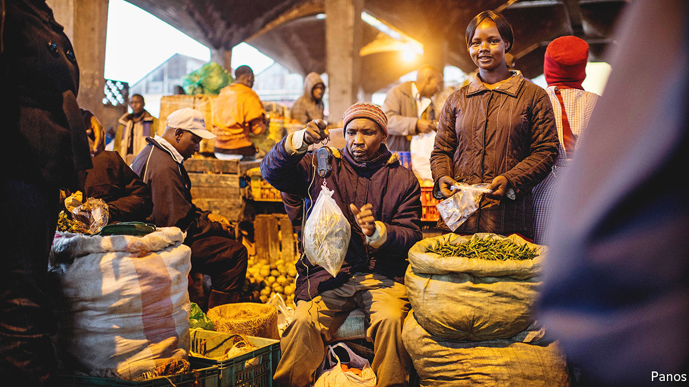

###### Clicks and middlemen

# How e-commerce looks different in Africa 

##### Instead of selling directly to consumers, startups are targeting informal retailers 

 

> May 26th 2022 

To the untrained eye Wakulima market in Nairobi, Kenya’s capital, looks like pandemonium. Scores of workers push handcarts laden with fruit and vegetables, jostling past heaving crowds. Buyers and sellers loudly debate the quality of a papaya or the merits of an onion. It seems chaotic. But not to James. The wholesaler (who asked that his surname not be used) gazes serenely as hirelings toss pineapples out of an open lorry, while others arrange the spiky fruit in a dozen piles of varying price, size and juiciness. 

James is one of many middlemen keeping Kenyans fed. He buys produce from brokers, who have bought from farmers. Transporters take the goods to Wakulima, where James sells to informal retailers, who take the food to street stalls or kiosks, where they sell small amounts to customers. “This is a good business,” he says. Does he not worry about competitors? He shakes his head. “Of course, we agree on prices.” 

Middlemen are crucial to shopping across Africa. Many consumers are too poor to buy more than a few goods at once, or to travel to large shops, so they rely on informal vendors. These account for about 90% of retail transactions in Africa. But it is too costly for these small-scale sellers to source directly from farmers or manufacturers, so they rely on middlemen, often buying at wholesale markets. 

These supply chains ensure goods get to every nook and cranny. But research suggests that relying on middlemen means, at best, lots of mark-ups and, at worst, that middlemen act like cartels, keeping prices low for producers and high for consumers. More promisingly, these inefficiencies have created opportunities for e-commerce startups, which are disrupting traditional ways of doing business. 

Academic evidence points to the market power of established middlemen. In a paper published in 2020, Lauren Falcao Bergquist and Michael Dinerstein, respectively of the Universities of Michigan and Chicago, studied Kenyan maize markets. To test the extent of competition among the traders who sell maize at wholesale markets, the researchers handed out a subsidy per kilogram sold by the traders. In a well-functioning market lower costs for sellers would mean lower prices for buyers. But the middlemen passed on just 22% of the reduced costs. 

An earlier paper by David Atkin and Dave Donaldson, today both at the Massachusetts Institute of Technology, looked at the cost of getting goods from a to b in Ethiopia and Nigeria. They found that it was four to five times more expensive than equivalent journeys from wholesaler to retailer in America, a difference that largely remained after controlling for the quality of the roads. One reason for the gap was the role of intermediaries. The authors noted that when the prices of the relevant goods fell in world markets, most of the surplus was captured by middlemen. 

“The price of food is a sign of how efficient markets are,” says Peter Njonjo, Twiga’s chief executive. The Kenyan e-commerce firm buys fresh produce directly from farmers and takes it to warehouses, where it co-ordinates delivery to informal retailers. The vendors place orders on the Twiga app, which gives the firm lots of data to match supply with demand. Mr Njonjo claims that Twiga has reduced the share of farmers’ produce that rots from 40% to 5%. That means farmers and retailers both get better margins. In theory this should result in shoppers enjoying lower prices.

Twiga is one of several African e-commerce firms attracting tens of millions of dollars in venture capital. TradeDepot, which operates in Ghana, Nigeria and South Africa, has a similar model, focused on packaged goods. As Onyekachi Izukanne, its chief executive, explains, for clients such as Unilever, a consumer-goods conglomerate, “the economics of getting into millions of small stores doesn’t make sense.” Large suppliers have historically relied on middlemen to reach informal retailers. “Where we come in is to be able to aggregate a lot of demand, and to aggregate inventory from multiple suppliers.” 

On May 3rd Wasoko, a similar e-commerce firm operating in six countries, topped a  ranking of African companies based on how fast their revenues grew from 2017 to 2020. Its boss, Daniel Yu, says the growth of firms like his reflects their understanding of African retail. In markets where many shoppers buy sachets of shampoo or scoops of cooking oil, and live in hard-to-reach places, selling directly to them online is quixotic. 

For all the talk of the African middle class, he says, “the reality is the Amazonian consumer does not exist.” Mr Yu argues that is why, for instance, Jumia, a business-to-consumer firm once dubbed “the Amazon of Africa”, has struggled to live up to its initial hype. The business-to-business e-commerce model, which has proved successful in parts of Asia and Latin America, may stand a better chance. 

If Wakulima market typified the old way of doing business, then the new way is symbolised by Twiga’s huge warehouse in Tatu City, a bespoke development 20km north of Nairobi. Among other modern features, it has Africa’s largest facility for ripening bananas. Sprays of ethylene gas almost magically turn shelf after shelf of green fruit a lustrous yellow. It would not look out of place in rich countries, notes Tim Broekhuizen, a Dutch logistics expert hired by Twiga after 17 years running supply chains across Asia. The facility is the sort that African retail has long lacked. And it may be enough to worry even the most serene of middlemen. ■

