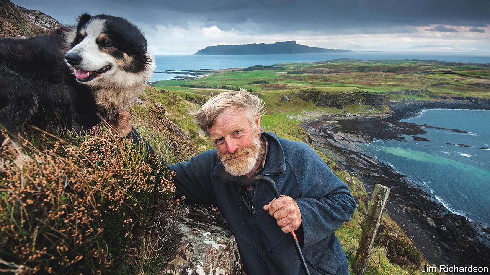

###### The barefoot laird

# Lawrence MacEwen made a tiny island prosper 

##### The chief of the isle of Muck died on May 16th, aged 80 

 

> May 26th 2022 

As soon as spring arrived, the young Lawrence MacEwen shed his shoes. Barefoot, he ran to school down the only road on Muck, a mile and a half of gravel mixed with grass. Barefoot, he jumped among the fallen basalt stones of the dykes built long ago by kelpers, who had made a living gathering seaweed from the rocks. Barefoot he climbed the craggy western cliffs, hanging on to heather for dear life, and scampered to the top of Beinn Airein, the highest hill, to look out past Eigg and Rum to Knoydart and the Cuillin Hills. Barefoot he would stand for hours on the beach below his house, so mesmerised by the rolling tide that he could not stir until his mother called him in for tea. His feet would sink a little into the white sand, embedding him in the place. 

It was a tiny place at that, not quite a mile long and two and a half miles broad, the smallest of the Small Isles off Scotland’s west coast. His family had bought it in 1896 and made a decent living from it, for its deep volcanic soil could provide fine hay, corn and vegetables, as well as grazing. Yet it was also left behind by the world and benighted by the weather, sometimes cut off entirely by autumn storms. Most residents had been evicted in the 19th century, or had moved away to softer places. By the late 1960s the Mac-Ewens, too, were wondering whether or not to stay. Lawrence’s elder brother Alasdair, now the owner, was set on going to the mainland and making Muck a summer-only place, with holiday lets. But Lawrence knew he could never leave, being rooted there.

So he took Muck on, at 27, and for the next 50 years directed its future. He liked a challenge. On Muck, they came from all directions: from the driving wind that bent him forward, to the sea that drowned several of the island’s scarce fishermen, to the vexing logistics of driving skittish sheep and cattle into a listing wooden boat to get them to market in Glenuig or Arisaig, over the water. He took all this in his tall, loping stride. A dozen mishaps attended every scheme he fixed on; every Muck task entailed blood, sweat and turmoil; but his devotion to the island transcended everything. 

This being so, he did not want to change it much. He worried about television, cars, crowds of nosing tourists and shuttered second homes. On the other hand, visitors meant income. He struggled with this dilemma. Under his aegis there was only one tiny hotel, built by his younger brother, in the single settlement at Port Mor, along with a tea-room selling his wife Jenny’s wonderful cakes. Those would be baked at dawn, while the fitful generator was on; reliable electricity did not come until 2013. There was still no pub, post office, general shop or even post box. No church either, though in the tiny graveyard lay the ruins of a chapel. Nor, still, was there an easy harbour, because to build one on the best site would have spoiled the glorious view of Rum and Eigg. And the population, as for decades, still hovered around 40 souls. 

But the laird was sure that 40 souls could keep Muck going, if they worked hard enough and pulled together. What the island needed was nothing sudden, but a spirit of community and self-sufficiency. He encouraged the islanders to plant trees, having tried as a teenager to plant 1,000 beech and spruce saplings in a day. He took over neglected gardens and set up polytunnels, so that everyone could grow vegetables. For a while his herd of Ayrshires produced free milk for the whole island, until the health-and-safety ghouls came down on him. (They moaned about the water, too, though he knew Muck’s springs were pure as any bottled kind.) He also held an annual Open Day, with tours of his farm and displays of produce, to show what little Muck could do.

The hub of his philosophy was the island’s nursery-and-primary school. Attendance sometimes sank to one pupil, but it was vital to keep it going. Children were the future, even though at 12 they were bound to leave for schooling on the mainland. Those earlier years were a precious training in the love of nature and simplicity that he had; when people applied to him to settle on Muck, those with infants came first. For a time, before the residents built a community centre with Lottery money, the new schoolhouse he also insisted on was where they held their meetings, parties and dances, the beating heart of the island. 

At these their laird would almost always appear, with his shaggy red-blond beard and sea-blue eyes, often barefoot. Though his voice had been honed and anglicised at Gordonstoun, there was not a jot of arrogance in him. Barefoot again, he would joyfully hand out Jenny’s tea and scones. Equally, he would take a shovel to concrete and gravel whenever it was required, and topics such as the new pier would be put to a democratic vote. 

In fact he did not see himself as a laird at all, but as a steward and a farmer. His usual dress was a dung-smelling boiler suit and wellies, his normal conveyance an ancient red Massey Ferguson tractor, and his chief friends and companions his 40 red Luing cattle. He kept 600 sheep too, mostly dark-fleeced Jacob-Cheviots of which he was very fond. But the cows were his passion. He would stand for long moments scratching and enchanting them, while he recited one of the scores of poems he had learned as a boy: “She neither smiled nor kissed him/because she knew not how/for he was only a farmer’s lad/And she was a fine Luing cow.” 

That scene appeared in a documentary, “The Prince of Muck”, made by Cindy Jansen, a Dutch film-maker, over four years from 2014. Her film caught the laird at a time when his son Colin had taken over the farm and Lawrence, still determined to look after his island, could not bear to let go. He was left in a niche with his favourite cows, stubbornly milking them by hand in the byre. Under Colin Muck had acquired a fish farm, wind turbines, Wi-Fi, a luxury hotel and holiday lets. The island had let the world in. 

Gradually he came to accept these things. Yet his favourite vision of the future was a different one. In it he lay in the little unfenced graveyard, under the good Muck earth, while his cows wandered over him, gossiping to him as he had to them. He would surely hear their whispering and munching as he lay there, barefoot, embedded in the place. ■

