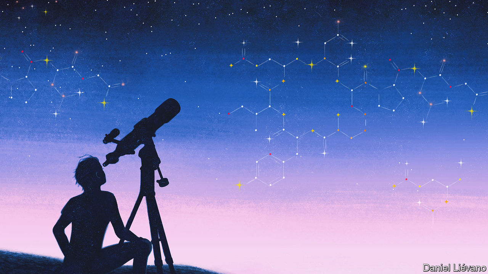
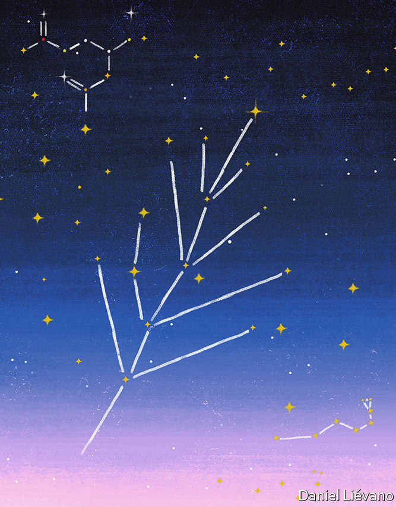

###### Life, but not as we know it

# How to improve the search for aliens 

##### So far, people have sought Earthlike biology. That will change 

 

> May 25th 2022 

For decades, astronomers searching for life beyond humanity’s home planet have had a simple strategy: follow the water. Water is the  of terrestrial life and as thousands of new planets have been discovered orbiting faraway stars, the greatest levels of excitement have usually been reserved for those in the “habitable zones” of their systems—in other words orbiting at a distance where liquid water could exist on the planet’s surface. 

The next step has been to look for biosignatures—molecules which might betray the existence of biological processes. These could include oxygen or methane in a planet’s atmosphere. On Earth, those molecules persist only because living things constantly regenerate them. 

The problem with both these approaches is obvious—they are restricted to finding life as currently known. But, as Natalie Grefenstette, an astrobiologist at the Santa Fe Institute in New Mexico, points out, “we don’t know if other forms of life would necessarily have the same signatures, if they would have the same metabolisms, if they would be based on the same genetic molecules or any of the same molecules at all.” Life on Earth could have evolved in the way that it has because the specific chemistry of the planet at crucial times gave rise to selective pressures which might not be present on other worlds. “And so we’ve been thinking—if life were different, how do you even look for that?”

Exotic beasts and how to find them

From May 16th-20th, at AbSciCon, a biennial astrobiology meeting organised by the American Geophysical Union and held this time around in Atlanta, Georgia, astrobiologists including Dr Grefenstette considered that question and discussed ways to expand their searches in the coming decades, so that they might stand a better chance of recognising more exotic forms of life than are currently being sought. To do this, they will need several strategies. 

The first begins by imagining the various different chemistries which exotic forms of life might employ, and using those to devise a wider set of potential biosignatures. On Earth, the most important molecules of life almost all involve carbon atoms. These are particularly versatile because they can form chemical bonds with up to four other atoms, including other carbons, to create complex molecular structures. Carbon is the fourth most abundant element in the universe and the molecules it forms can survive for long periods in the sorts of temperatures and pressures found on Earth’s surface.

An exotic lifeform might plausibly, however, rely on silicon instead of carbon. Silicon sits just underneath carbon in the periodic table and thus shares with it the ability to bond with up to four other atoms. Familiar examples of the results are most of the huge diversity of minerals which make up rocks, for silicon is the second most common element in Earth’s crust. It is also the seventh most abundant in the universe, which means there is plenty of it available for potential silicon-based lifeforms to use. 

Alien life might, though, have its roots in something yet more exotic. In the laboratory, metal oxides known as polyoxymetalates have shown some remarkably lifelike abilities, such as being able to form membranes (dubbed “inorganic chemical cells” by Lee Cronin, a chemist at the University of Glasgow) and being able to assemble, with some chemical help, into complex structures reminiscent of dna. 

Whatever its building blocks, though, life will need a solvent in which to function. On Earth, that solvent is water. 

Water is a good solvent because it is a “polar” molecule, meaning its electrical charge is unevenly distributed. In a molecule of HO the oxygen has a slightly negative charge and the two hydrogen atoms are, by way of counterbalance, slightly positive. This polarity causes water molecules to stick to similarly polar molecules, making them good at dissolving other chemicals—which, in turn, once thus in solution, can interact with each other. That enables water to support the myriad functions of life, and no other abundant chemical on Earth matches this versatility.

Other chemicals can, however, fulfil some of the roles water plays. Life elsewhere might, perhaps, have found a way to employ ammonia. This, like water, is polar, and therefore good at dissolving things. It is not quite as good at doing so as water, though, and it also stays liquid (at terrestrial atmospheric pressures, at least) only between -78°C and -33°C. But that would make it available in liquid form in frigid places such as Europa, a moon of Jupiter, and Titan and Enceladus, moons of Saturn, where water itself would be frozen.

Possible solutions

Titan in particular is believed to host vast ammonia-rich underground lakes which might act as cradles for chemically exotic life. But other possibilities exist there, too. Dr Grefenstette says astrobiologists are also intrigued by the lakes of liquid methane that cover Titan’s surface (the average temperature of which is -179°C). Methane exists on the surface of Titan in much the same way that water does on Earth—in liquid, gaseous and solid forms. 

Methane is not a perfect solvent for life. It is not polar and therefore not as versatile in that regard as water. And it remains liquid (again, at terrestrial atmospheric pressures) only between -182°C and -161°C. Since chemical reactions proceed more rapidly at higher temperatures, on Titan’s surface they would be pretty slow. But astrobiologists hypothesise that life composed of different materials to those on Earth—smaller hydrocarbons and nitrogen, for example—could feasibly eke out an existence there.

Perhaps the most promising general-purpose alternative to water is formamide, a colourless organic liquid composed of carbon, hydrogen, oxygen and nitrogen (all elements common in the universe) that can dissolve many of the same chemicals as water—including proteins and dna. It can also stay liquid at up to 210°C, making possible a large range of chemical reactions on planets with more extreme surface temperatures than Earth’s. Formamide is such an intriguing alternative to water that some astrobiologists even argue that it might have been the main solvent used by the earliest forms of terrestrial life. This chemical has been located in vast clouds at the edge of the solar system and also in more distant nebulae where stars are forming, according to Claudio Codella, an astronomer at the Arcetri Astrophysical Observatory in Florence, Italy. Finding it definitively on another world would surely pique interest among those searching for exotic forms of life.

The units of life on Earth—cells—are contained within lipid membranes. These keep the chemical reactions which sustain life concentrated inside a cell, and the exterior world outside it. Such membranes would not be stable in a medium such as liquid methane. But exotic lifeforms on Titan might instead build membranes from structures called azotozomes. These are molecules, currently hypothetical, made from nitrogen-rich organic compounds, according to Paulette Clancy, a chemist at Cornell University who came up with the idea. They would, she thinks, be capable of operating in the ultra-low temperatures of a place like Titan.

Or perhaps there could be life without any membranes at all. Lifelike chemical reactions have been shown to occur on the surfaces of certain minerals, including pyrites and various clays. These often contain networks of pores and cavities that could serve the compartmentalising function of lipid-based cells. Or biological reactions might be contained within drops of liquid floating in planetary atmospheres.

 


Finally, life needs to store information about itself and pass that information on to its offspring. Terrestrial organisms do this using molecules called nucleic acids. These employ four different molecular units known as nucleotides to carry a code of instructions that can build 20 different amino acids, which then link up in various combinations to form proteins. But laboratory experiments and samples from meteorites show that many more nucleotides and amino acids than these exist. Though they have not been incorporated into life on Earth, they could form the basis of alternative systems of genetic information. 

Identifying exotic life forms made from different materials is thus a matter of widening the search from Earthly biosignatures—oxygen, methane and so on—to include chemicals that might be made by various imagined biochemical systems. One tool for this search is the mass spectrometer, a device that ionises samples and then filters those ions by mass. 

Mass action

Mass spectrometers have been the eyes and ears of decades of space exploration, said Luoth Chou, an astrobiologist at Georgetown University. Successive generations of these devices, flown into space, have permitted researchers to characterise chemicals everywhere from the surface of Mars, via the atmospheres of Venus and Titan, to the plumes of water ejected from geysers on Enceladus. 

The next generation of mass spectrometers, though, will be smaller and yet more powerful. And they will be carried aboard a range of missions far and wide into the solar system.  will hop around the surface of Titan in the mid-2030s and take a close-up look at the molecules there.  will orbit Venus in 2031. The Jupiter Icy Moons Explorer will explore the Jovian satellite system, starting in the early 2030s. And ’s mass spectrometer will provide a high-resolution characterisation of that body, beginning at the end of this decade.

If exotic life does exist, however, it could use chemistry that goes way beyond anything astrobiologists can currently imagine. To get around that means thinking of biosignatures which depend not on chemistry but rather on the patterns of behaviour associated with life. 

There is no universal definition of life. But astrobiologists often default to nasa’s operational definition of “a self-sustaining chemical system capable of Darwinian evolution”. Living things self-replicate and make large amounts of specific complex molecules (for example, proteins or dna). They also draw energy and consume resources from their environments to fuel their metabolisms. Based on these ideas, so-called agnostic biosignatures could include looking for excesses in certain elements or isotopes in an environment, or for specific patterns within groups of chemicals that cannot be explained by abiotic processes alone. Peter Girguis, an evolutionary biologist at Harvard University, told the AbSciCon meeting that this new class of biosignatures would be “indirect proxies for a living organism”.

One example would be to search for gradients in an environment—zones of sharp change in, for example, heat or electrical voltage or chemicals. According to Dr Girguis, “all living organisms that we know of establish gradients of one kind or another to maintain themselves at a kind of disequilibrium from the environment.” 

Some of these gradients occur at cellular and microscopic scales, and can be incredibly sharp and therefore distinguishable from non-biological processes. Others are larger-scale. In marine sediments on Earth, for example, microbes work together to oxidise methane, a process tied to the chemical reduction of sulphate ions. “We see gradients in methane and sulphate concentration over centimetres, and they’re really pronounced,” says Dr Girguis. “This is a biological manifestation of their activity and yet this is detectable by simply making abiotic measurements.”

Another tactic would be to study the complexity of the molecules at a particular location. Biological molecules are selected and shaped by evolution to do specific jobs within an organism, such as assembling or disassembling other molecules, or signalling between cells. That often requires unusually energetic chemical processes, which in turn need the help of catalysts. On Earth, these catalysts are protein molecules called enzymes which are, themselves, the product of evolution. Finding complex molecules of any sort might thus be considered a potential biosignature. 

A related concept is what Chris McKay, a planetary scientist at nasa Ames Research Centre, calls the “Lego principle”. The idea here is that life is recognisable by its use and reuse of a selected set of molecules. Abiotic samples scooped up from an alien world would be expected to contain a wide array of organic molecules, some of them in fairly small amounts. A biological sample, by contrast, would contain large numbers of just a few distinctive molecules. Molecules that are chemically similar (left-handed and right-handed versions of an amino acid, for example) might have markedly different concentrations if they came from a biological sample, whereas they would probably be present in near-equal numbers in a non-biological one. Spotting patterns like these would be independent of the specific biochemistry involved.

The past as a clue to the present

Such methods would widen the astrobiological search wherever it was possible to obtain a sample—in other words any world in the solar system to which researchers can send a probe—and apply to it tools such as miniaturised, space-hardened mass spectrometers. For planets going around other stars, though, things are obviously trickier. Few people think human beings or their machines will visit any of the rapidly expanding population of these exoplanets anytime soon. Astrobiologists are instead considering other ways to search for new agnostic biosignatures. Michael Wong, an astrobiologist at the Carnegie Institution for Science, in Washington, dc, presented a technique that applies what is known as network science to data about exoplanets’ atmospheres. These data can be gathered using telescopes on, or orbiting, Earth. 

Any chemical system, the chemicals within an atmosphere included, can be represented by a so-called network diagram, in which molecules that react with each other in some way are connected by lines. Dr Wong showed that, when compared with those of other planets in the solar system, Earth’s atmospheric network stands out like a sore thumb. In fact Earth’s network more closely resembles those of biological systems, such as marine food webs. This technique is a work in progress and Dr Wong said it would need a lot more development before astrobiologists could include it in their life-detection toolkit. But it is an intriguing approach.

Dr Girguis told the meeting that future searches for exotic life in the universe would do well to learn from mistakes made by explorers searching for life in Earth’s oceans in the 19th century. In one expedition, for example, Edward Forbes, a prominent naturalist from the Isle of Man, was dredging in the Aegean Sea. He noticed that the farther plants and animals were from the water’s surface, the less well they thrived. In 1843 he extrapolated his incomplete data to propose his azoic hypothesis, which stated that life would not exist at all below 550 metres. 

It took several decades to prove him wrong, an effort that involved some of the first scientific endeavours designed to explore the deep ocean—such as the  expedition that sailed from 1872 to 1876. These, said Dr Girguis, were some of humanity’s earliest life-detection missions. “Let’s not be too quick to extrapolate,” he warned his fellow astrobiologists. “And let’s never underestimate the capacity of living organisms.” ■


