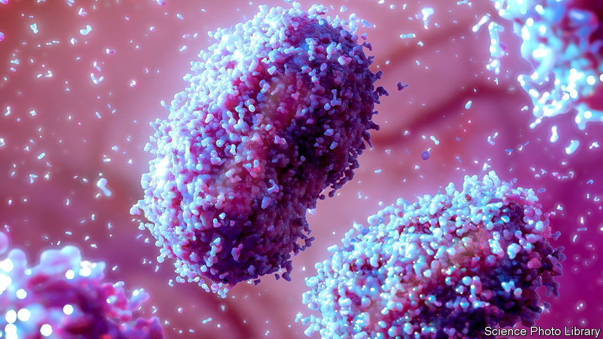
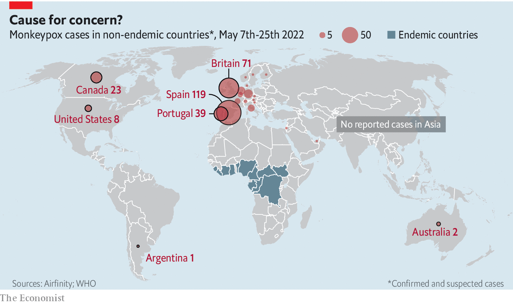

###### A new outbreak of disease

# Monkeypox is not covid mk2, but it needs to be nipped in the bud 

##### The illness can be dangerous for children, pregnant women and the immunocompromised 

 

> May 25th 2022 

Since britain reported a case of monkeypox on May 7th, more than 300 further instances have been noted across the world. The disease, which is usually confined to Africa, is now present in at least 17 countries in Europe and five other non-African ones (see map). 

The symptoms (fever, exhaustion and pustules which spread across the face and body) are similar to those of smallpox, a disease that once plagued humanity but has now been exterminated. Some researchers suggest that, by ending routine anti-smallpox vaccination, this extermination may have opened the door for monkeypox to spread. 

The World Health Organisation (who) says the illness rarely kills healthy adults if treated early, but can be dangerous for children, pregnant women and the immunocompromised. Those caveats are important. There is no recorded case of anyone outside Africa having died of monkeypox. But in that continent, where health care is often poor, it is fatal 3-6% of the time. Also, a strain prevalent in Congo is much more likely to kill than the west African variant now spreading outside the continent.

 


Previous European outbreaks have been limited to travellers from Africa, or their close contacts. The first case found in Britain this month involved someone recently arrived from Nigeria. Since then, the disease has spread more widely. By May 25th Britain had diagnosed 71 cases. Spain had reported 119. Portugal, 39. Argentina, Austria and Denmark confirmed infections on May 23rd.

Monkeypox is most frequently transmitted by skin-to-skin contact, bodily fluids or contaminated material such as clothes and bedding. Many of the recent European infections have been linked to big events, including a gay-pride parade in Spain and a fetish festival in Belgium. Hans Kluge, the who’s regional director for Europe, has warned that “transmission could accelerate” during the summer months, fuelled by festivals and parties. He recommends thorough handwashing and protective equipment for health workers. Infected people and their contacts have been advised to isolate for 21 days and health authorities are using contact-tracing to minimise the spread.

But the virus is not as rapidly transmissible as sars-cov-2. Nor does it mutate as quickly as coronaviruses are prone to do, reducing the risk of it suddenly becoming more dangerous. And Western countries know how to deal with it. The last big outbreak outside Africa was in 2003, when monkeypox-carrying prairie dogs caused more than 70 cases in America. That incident was quickly contained. 

Vaccination can help people recover even after they have been infected, and smallpox jabs (of which many countries retain large stocks) are estimated to be 85% effective against monkeypox. Some places are already “ring-vaccinating” the personal contacts of those infected, both to protect the individuals in question and to break the chain of infection. So, although the number of cases will probably continue to rise for a while, monkeypox is most unlikely to lead to lockdowns in the way that covid-19 did.


