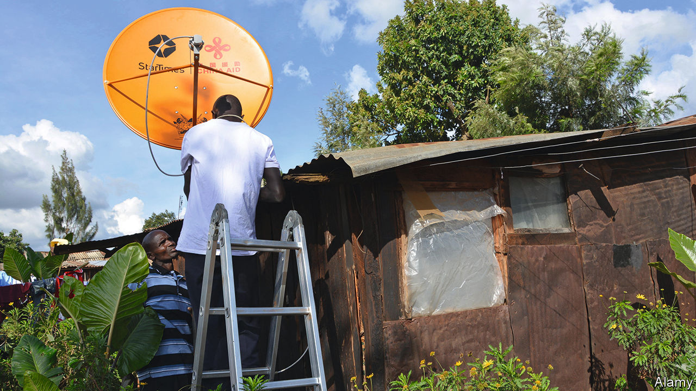

###### The media

# China, meet Fourth Estate 

##### China is working hard to shape public opinion in Africa, but its more lasting impact could be on the infrastructure of media itself 

 

> May 20th 2022 

The call came from the Chinese embassy. During a video meeting in March Joe Biden had warned Xi Jinping of “consequences” if China provided material support to Russia in its invasion of Ukraine. But China wanted readers in Africa to get their version. Xinhua, the official news service, supplies content free to many African media outlets. It made sure the story was available in time for Tanzanian deadlines. A Chinese diplomat alerted news outlets to the case, according to one journalist. The diplomat said the story was “important” to them. 

At least one newspaper, the, used Xinhua’s story. Readers did not see any hint of a warning from Mr Biden. Instead they read Mr Xi’s admonition that nato should talk to Russia to meet “the security concerns” of Russia and Ukraine. (They also learned that “China stands for peace and opposes war”.) America’s message was presented as deferential by comparison. Xinhua said Mr Biden wanted a “candid dialogue and closer co-operation”. The account devoted much space to promoting China’s line on Taiwan, twice mentioning Mr Biden’s assurance that America does not support its independence. 

Propaganda is promoted online as well. A handful of Tanzanian influencers with modest social-media followings are paid 50,000 to 100,000 Tanzanian shillings (about $22-44) a month to retweet and like the embassy’s posts on Twitter and Facebook, says Khalifa Said, editor of The Chanzo news site. The embassy pays to place op-eds in newspapers by the ambassador or by African academics promoting China’s line. And diplomats try to suppress negative stories, from African news about Chinese nationals arrested for poaching to Western stories about the oppression of Uyghurs in Xinjiang. They may be unable to kill a story altogether, but they discourage follow-ups. “Sometimes they succeed, sometimes they don’t,” says one Tanzanian journalist. 

Chinese officials are working more aggressively to shape African opinions of their regime and even the infrastructure of African media. The most visible push has been in content. Over the past decade Mr Xi has urged state media and diplomats to “tell China’s story well” abroad, declaring that the Communist Party needed to improve its “discourse power”. China has hugely expanded its state media, adding local bureaus and staff at Xinhua, China Radio International and cgtn, the official international tv news service, which opened its African headquarters in Nairobi in 2012.  launched a weekly African edition in 2012. Last year People’s Daily Online, the website of China’s official mouthpiece, started a Swahili-language service. 

More quietly China has cultivated relations to influence media, from heads of state to editors to young journalists. Chinese state media and diplomats have formal and informal partnerships with media companies, becoming suppliers of free content to most, reliable paying advertisers for many and even buying stakes in some. Propaganda officials call placing their content in these foreign outlets “borrowing the boats to reach the sea.” Sometimes this happens without even hinting at China’s involvement. 

Young and old African journalists are brought to China for training in the state media’s non-confrontational, more government-friendly approach to news. China brings officials from African countries to seminars on “cyberspace management”. At one such event in 2017 Freedom House, a non-profit group based in Washington, dc, found that attendees were given a tour of systems for “public-opinion management”, including “real-time monitoring of negative public opinion” and tools to guide public opinion to be more positive.

As with African bridges and ports, Chinese firms are also building the physical infrastructure of African media. China has laid many digital pipes for transmission of content online and via satellite. The Chinese telecoms giant, Huawei, has built about 70% of Africa’s 4g infrastructure, supplying the know-how to monitor and censor networks. StarTimes, a Chinese satellite firm, is strong in digital television. Its public profile in Africa is as a tv provider, serving 13m subscribers in half of Africa’s 54 countries (plus 27m more customers across the continent who get content over the internet). Less visibly, it is helping 15 African countries migrate from analogue to digital transmission, according to a tally by Dani Madrid-Morales of the University of Sheffield.

In some countries StarTimes transmits the signal for competing channels (in Zambia the company took a 60% stake in the state broadcaster’s digital provider.) That raises worries about control of broadcast infrastructure akin to concerns over the dominance of Huawei in telecoms. “The risk is that then it becomes a choke point, so whoever controls that platform, controls essentially television access for the whole country,” says George Sarpong, executive secretary of Ghana’s National Media Commission, a regulator overseeing media outlets. 

Polling suggests attitudes among Africans to China, while dipping slightly in recent years, are more positive than in the West. That may be due to significant Chinese-financed economic activity, which most Africans see as beneficial. But some stories about Chinese human-rights abuses may also get less play in certain outlets. (In 2018 a columnist at Independent Media, a South African media group in which Chinese state-backed firms hold a 20% stake, lost his column after writing about the Uyghurs). 

Still, negative news stories about Chinese misdeeds in Africa routinely go viral on social media. On April 20th the sentencing of a Chinese businessman to 20 years in prison for whipping Rwandan workers was celebrated on Twitter. The occasional Xinhua account inside the local newspaper or in an embassy post that wins a few retweets has less chance of turning people’s heads. A Tanzanian foreign editor says his newspaper cannot publish most material from Xinhua because it is so “one-sided”. He doubts readers are swayed much by the articles that do appear. 

The example of StarTimes reveals a yawning gap between China’s potential and its actual impact. Like Huawei it is ostensibly a private company, but it is also clearly backed by the Chinese state. Mr Madrid-Morales notes that its founder, Pang Xinxing, travels in Chinese diplomatic delegations and has met at least 15 African heads of state or government. The StarTimes brand has spread across Africa with help from the Chinese government. StarTimes has provided free equipment (and at least a month of free content) to hundreds of rural areas under a Chinese initiative to deliver satellite tv to “10,000 villages” in Africa. In some countries, the lowest-tier StarTimes customers get international news predominantly from Chinese state media, either cgtn or Xinhua-controlled cnc World. 

Of influence and power

Even so, not a lot of people actually watch cgtn. Just 9% of Tanzanians surveyed in April for  by Premise had watched China’s flagship news channel in the latest month. By comparison 73% had watched the bbc. Across the seven countries Premise surveyed, cgtn did best in Congo, where 28% of respondents had watched it in the latest month. But 73% had seen France24. (The survey skews slightly to wealthier and more urban than average, but the ages of respondents are representative). 

And in Ghana, where just 4% of people had watched cgtn in the latest month, Mr Sarpong accepts that the danger of StarTimes’ control over digital infrastructure is for now theoretical. But he says governments need to think harder about regulation to prevent it becoming real. He posits an incumbent ruling party that decides a certain tv station is crucial ahead of an election. Could they ask China to shut down the signal? “If you allow the Chinese, who have a culture of censorship, to own this infrastructure, you just endanger yourself.”


African countries have not adopted anything like the sophisticated opinion monitoring and censorship prevalent in China. Some governments have passed laws restricting online speech that echo its approach. But regimes have used blunter tactics when challenged, shutting down the internet or blocking social media. Eleven African countries did one or both of these last year, according to a report in January from 10vpn, a virtual private network. Many shutdowns were brief, imposed just ahead of elections or to stifle anti-government protests. Nigeria blocked Twitter for months after the service deleted a tweet by its president. 

Yet some African regimes have made use of Chinese know-how to go after dissidents and journalists. The  reported that in Zambia in 2019 the Cybercrime Crack Squad, a unit of the telecoms regulator, enlisted the help of Huawei to track down and arrest bloggers for an opposition news site. It also found that in Uganda in 2018 frustrated security officials had asked Huawei employees to help crack WhatsApp communications by the leader of an opposition movement. Huawei engineers penetrated a group chat, enabling Ugandan authorities to arrest the opposition figure and dozens of supporters and thwart plans for street demonstrations. (Huawei has denied that its employees conduct any such hacking).

The report suggests that Mr Sarpong’s hypothetical concern is no longer so outlandish. If an African government wants to use the tools and expertise that the Chinese supply to impose censorship, somebody from China will help. The long-term worry about Chinese influence may be less about how China uses African media, but more about how African institutions and governments use the media infrastructure that China has built.■

