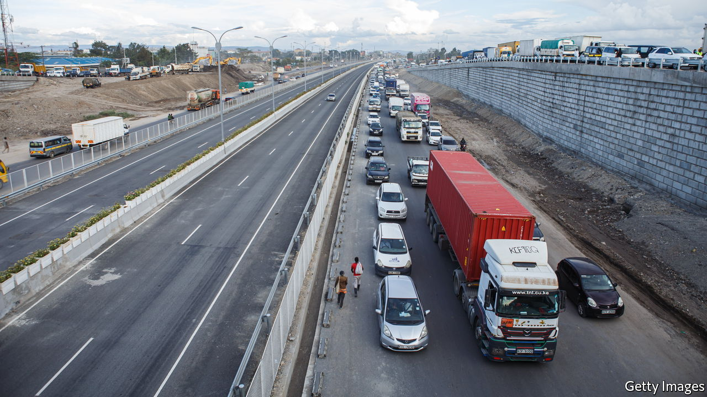
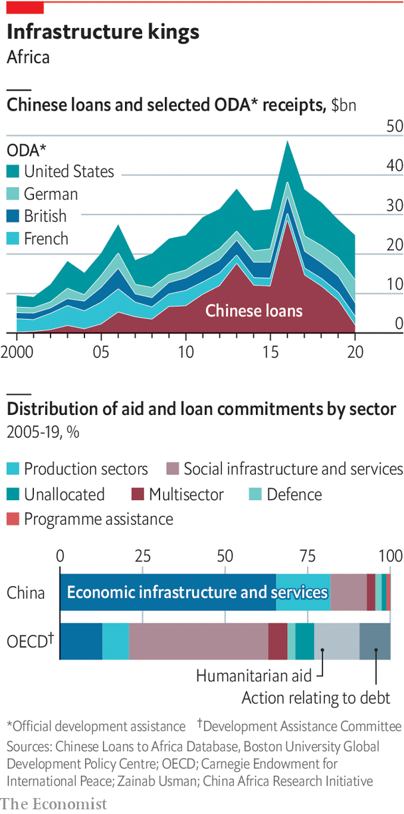
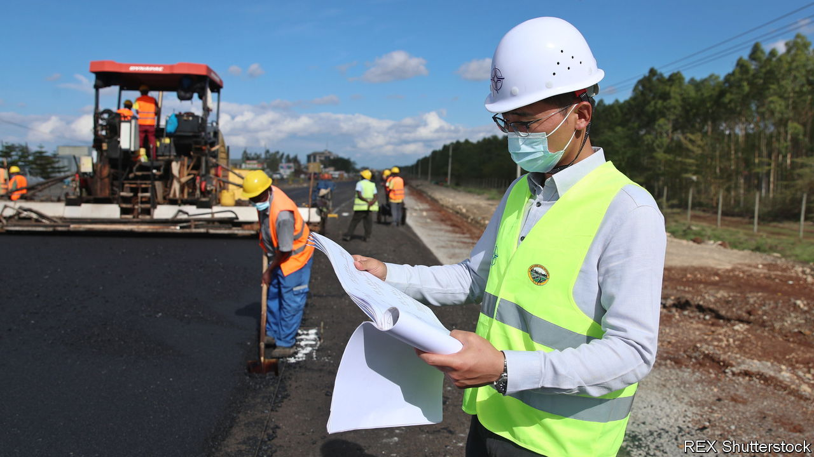

###### Debt and infrastructure

# Chinese loans and investment in infrastructure have been huge 

##### An era of big loans and big projects is coming to an end. How did it change Africa? 

 

> May 20th 2022 

The nairobi expressway curves 27km (17 miles) through Kenya’s capital. Built by the China Road and Bridge Corporation, a state-owned enterprise (soe), the road will open later this year. Under its concrete pillars, Nairobians share their views of it. Samwel Juma, a student, calls it “a project for the future” that will unclog traffic jams. But Gabriel Kihoti, a hairdresser, questions why it was a priority when the cost of food and fuel is surging. Francis Muriu, a cab-driver, calls it “a road for the rich, not the poor”.

The road symbolises a shift in a key China-Africa relationship: over debt and infrastructure. In the 2000s and 2010s China’s state-backed banks lent African governments billions for roads, ports or airports built by Chinese soes. Some deals, as in Angola and Congo, linked repayment to the extraction of natural resources. State-backed lending has since dwindled, as China seeks new funding models. The expressway’s tolls, which in theory should pay for the road, are an example. 


Kenyans’ attitudes reflect lingering ambivalence after two decades of Chinese construction across Africa. China says this has been “win-win” for both. African leaders say China was the only country willing to meet their infrastructure needs. Critics argue that China has built white elephants, fostered corruption and encouraged indebtedness. New research suggests China has been neither the benevolent partner of propaganda nor the scoundrel of the West’s imagination. It also shows that Africans can get more out of the relationship, depending on how they negotiate. 

Like the West, China substantially increased its development finance to Africa in the 2000s. Unlike the West, most of it took the form of loans at or near market rates, rather than aid. From 2000 to 2020 Chinese state financiers lent $160bn to African governments. Whereas Western aid or World Bank lending is typically widely spread around, almost two-thirds of China’s loans to Africa were for infrastructure. From 2007 to 2020, Chinese infrastructure financing for sub-Saharan Africa was 2.5 times as big as all other bilateral institutions combined.

In the 2000s African countries had more scope to borrow after debt relief from rich countries and a commodities boom. An adviser to one leader stresses the shift to multiparty democracy from the early 1990s. “You’re stuck with this democracy thing and you’re stuck with having to demonstrate to the voting population what you’re bringing to the table.” The easiest way to do this was to get China to lend and build.

Yet Western criticisms are often based on misguided assumptions. China is a big lender but rarely accounts for most African countries’ debts. In 2020, the most recent year with good data, Chinese loans accounted for 17% of the stock of public debt in sub-Saharan Africa, says the China Africa Research Initiative (cari) at Johns Hopkins University in Washington, dc. That was more than all other bilateral official creditors combined, but less than the share held by the World Bank (19%) or commercial bondholders (30%). In a paper in 2020 cari researchers noted that China accounted for more than a quarter of public debt in only seven of 22 countries classified by the imf as suffering “debt distress”.


There is little substance to claims of “debt-trap diplomacy”, in which China hoodwinks borrowers so as to seize assets. It is more accurate to say that China’s hard-nosed approach conflicts with its seemingly benevolent rhetoric. China may not be a duplicitous negotiator—but it is ruthlessly self-interested. Last year AidData, a research group at William &amp; Mary University in Virginia, examined 100 contracts between Chinese entities and developing countries. The authors noted a “muscular” approach, with strict confidentiality clauses, requirements that China be repaid ahead of others and the use of escrow accounts. “One needs to go back to the 19th and early 20th century to find similar security arrangements in sovereign lending on the scale that we observe in our Chinese contract sample,” they concluded. In a follow-up paper, AidData found that a deal to expand Entebbe airport in Uganda required that all revenues generated by the airport for 20 years be used to pay back the loan.

Untransparent

Opacity is a big problem. A paper in 2019 co-written by Sebastian Horn and Carmen Reinhart of the World Bank estimated that 50% of Chinese lending to poor countries was “hidden” from the bank and the imf, partly because loans between parastatals may not appear on public balance-sheets. Chinese creditors are increasingly fragmented. The Export-Import Bank of China and the China Development Bank, both state-backed, once dominated lending, but more recently they have been just two entities among many.

 


This has made it harder for governments to resolve debt crises. Under Zambia’s former president, Edgar Lungu, finance ministers were sidelined when contracts were agreed by his office. After Hakainde Hichilema replaced Mr Lungu last year, a study by cari found that the debt Zambia owed China was twice previous estimates. It included debts to at least 18 different Chinese lenders.

When China renegotiates debts, it prefers pushing back repayment dates to taking “haircuts” on the principal. Angola, which has borrowed more from China than any other African country, has been granted a three-year stay, says Vera Daves de Sousa, its finance minister. China was “very open” about extending the term, “but very reluctant to adjust the payments”. Mr Horn and Ms Reinhart argue that China’s can-kicking risks hobbling African economies, much as Western governments did in the 1980s and 1990s. 

A chapter in “Banking on Beijing”, co-written by Bradley Parks of AidData, suggests that the average Chinese project raised growth by 0.41-1.49 percentage points after two years—a large boost. The authors find that in areas around a project night-time light (a sign of economic activity) increased by 8%. Often the most effective projects are unglamorous, such as a road linking Nairobi to nearby Thika. Yet whether the loans could be put to better use is another question. China prides itself on a “demand-driven” approach: doing what African leaders want, to hell with technocrats in finance ministries. In Congo the “deal of the century” signed with Joseph Kabila in 2007 swapped mining rights for infrastructure projects. In Ethiopia China helped Meles Zenawi’s push for industrialisation. In Kenya China supported Uhuru Kenyatta’s “Vision 2030”, notably via the standard-gauge railway (sgr), its largest infrastructure project since independence. 

African leaders say China works at a speed to match their needs, at least electorally. Abdoulaye Wade, a former president of Senegal, claims “A contract that would take five years to discuss, negotiate and sign with the World Bank takes three months when we have dealt with Chinese authorities.” The average infrastructure project in the Belt and Road Initiative (bri), which 43 African countries have signed, takes 2.8 years, roughly a third of the time needed by the World Bank or the African Development Bank. 

Yet indulging African politicians does not always produce optimal deals for citizens. The sgr “will never pay for itself”, says Kwame Owino, of Kenya’s Institute of Economic Affairs, a think-tank. Chinese projects favour leaders’ political bases, notes “Banking on Beijing”. A province from which an African leader comes typically receives 70% more funding from China than one that has no such luck. In election years it gets 134% more. World Bank projects show no such bias. 

 


China also facilitates corruption. The “deal of the century” in Congo was reported to include millions of dollars for the family of Mr Kabila. The mix of venal African politicians and Chinese money can often be malign. In Zambia, say two sources, Chinese contractors have identified road projects with politically connected figures and inflated the cost to boost profits and kickbacks. That has affected the quality of the work. “You have the road,” says Caleb Fundanga, a former central-bank governor, “but not the road you wanted at the beginning.” 

In a paper in 2018 Ann-Sofie Isaksson and Andreas Kotsadam looked at opinion-survey data from Chinese projects in 29 African countries. They found that local residents reported increases in corruption, which did not happen with World Bank schemes. The finding “seems to signify that the Chinese presence impacts norms,” concluded the authors.

Africans see their governments as responsible for corruption. “I blame ourselves for choosing bad projects; I don’t blame the Chinese,” says David Ndii, a Kenyan economist. Yet a Western diplomat reckons China has caused the “institutional degradation” of African countries. Mr Parks of AidData suggests that “There is a tension between efficacy and safety in Chinese development finance, and some countries are more effective than others at managing these risks and rewards.”

Since a peak in 2016 China has reduced lending to Africa. In 2020 just $1.9bn in loans went to African governments, the lowest since 2004. This partly reflects the pandemic. But it also shows how both China and Africa now place more emphasis on other parts of their economic relationship: trade and investment.■

