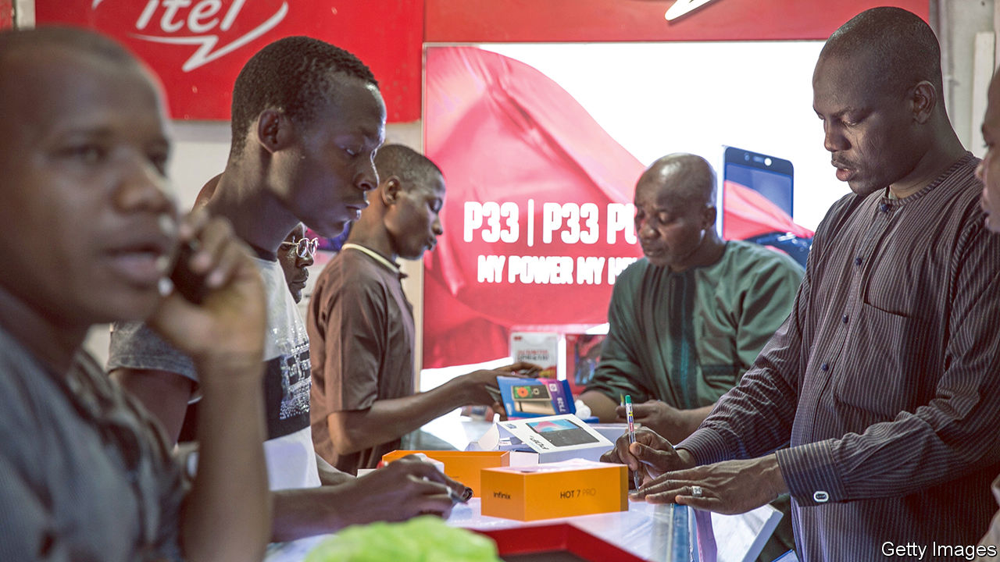
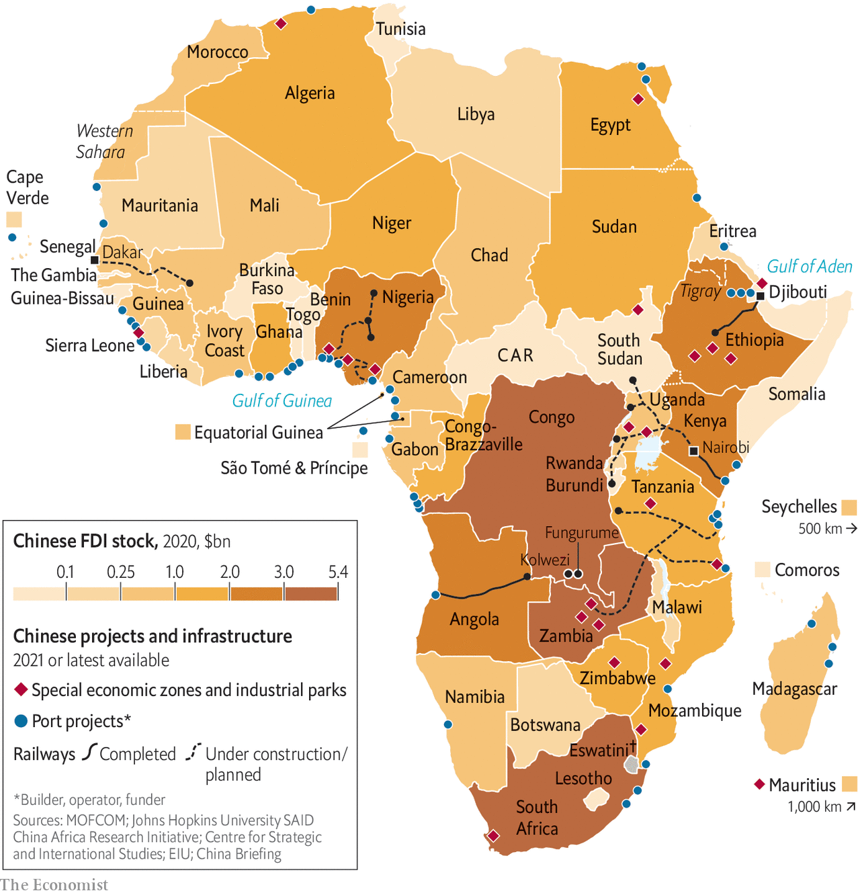

###### Business and trade

# How Chinese firms have changed Africa 

##### Chinese companies have made their mark on the African continent, in ways good and bad 

 

> May 20th 2022 

Outside a bar in Fungurume, a mining town in Congo, men caked in dust spit peanut shells onto the floor. Inside, where Chinese New Year lanterns hang from the walls, Emmanuel (not his real name) explains how things changed after 2016, when a majority stake in the Tengwe Fungurume Mine (tfm) was sold by an American firm to China Molybdenum. He says the new owners tried to cut his salary and used subcontractors who recruit day labourers and eschew safety protocols. He says staff racially abused and hit Congolese workers. “We loved Americans,” he says. “We are fed up with the Chinese. They treat us with total disrespect.” In response, says Emmanuel, some colleagues went on strike and burned the Chinese flag. (China Molybdenum says it adheres to all Congolese laws and international labour standards, and that abuses “cannot possibly be happening within the tfm site.”)

Around 70% of the world’s cobalt, which is an essential mineral in the production of electric vehicles, is mined in Congo. China, which dominates cobalt refining, has a stranglehold over its production. In 2020 Chinese firms owned or had a stake in 15 of Congo’s 19 cobalt-producing mines. American officials have tried to persuade President Félix Tshisekedi to loosen China’s grip. But Chinese firms, supported by their country’s diplomats, are canny in navigating Congolese politics, lobbying not just Mr Tshisekedi but powerful politicians in mining regions. 

To ordinary Congolese, the arrival of Chinese miners is another episode in a history of venal elites colluding with extractive firms to exploit the country’s immense resources—and its people. But residents of Congo’s mining towns seem to think Chinese firms are more ruthless than Western ones. “The Chinese don’t really care about the people and the community,” says Donat Kambola Lenge, a human-rights lawyer in Kolwezi. “They just care about having relationships with people in power.” 

Yet though Chinese mining in Congo is part of the story of Chinese business in Africa, it is not the only part. The extent of Chinese business interests has deepened and broadened in the past two decades. Some governments, like Congo’s, fail to use the relationship to deliver benefits to ordinary people, but others do a better job. Viewed as a whole, China’s business links reflect patterns of globalisation, not a new colonialism. 

The data hint at China’s growing footprint. Annual flows of foreign-direct investment (fdi) from China rose from just $75m in 2003 to $4.2bn in 2020. The stock of Chinese fdi in Africa ($44bn) is lower than Britain’s ($66bn) or France’s ($65bn), but slightly higher than America’s ($43bn). The value of trade between China and Africa has risen from $10bn in 2000 to a record $254bn in 2021—more than four times that between America and Africa. For China that is just 4% of total trade, less than with Germany. But China has moved from being the main source of imports for just four of Africa’s 54 countries to most of them. 

Going shopping

African shoppers have also benefited from cheap Chinese products. In Kolwezi phone shops are emblazoned with logos from Infinix, Itel, and Tecno, all of them owned by Transsion, a Chinese firm whose phones account for almost half the sub-Saharan market, more than twice the share of Samsung, its nearest competitor. Unlike the South Korean firm’s devices, or Apple’s, Transsion’s products are designed for Africans. Its cheapest phones cost $20, have African-language keyboards and camera exposures that are adjusted for black skin. In 2015 Transsion launched Boomplay, Africa’s most popular music-streaming service. Cobus van Staden of the South African Institute of International Affairs, a think-tank, says that firms like Transsion have normalised business in Africa. “They have changed the discussion about the nature of the African market itself, by showing you can make a shitload of money. That is where China is a game-changer.” 

McKinsey, a consultancy, estimates that there are 10,000 Chinese firms active in Africa—several times the number that are actually registered with the commerce ministry in Beijing. Almost a third of McKinsey’s sample had profit margins greater than 20%. Whereas the largest are often soes, around 90% are private firms. About a fifth of them are in construction. Chinese companies are thought to win around half of all African construction contracts that are tendered to foreign firms. They may benefit from state subsidies, but many simply outcompete their rivals. One Kenyan bigwig contrasts the approach of French firms, which take months to do feasibility studies and put their staff up in posh hotels, with the urgency of the Chinese, who sleep three-to-a-room to keep costs down. 

 


Roughly a third of Chinese firms are in manufacturing. McKinsey estimates that 12% of Africa’s industrial production is accounted for by Chinese companies. Some manufacturers use Africa as a base for exports, raising hopes of African leaders who believe that, as Asians get richer, Africa will lure more labour-intensive factories. But power, labour and logistics are generally too expensive in Africa. Chinese manufacturers tend to serve mostly local markets, rather than export. 

In Nigeria Chinese firms are big in the furniture, ceramics and wig industries. Some are located in special economic zones launched by the Nigerian and Chinese governments. But many have had little public help, opting simply to cluster near Chinese entrepreneurs from the same province. “We have to do it all ourselves,” one manufacturer told Yunnan Chen, a researcher for cari, in 2020. 

And Chinese firms have boosted local economies. A paper last year by Riccardo Crescenzi and Nicola Limodio of the London School of Economics used measures of night-time lighting to find a positive impact on economic activity in local areas 6-12 years after an inflow of Chinese fdi. There is also little truth in the myth that Chinese firms hire only fellow countrymen. African employees make up 70-95% of Chinese firms’ workforces, according to a recent summary of the evidence. 

Chinese firms help African ones. Joseph Ager, who runs a small construction firm in Nairobi, says Chinese investors are tough (“There’s no bargaining; they give you the price”) but “understand us Kenyans”, seeing the need to give cash-poor firms payments in advance. They have boosted his social mobility, he says. “I’m not well-educated, I’m a second-born from a poor family. But I’ve been able to raise our living standards.” 

Much depends on African governments. In Benin, notes a paper in April by Folashade Soule of Oxford University, officials diligently negotiated a commercial centre for Chinese and local firms to ensure that its laws had primacy and that Chinese firms used the centre for wholesale but not retail selling, protecting local traders. “[The] successful negotiations on the business centre are an example of how African countries can sometimes exercise agency despite the asymmetrical nature of their relationships with China,” says Ms Soule. 


Yet not every government can push back. Africans find it hard to reach senior levels in Chinese companies. In Congo and elsewhere Chinese miners have fostered poor labour practices. In Nigeria Chinese cartels in ceramics and wigs have locked out local competitors. Environmental degradation is common. Tighter regulation of pollution in China, argues an Ethiopian businessman, is one reason why some Chinese firms move to Africa. 

Africans want the Chinese to make things easier for exporters. Most countries have gaping trade deficits with China. Just three commodity-exporting countries (Angola, Congo and South Africa) accounted for 62% of Africa’s exports to China in 2021. In December, at the triennial forum on China-Africa co-operation in Dakar, China pledged to raise imports from Africa, which stood at $106bn in 2021, to $300bn within three years. That will involve “green lanes” to help agricultural exporters.

The saga of the Kenyan avocado suggests that there is some substance to this pledge. Chinese fears of imported pests meant that, until recently, only frozen avocados were allowed in. But earlier this year China announced that it would accept fresh ones as well—expanding the number of potential exporters from two Kenyan firms with sufficient freezers to more than 100. Tiriku Shah, who runs a food company, is impressed by the help given by Chinese diplomats. “At first they were just helping the Chinese. Now they help Africans go to China as well.” 


Other African products have gained approval, such as Zambian blueberries and South African lemons. When Beijing imposed tariffs of up to 212% on Australian wine after Canberra’s questioning of the origins of covid-19, am Vineyards, a South African vintner, sent Shanghai hundreds of samples, tweaking the blend to find the right plonk for the Chinese palate. The first bottles arrived in China late in 2021. The internet allows Chinese consumers to buy products directly. After Alibaba hosted the Ethiopian ambassador to Beijing on a shopping live-stream, 11,200 coffee bags were sold in a few seconds. 

All of which is promising. But the volume of exports remains small. China’s approach to opening up African markets remains ad hoc and dependent on lobbying case-by-case. Only one African country, Mauritius, has a comprehensive free-trade deal with China. That is a reminder of how, for Beijing, its political relations with Africa are ultimately higher-priority than its economic ones.■

