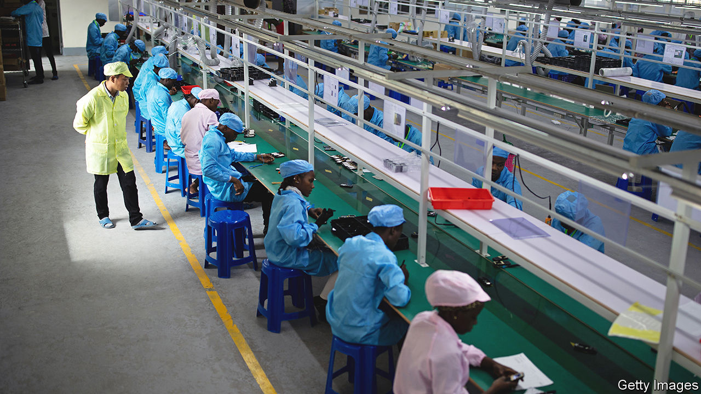
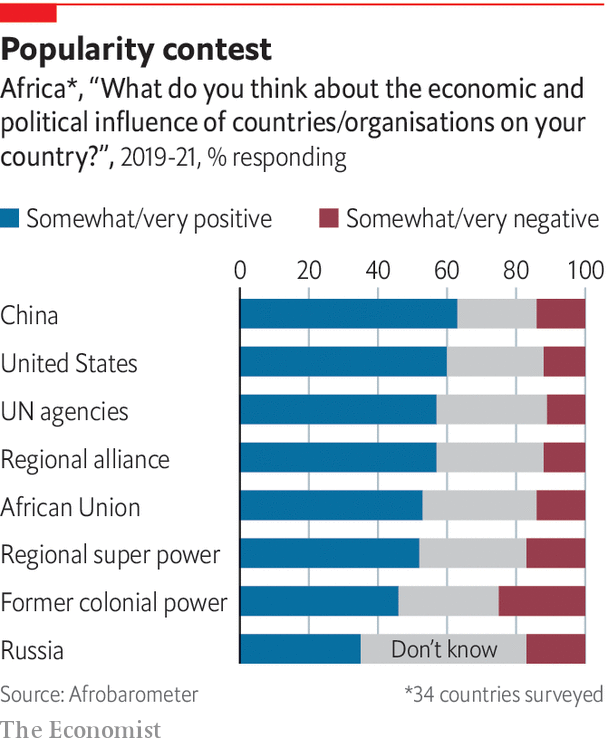

###### China in Africa

# The Chinese-African relationship is important to both sides, but also unbalanced 

##### If the West wants to counter China’s role in Africa it first must understand it 

 

> May 20th 2022 

No other country comes near the depth and breadth of China’s engagement in Africa. It is Africa’s largest trading partner, bilateral creditor and a crucial source of infrastructure investment. Chinese firms account for an estimated one-eighth of the continent’s industrial output. Chinese-built digital infrastructure is critical to the platforms on which Africans communicate. Political, military and security ties are becoming closer. Understanding the China-Africa relationship is key to understanding the continent—and the global ambitions of Xi Jinping.

The modern history of this relationship has three phases. During the cold war China supplied aid, constructed the odd railway or parliament building and tried, mostly unsuccessfully, to export Maoism. But the main thrust of its relationship was political. China saw newly independent African countries as potential allies. In 1971, when the un voted for China to take over its seat from Taiwan, 26 African countries sided with Mao. “It is our African brothers who have carried us into the un,” he said.

The second phase, from the 1990s, was defined by economics. For a booming China, Africa mattered. Oil and metals were imported from the continent; surpluses of money and manufacturing went the other way. To African countries that had just thrown off one-party rule and ended years of stagnation, China gave useful infrastructure. China went from net recipient of aid to “lender of first resort”, notes a new book, “Banking on Beijing”, by Axel Dreher and colleagues. From 2000 to 2014 Chinese aid and, especially, loans meant only America gave more development finance. More than half China’s development projects were in Africa. 

This period still shapes thinking about China-Africa relations. But, as Daniel Large of the Central European University argues in another book, “A New Era” has emerged under Mr Xi, who has made four tours of Africa as president and nine in all. He “has been remaking China’s Africa relations in his own image,” argues Mr Large. (Barack Obama was the last American president to visit.)

Economic ties still count. But since 2016 China’s lending to Africa has shrunk. It builds fewer mega-projects, putting more emphasis on trade and investment. And politics has again become a driving force. China’s attitude to Africa is part of Mr Xi’s assertive foreign policy. His approach gives a greater role to the Chinese Communist Party, which has a membership larger than the population of all but four African countries. 

The West is alarmed. Hillary Clinton, Mr Obama’s secretary of state, spoke of a “new colonialism”. Mike Pompeo, who was secretary of state under Donald Trump, talked of China’s “empty promises”. In 2021 the Biden administration proposed Build Back Better World (b3w) as an effort to counter China—a “values-driven” attempt to finance infrastructure in poor countries. The eu has launched Global Gateway, a similar plan. Ursula von der Leyen, president of the European Commission, says that, unlike China, the eu wants to create “links and not dependencies”. 

 


Yet these efforts have flaws. b3w is little more than a new label for inter-agency co-operation in Washington. Global Gateway is vanishingly slight in detail. But the bigger failing in the West’s view of China-Africa is conceptual. At times it reduces China’s role to that of a giant construction company. And when not simplifying, the West exaggerates, ascribing more calculation to Beijing than it deserves, as in broad and misleading accusations that it deliberately pursues “debt-trap diplomacy”.

The tendency is to see events in Africa as part of a great-power game. Some things China does warrant concern (building military bases, monopolising cobalt mining). But others do not (building airports, selling mobile phones). African politicians dislike being patronised and are sceptical of the West’s motives. African leaders want it understood that they often have no option but to deal with China, which they do with their eyes open.

Most Africans think highly of China. A survey of 34 African countries last year by Afrobarometer, a research group, found that 63% of respondents felt China had a “very” or “somewhat” positive influence—more than the 60% who said the same of America. Polls in seven African countries for  by Premise, conducted in April, found a similar result. In every country more respondents felt that China had a “good” than a “bad” influence. 


None of which means accepting China’s propaganda. It is nonsense to claim it is motivated by altruism. China is ruthlessly self-interested. Although its mix of credit and construction has boosted growth, it has also fostered corruption and often propped up autocracies. Some Chinese firms mistreat African workers and harm ecosystems. Its diplomats work to block critical coverage in the media and dangle aid in return for support at the un. 

Analysts stress African “agency” in dealings with the Chinese. African governments try to negotiate better deals, with varying success. But agency cannot obscure the asymmetry in relations. Africa and China both have 1.4bn people but China is a single, brutally disciplined one-party state, and its economy accounts for nearly 20% of world output. Africa is a continent of 54 mostly weak countries, and its economy is worth only 3% of the world’s. 

This special report puts the case for understanding the China-Africa relationship. China wants to co-opt the global south. It is effective in “hardware”—infrastructure, trade, telecoms—but has a more malign influence on “software”—the institutions crucial to Africa’s future. In Afrobarometer polls, far more countries list America than China as their preferred future model (23 against five). In our survey from Premise only two countries (Ethiopia and Tanzania) saw China more favourably than America. Put crudely: Africans appreciate China’s economic role but prefer democracy and freedom to authoritarianism.■

