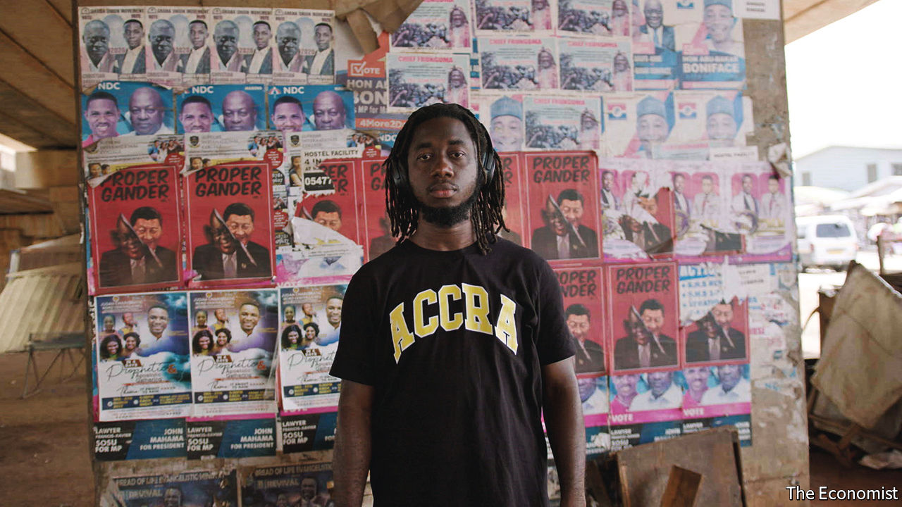

###### Political links

# The price of friendship 

##### China has much to offer African governments, but it also wants much in return 

 

> May 20th 2022 

In 2019 yaw osafo maafo, a Ghanaian minister, spoke in Washington, dc, to his countrymen abroad. He was asked why a Chinese woman arrested for illegal gold-mining was sent back to China instead of being prosecuted. His answer became a national scandal. “We have a very good relationship with China,” he said. “So when there are these kinds of arrangements, there are other things behind the scenes. Putting that lady in jail in Ghana is not going to solve your economic problems.” 

To Ghanaians like Bright Ackwerh, a cartoonist, the comments merely confirmed that China has too much political influence in Africa. The notion has inspired his art. In one poster he depicts a smiling Nana Akufo-Addo, Ghana’s president, being peeled off to reveal the smug face of Xi Jinping. In another, which the artist calls  (we are begging), Mr Xi pours polluted water into a bowl held by a supplicant Mr Akufo-Addo as the Chinese ambassador to Ghana gleefully displays a gold bar.

Mr Ackwerh’s art is suffused with the image of China as a skilled, ruthless practitioner of power politics in Africa. China’s fraternity with African governments, rooted in a Mao-era revolutionary alignment, has evolved into a new form of patronage. China in the 21st century is richer, but also more demanding than it was under Mao. It has more to offer, but wants more in return. Civil society in Africa frets about the implications. 

For authoritarian regimes, Chinese patronage and ties to the political elite can be sources of strength. In Tanzania one member of the ruling party proudly calls his country the “entry door” for China into Africa. In Ethiopia China has weathered a tumultuous change in government, and won fresh goodwill from the ruling party by helping it in the fight against Tigrayan rebels. 

China takes a more sophisticated approach in Africa’s multiparty democracies. It is not hindered by ideology. In places like Ghana and Kenya the international department of the Chinese Communist Party has spent years cultivating ties with not just the ruling party but with any rivals that have a chance of winning power. Joshua Eisenman of the University of Notre Dame found that, in Ghana, the department had courted the New Patriotic Party (npp) even when it was out of government. That paid dividends in 2016, when Ghanaians voted the npp into office. 

Helping the powerful

Officials say China is more adept than Western rivals at helping politicians stay in power, especially by financing infrastructure projects. This is most obvious in one-party states, but even democratic leaders acknowledge it. Gabby Asare Otchere-Darko, a member of Ghana’s ruling party, argues that China helps governments respond to “the pressures of delivering in a democracy”. Yet polls suggest that ordinary Africans are less convinced. In a survey conducted for , Premise found majorities in seven countries (some authoritarian, some democratic) thinking that their country benefited from the relationship, but China gained more. In Ghana 62% of respondents agreed. Ghana also registered the second-highest share of respondents saying their country did not benefit at all, at 25% (against 35% in Congo). 


Episodes like the minister’s comment about not prosecuting the Chinese gold-miner hint at some reasons for such discontent. Tens of thousands of Chinese entrepreneurs have arrived over the years to conduct illegal gold-mining, often hiring Ghanaians. They have industrialised the practice, importing excavators, churning up earth and polluting rivers. Some Chinese miners are armed with guns, and there are occasional reports of firefights. Yet for years Chinese miners were rarely arrested or imprisoned (though in a rare crackdown in June and July 2013, 4,592 Chinese miners were deported).

This pattern is repeated elsewhere. In June 2019 another Chinese businesswoman was sent home, not prosecuted, for illegally stripping Ghana of rosewood. In the Gulf of Guinea Chinese trawlers have for years scooped up fish far beyond legal limits to ship back to China, depleting stocks for Ghanaian fishermen. In such cases, environmentalists say Chinese entrepreneurs break laws with impunity, exploiting weak regulators. Ghanaians have grown so used to this that, when the attorney-general announced last year that ten Chinese nationals arrested for illegal mining would be prosecuted and imprisoned, it made headlines. 

Ghanaians might worry more about Chinese gold-mining and overfishing if their economy were not so shambolic, with high inflation and a depreciating currency. In the Premise survey, 74% of Ghanaians said their country was on the wrong track. For the ruling party, a boost of Chinese investment is politically helpful. “That’s when you go and see what you can negotiate. So you can get things done. So you can stay in office, you can deliver for the people,” says Mr Otchere-Darko.

Good-governance advocates worry that, although China’s political and financial clout may help to win elections, it weakens democracy. If voters like Chinese-financed roads and power plants, that reduces pressure on political leaders to fix other problems. Many think China’s money corrupts politicians and undermines democratic norms by coming without the strict conditions of Western aid. In 2017 a Ghanaian news outlet reported that China’s embassy had urged a minister to “guide the media” to report more “objectively” on illegal gold-mining, for the sake of bilateral relations. The letter referred obliquely to “reports and cartoons that are defaming Chinese leaders”. (Advertising firms have refused to put Mr Ackwerh’s work on billboards, with one telling him they did not want to be dragged into political controversy.) 


In authoritarian countries, Chinese diplomats mostly keep quiet except to praise governments. Before a Tanzanian election in 2020 that was widely seen as neither free nor fair, the Chinese ambassador praised the electoral system and repeated China’s policy of “non-interference”. Khalifa Said, an editor at The Chanzo, an independent news site, says Tanzanians have suffered from China’s refusal to “interfere” and criticise, especially under John Magufuli, the president who died in 2021. When a newspaper is banned or an opposition figure disappears, “China does not care,” he says. “You need people that your government respects, or can listen to, to say something, to say, ‘no, enough is enough.’ ” 

And China is increasingly willing to make political demands of its own. During the pandemic political leaders were prodded to declare publicly their gratitude for Chinese munificence in delivering vaccines and personal protective equipment. Such transactional diplomacy is even starker at the un. Diplomats say that China has promised aid or financing in return for support at the un, particularly over its treatment of Uyghurs in Xinjiang. China threatens reprisals against any governments that criticise its human-rights record, and seeks allies in making the global order more friendly to autocracy. In June 2021 no African country backed a critical statement on China at the un’s human-rights council. Indeed, 34 African countries signed a counter-statement in defence of China. 

The numbers suggest that it pays to side with China. Scholars at AidData have conducted a statistical analysis comparing votes in the un general assembly between 1999 and 2016 with official financial commitments from China. They found that, on average, a 10% increase in voting alignment with China yielded a 276% increase in aid and credit. They calculated that, if countries increased their alignment to Sudan’s level of 93%, the yield would rise further. Cameroon’s would more than quintuple; Ghana’s would go up by 81%.

That may explain China’s relatively robust support from African countries at the un. But it also points to the risk of becoming too reliant on Chinese money. Such funding can easily vanish, putting a recipient country in a bind. Something like this may be playing out in Ghana. In 2018 the Ghanaian government struck a deal with Sinohydro, a Chinese soe, for $2bn in infrastructure projects. But the government hoped to raise the money by mining and processing bauxite, including from a sensitive reserve, the Atewa forest. Environmentalists sued to block mining in the forest. A plan to build a bauxite refinery may not prove feasible. If the government cannot show how it will repay Sinohydro, it is not clear how much of the $2bn will materialise. Four years on just one project, a road interchange, has been completed. 

Perhaps China will find another way to help Ghana as it faces deep fiscal woes. But this is a reminder of its leverage over African countries, which is well understood by their political leaders. If China can help them win elections in Africa by building roads, it can also cost them elections by not building them.■

