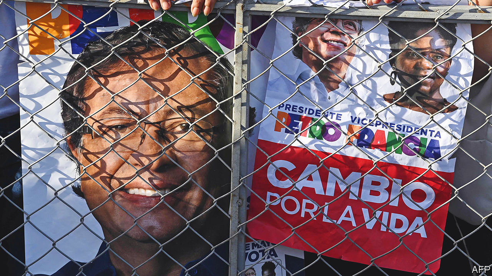
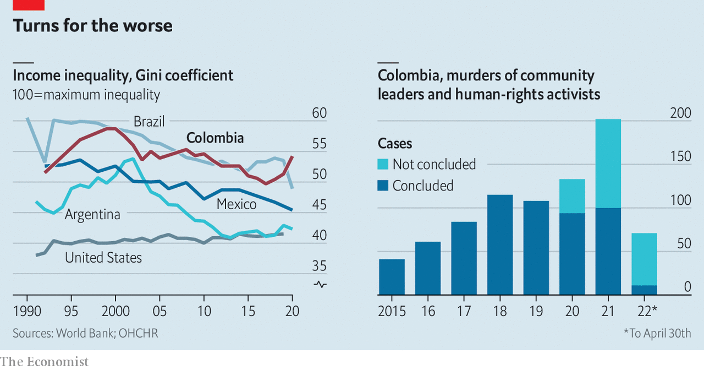
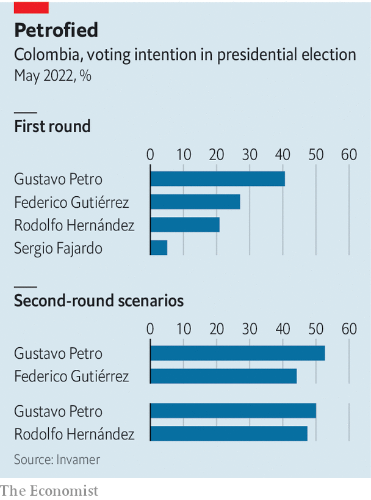

###### The costs of inaction

# A divided Colombia is poised to elect its first leftist president 

##### The threat of violence hangs over Gustavo Petro’s election, win or lose 

 

> May 26th 2022 

“It is time for the left to come to power,” says Nicole Gómez, a student in Bogotá. “We are tired of the inequality, and of everything staying the same.” She and the rest of the Colombian electorate go to the polls on May 29th to elect a new president. The right-wing incumbent, Iván Duque, is stepping down after his constitutionally-allotted one term in office.

Ms Gómez plans to vote for Gustavo Petro, a former guerrilla hoping to become Colombia’s first leftist leader. Her exhaustion is typical. Voters want to break with a political class they see as corrupt and ineffective. Mr Petro leads the race, but is unlikely to win the 50% of votes needed to avoid a run-off on June 19th. The election is the most important in Colombia’s recent history. The country’s institutions are at stake, as are its investor-friendly economic model and the future of the peace deal signed in 2016, which ended a 50-year civil war. The immediate threat is that violence breaks out in the election’s aftermath.

When its progress is measured in decades, Colombia appears to be doing well. gdp per person grew from $1,400 in 1990 to $6,700 by 2018. Over the same period, the share of university-aged people enrolled in tertiary education nearly quadrupled to 55%. In April 2020 Colombia joined the oecd, a club mostly of rich economies. That is good going for a country that has been in a near-continuous state of civil war since 1948. The most recent one, which ran from 1964 to 2016, saw the state fighting the Revolutionary Armed Forces of Colombia (farc), a Marxist guerrilla group. A quarter of a million people died and another 8m were forced to flee their homes. 

 


Despite the improvements, Colombians like Ms Gómez have reason to be angry. Their country is one of the most unequal in the world (see chart). A regressive tax system does little to help. Tax revenues make up just 19% of gdp, far below the oecd average of 33%. Colombia is one of the only countries in Latin America that has never carried out land reform with any gusto. More than 80% of private agricultural land remains under the control of just 1% of farms. That is much higher than the regional average of about half. Many of these problems are not getting better. Concentration of land ownership increased between 2000 and 2015. Inequality has hardly budged in a decade. 

Mr Petro has topped the polls all year. More than 40% of voters say that they will cast their ballot for him. He rejects the label of socialist firebrand. As a member of the m-19, a nationalist movement, he says he did not want to usher in a Soviet economy. He told that he now wanted a “social-democratic market economy” with “respect for private property and free enterprise” and a healthy dose of “social responsibility”. 

Central-bank independence will stay, too, though Mr Petro is keen for “people close to society” to have a presence on its board. He has promised in writing, under oath and before a notary, not to expropriate businesses. Maria Claudia Lacouture, the president of the American Chamber of Commerce in Colombia, says she recently had a long meeting with Mr Petro. He was not so business-friendly the last time he ran, and lost, in 2018. 

Yet many of his proposals remain radical. He wants tariffs on agricultural imports, but has not said at what level, just that their goal will be “domestic job creation”. He guarantees work for Colombia’s 3m unemployed people. New exploration for oil and gas, products which make up half of Colombia’s exports, would be banned. University education will be made free. Trade deals are to be renegotiated, most importantly with the United States. 

Mr Petro plans to pay for this by clamping down on tax evasion, reducing exemptions and raising taxes on agricultural estates which are “unproductive”, a term he has not defined. He thinks this, and pension reforms, will increase government revenues by 5.5% over four years. 

His policies are unlikely to be cost-neutral. Wealthy Colombians already appear to be moving their money out of the country to hedge against his victory. The Miami Association of Realtors says more Colombians searched its website for property in March than did so from anywhere else. Mr Petro says growth in tourism and agriculture will make up for shortfalls created by his ban on oil and gas exploration. But to replace revenue from hydrocarbons, Colombia would need to reel in as many tourists as Argentina and Brazil combined. 

Mr Petro has a reputation for being hard to work with. Some 60 officials resigned or were sacked during his four years as mayor of Bogotá. One wrote an open letter warning that “a left-wing despot does not stop being a despot just because he is from the left”. In that light one of Mr Petro’s commitments, to “democratise institutions”, sounds concerning. Moderates hope that the fragmented Congress elected in March, in which Mr Petro’s coalition lacks a majority, will force him to build alliances. 

Mr Petro’s strength spooked Colombian elites in the run-up to the election. In the primaries in March they chose Federico Gutiérrez, a former mayor of Medellín, Colombia’s second city, to run against him. The hope is that his everyman persona—he goes by his nickname Fico—can counter Mr Petro’s fustier manner. They also hoped that his status as a relatively independent candidate would provide some cover for their unpopular politics. 

This plan worked at first. Unknown beyond Medellín before the primaries, within three months a quarter of the electorate said they planned to vote for Fico. 

 


But his rise has stalled. For many, Mr Gutiérrez is a candidate of continuity. All of Colombia’s traditional parties back him. Some of his policies are moderate. Although he voted for the peace deal of 2016, the support he enjoys from landholding elites and right-wing parties that opposed it may limit his ability to carry out its land-reform mandates. “My worry is that the peace deal would be abandoned and left to die,” says Yesid Reyes, a former Minister of Justice, who helped design the agreement. 

Mr Duque has been slow to make the changes required by the peace deal. Just 4% of the land-reform measures mandated in the accord have been put in place since it was signed, according to the Kroc Institute for International Peace Studies at the University of Notre Dame in Indiana. More than 1,000 environmental and human-rights leaders were killed over the same period, mostly by new armed groups that emerged to fill the vacuum left behind by the farc. That is what the mandates of the peace accord were designed to fill. More than 300 ex-farc combatants who laid down their arms have also been murdered.

The constraints on the degree to which Mr Gutiérrez would be able to improve this, along with his establishment credentials, have created space for another challenger to Mr Petro. Rodolfo Hernández, a populist outsider, has surged in the polls in the past three weeks. He is now tied with Mr Gutiérrez. A 77-year old former mayor of Bucaramanga, a mid-size city near the Venezuelan border, he made his money building homes for the poor. He has been recorded saying that the key to becoming wealthy was financing the purchase of his slum homes, not just building them: “I collect the mortgages, which are the cash cow. Just imagine, 15 years of a little man paying me interest. It’s delicious.” 

This sort of unpleasantness is the norm. Mr Hernández was suspended twice when he was mayor, once for slapping a city legislator and once for campaigning while holding public office, which is banned in Colombia. He resigned shortly before the end of his term. 

Mr Hernández blames corruption for most of Colombia’s problems. This chimes with voters’ mood. As soon as he is president, he says, he will start selling off the presidential cars and planes. He wants to close dozens of Colombia’s embassies and consulates because the civil servants employed there “don’t do any work”. Other countries’ representatives are to be served nothing more than tap water when they visit the presidential palace. All this is ironic given that Mr Hernández is due to be tried for corruption in July. 

TikTok vs Trotsky

Mr Hernández’s populist bombast lends him an anti-establishment air which may provide an edge over Mr Petro if the pair end up facing off in June. Mr Petro has run for president twice before, and has been a member of Congress for decades. Mr Hernández reaches his supporters through TikTok, a social-media app, where he posts goofy videos playing on his septuagenarian charm. He is prone to gaffes. In 2016 he said that he was a “great follower” of Adolf Hitler. (He apologised last year, after he declared his presidential candidacy, and said he had been thinking of Albert Einstein.)

Mr Hernández’s policy proposals are a mixed bag. The plan is to cut domestic taxes but raise agricultural tariffs. He rails against international institutions, but seems to like some of what they do. His programme makes repeated, positive mentions of cop 26, a un climate-change conference. He wants to ratify the obscure Protocols of Nagoya-Kuala Lumpur, a un biodiversity agreement. He plans to rebuild ties with Venezuela, but has made xenophobic comments about Venezuelan women. He has wacky ideas about drugs, including supplying free cocaine to addicts as a public-health measure. 

Like other candidates he promises to implement the peace deal in full, even though his father was kidnapped by the farc and had to be ransomed. He even wants to negotiate peace with the eln, an extant leftist guerrilla group that is thought to have kidnapped his daughter in 2004 (she has never been found). 

Some of Mr Hernández’s bluster has authoritarian overtones. He plans to hold daily press conferences at which supposedly corrupt politicians will be named and shamed. Colombians who inform against corrupt officials will, he says, get 20% of any money that can be clawed back as a result. He has expressed fondness for Nayib Bukele, El Salvador’s autocratic president, who rules through Twitter-diktat. 

The most pressing concern is what will happen right after the vote. “Colombia is at risk of entering a new cycle of violence,” says Alejandro Gaviria, a centrist who ran unsuccessfully in the March primaries. Mr Petro is likely to cry foul if he loses, and start whipping up his supporters. The ground is prepared for this; after making claims of fraud in the legislative elections in March, a recount allowed Mr Petro’s coalition to secure at least three extra seats. A victory for Mr Gutiérrez is likely to bring protesters to the streets, unhappy with the status quo he represents. 

And like leftist candidates before him, Mr Petro’s life is at risk. He and his vice-presidential candidate, Francia Márquez, a rare black politician, have received death threats. They have campaigned behind bodyguards wielding riot shields. Such campaign tools attest to the possibility of violence. Colombians hope for change. A spiral of post-election mayhem is not what they have in mind. ■


