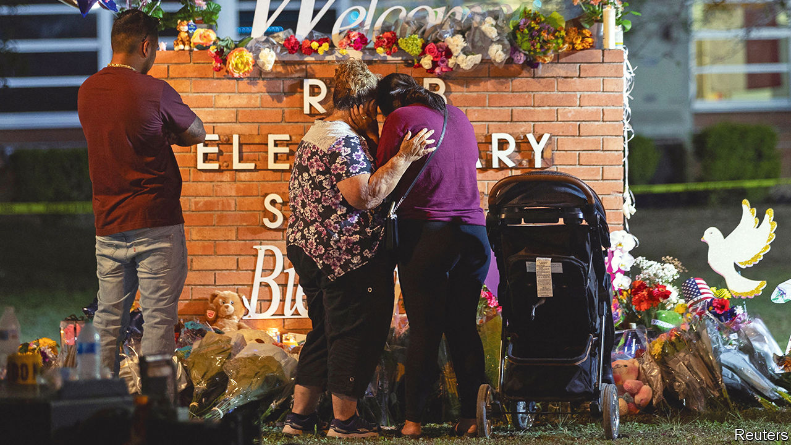
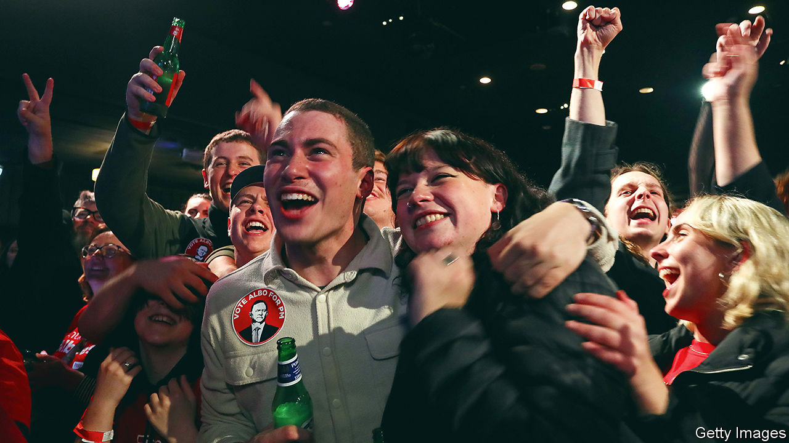

###### The world this week

# Politics 

#####  

 

> May 26th 2022 

An 18-year-old gunman murdered 19 young children and two adults at a school in Uvalde, Texas. After a stand-off with law-enforcement officers he was shot dead by a border-patrol agent. Parents were asked to provide dna samples to help identify the children’s bodies. The perpetrator had a semi-automatic rifle and wore body armour, as did the gunman who shot and killed ten black people at a supermarket in Buffalo on May 14th. It was the worst  in America since the Sandy Hook massacre in 2012. The fbi reported this week that the number of “active shooter” incidents, not counting episodes of gang violence or domestic disputes, rose by more than 50% last year to 61. 

Eric Adams, the mayor of , came under pressure to improve safety on the city’s subway system, and throughout the city generally, after a Goldman Sachs worker was shot dead on a train in a seemingly chance encounter. The alleged killer is a gang member with a lengthy criminal record. 

Donald Trump’s candidate in the  was roundly defeated. Mr Trump wanted to oust Brian Kemp as governor in the primary as revenge for his refusal to overturn the presidential election result in the state in 2020 (Mr Trump’s wild notion that the election was stolen rests in large part on losing Georgia). Mr Kemp’s victory means he will face the Democrats’ Stacey Abrams in a re-match for governor in November. Four years ago Ms Abrams claimed Mr Kemp suppressed the black vote in order to win. 

A judge suspended the Biden administration’s reversal of a pandemic health measure that allows for the swift expulsion of  back across the Mexican border. Amid a new surge in border crossings, Republican states have sued to keep the measure, known as Title 42, in place. 

A Gray day for Number 10

In  the final , a senior civil servant, into parties held at Downing Street during lockdowns was released, after police investigations ended. She levelled criticisms at senior political and official leadership, concluding that many of the gatherings were “not in line with covid guidance at the time”. The report also indirectly criticised Boris Johnson, the prime minister, for “failures of leadership and judgment”. 

A judge in  agreed to a deal that means the president, Alberto Fernández, will pay a donation to a vaccine-research institute so that legal proceedings against him for allegedly breaching lockdown rules are dropped. Mr Fernández’s partner threw a birthday party at the president’s official residence in July 2020. 

A police raid on a favela in  resulted in the deaths of 21 people. Police said all but one of the fatalities were members of a drug gang who were resisting an attempt to arrest their leaders. 

 has entered its “most active phase”, according to Ukraine’s defence ministry, as Russian forces step up their attacks in the east. Dozens of towns in the Donetsk region were assaulted by the invaders, as they try to encircle crack Ukrainian troops who have mounted a counter-attack. 

Ukraine’s foreign minister said his country strongly disagreed with a suggestion by  that it cede territory to Russia to bring an end to the war. The former American secretary of state said there “should be a return to the status quo ante”, which at the very least would mean Ukraine accepting Russia’s annexation of Crimea. 

Viktor Orban, the right-wing prime minister of , declared a state of emergency because of the war in Ukraine. His opponents say this is a ruse for Mr Orban to consolidate more power. Hungary is holding up an eu embargo on Russian oil while it tries to eke out exemptions. 

Michelle Bachelet, the un’s human-rights chief, began a highly orchestrated tour of the region of , where China is accused of detaining 1m Uyghurs and other minorities. Her ability to investigate such claims has been limited by the government, which expects a “friendly” visit. Activists in Washington released a trove of documents and photographs that detail China’s abuses in the region. 

 


The Labor Party won , defeating the conservative government that has held office for almost a decade. The new prime minister is Anthony Albanese, who promises to do more on climate change, an issue that bedevilled the tenure of his predecessor, Scott Morrison. Mr Albanese’s first task was to attend a security meeting in Tokyo with America, India and Japan to discuss relations with China. 

When Mr Albanese arrived in Tokyo he met Joe Biden, who was visiting Japan and South Korea. The American president caused a kerfuffle when he suggested that America will use force to help  if it is invaded by China. A furious China said there was no room for compromise. Mr Biden later clarified his comment, and said America had not changed its policy of providing Taiwan with the “military means” to defend itself.

While Mr Biden was in Tokyo,  and  flew nuclear-capable warplanes over the Sea of Japan in a co-ordinated exercise. After he left,  test-fired three ballistic missiles. 

The African Development Bank will channel $1.5bn to  for seeds, fertiliser and better technology in a bid to boost the continent’s output of food to avert hunger. Food prices have surged since Russia’s invasion of Ukraine; both are big producers of grain and fertiliser.

Pro-democracy activists in  said that more than 125 people were injured when police fired bullets and tear-gas at people protesting against the military government that took power in a coup six months ago.

Amnesty International’s annual report on the  found that at least 579 executions were carried out last year across 18 countries. That is up a fifth from 2020, but still the second-lowest number since 2010. Iran put the most people to death (314), followed by Egypt (83) and Saudi Arabia (65). China, which is thought to carry out thousands of executions a year, was excluded from the report, as were several other countries where data is hard to come by. 

The final call

New York’s last standing  was removed from its site near Times Square. Introduced in the early 1900s, coin-operated phones have been gradually replaced by Wi-Fi kiosks. The one carted away this week is heading to the city museum. 

