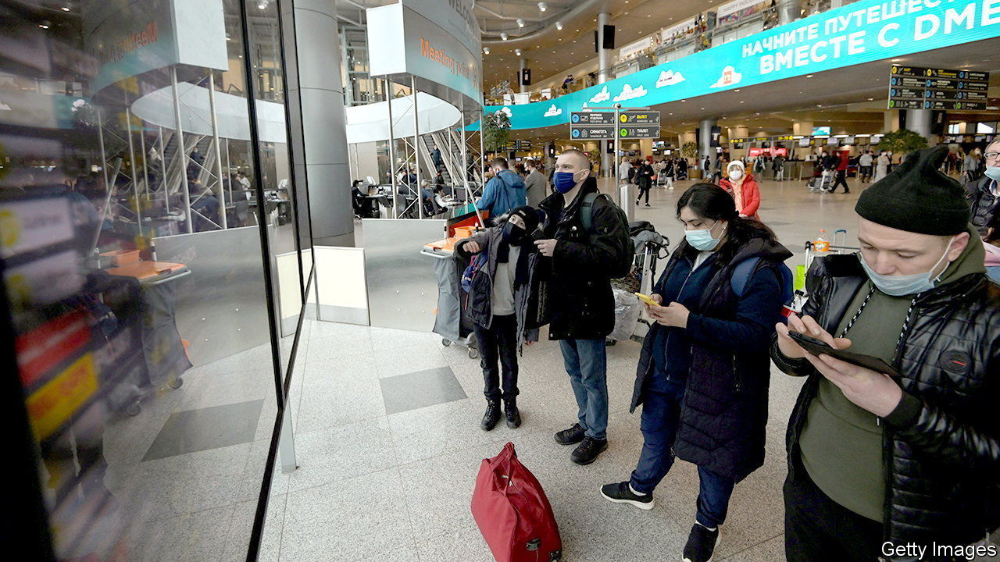

###### The talent war

# America has an opportunity to lure Russia’s tech talent 

##### Good for America, bad for Vladimir Putin 

 

> May 26th 2022 

Before the war in Ukraine, Nikolai Shevchik was happy working at an American technology startup in St Petersburg. But an economic slump and Vladimir Putin’s crackdown on dissent changed his mind. “For anyone who opposes the war, it is a question of safety now,” says Mr Shevchik, who is thinking of emigrating. He runs a channel on Telegram, a messaging app, where 50,000 or so like-minded Russians look for tech jobs abroad or remote work that pays in dollars or euros. Many have already fled to Turkey or Armenia.

Policymakers in Washington are looking for ways to capitalise on their disenchantment. America has often benefited from troubles abroad. Jewish émigrés from Nazi Europe, such as Leo Szilard and John von Neumann, helped develop the atom bomb and accelerated innovation in physics, chemistry and more. America scooped up hundreds of German scientists and engineers after 1945 through Operation Paperclip. Wernher von Braun, a former ss officer, became a leading force in the lunar programme. The collapse of the Soviet Union led Congress to pass the Soviet Scientists Immigration Act of 1992, permitting some 750 people to emigrate to America.

“These kinds of immigrants increase entrepreneurship, invention and growth,” says Jeremy Neufeld of the Institute for Progress, a think-tank. About 23% of America’s patents are produced by immigrants. Mr Neufeld estimates that nearly half of all advanced-degree holders in its defence industry were born abroad.

The Biden administration put its weight behind a provision tucked into the president’s proposed $33bn supplemental budget for Ukraine that would ease the path for Russians with technical skills to emigrate to America. Russians with a master’s or doctoral degree in science, technology, engineering or maths would no longer have been required to have an American employer as a sponsor for their h-1b visa, the employer-based immigration scheme. But Congress left this out of the bill it approved. So the search is on for other options. 

Certain requirements, such as the need for an employer, could be waived by executive order on national-security grounds. The o-1 visa, available to star academics, could be reinterpreted to allow a broader array of applicants. Congress has another opportunity in its version of an industrial-policy bill, which exempts advanced-degree holders from the caps on green cards, America’s permanent-residency permit.

Even if policymakers can ease the way for the likes of Mr Shevchik to come, America must still tackle an emerging talent gap with its principal geopolitical rival, China. China awards over 100,000 more advanced degrees every year than America does. America’s byzantine immigration system excels at kicking out foreign-born graduates. The place remains attractive to skilled foreigners—if only it will let them in. ■


