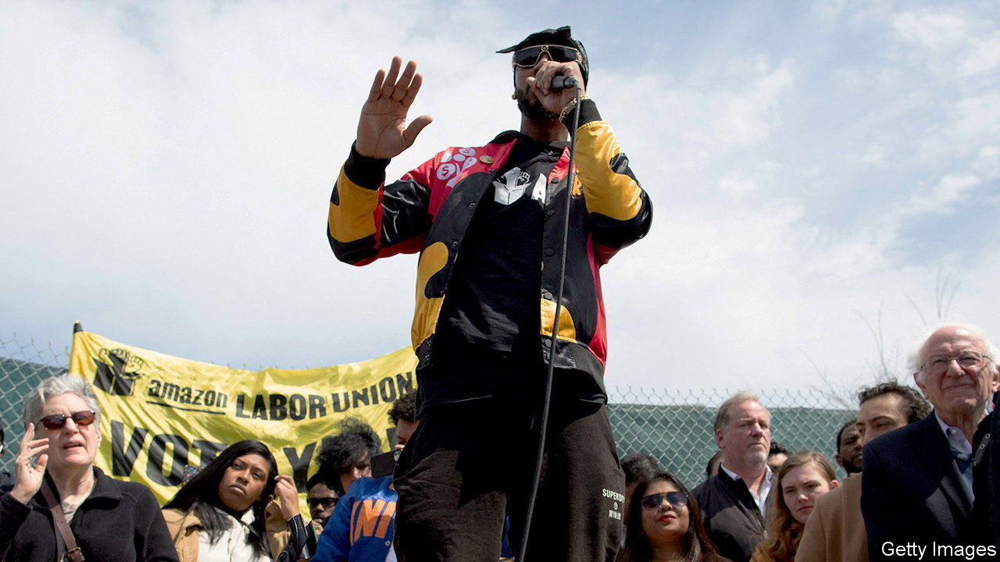

###### The name game

# New trade unions in America are successfully using company brands 

##### Deploying the Alphabet and finding a happy Medium 

 

> May 26th 2022 

Christian smalls and Jaz Brisack have lived very different lives. Mr Smalls started out as a rapper and worked in a series of jobs in retail before joining Amazon as a warehouse picker in 2015. He was fired in 2020 for leading a staff walkout, and he went on to found the Amazon Labour Union (alu). Ms Brisack won a Rhodes scholarship to the University of Oxford, then moved to Buffalo, New York, to work on a union campaign, but soon took a job at Starbucks. Eight months later she helped to found Starbucks Workers United (sbwu). Despite their different routes, Mr Smalls and Ms Brisack are the faces of America’s changing labour movement.

sbwu unionised the first Starbucks café last December: more than 90 have followed. In April the alu won an unexpected victory at jfk8, an Amazon warehouse in Staten Island, New York, to form the company’s first union in America. President Joe Biden has met Mr Smalls and told him: “You’re my kind of trouble.” One reason these unions have found success is that they have chosen to focus on organising workers within single firms rather than those across an entire industry.

Their names tell the story. Older unions have often had long names that describe their sectors—sometimes a mouthful (such as the Paper, Allied-Industrial, Chemical and Energy Workers International Union). This reflected their ambition. They wanted to win collective agreements covering all workers in an industry, to drive up wages and improve conditions across the board. But new unions are shunning complex monikers and using company names instead, such as Target Workers Unite (founded in 2018).

These are independent outfits but some enjoy the backing of older ones. The sbwu began with Ms Brisack secretly meeting with Workers United, affiliated to the century-old Service Employees International Union. Some 16 unions, including Alphabet Workers Union and Medium Workers Union, have sprung up since 2020, affiliated to the Communication Workers of America (formed in 1947). In the media industry, New Yorker Union started in 2018 and Condé Nast Union in March. 

Anastasia Christman of the National Employment Law Project, a think-tank, suggests that this helps target workers who lack experience of unions. Mr Smalls sought to distance alu from Amazon’s attempts to paint established unions as outsiders. alu’s name helped to create a shared identity rooted in the warehouse and not in a remote sectoral union.

Using company names makes it harder for firms to distance themselves from “independent contractors”. Instead, through their union’s branding, workers “insist on their identity as employees”, argues Ms Christman. Borrowing their employer’s brand also helps them alert consumers to the idea it could be associated with labour exploitation, says Catherine Fisk, director of the Berkeley Centre for Law and Work.

However it is not plain sailing. On May 2nd Amazon workers at ldj5 warehouse, in New York, voted against forming a union. And the sbwu may have unionised 90 cafés but there are some 15,500 Starbucks outlets in America. Brands—even borrowed ones—take time to develop. ■


