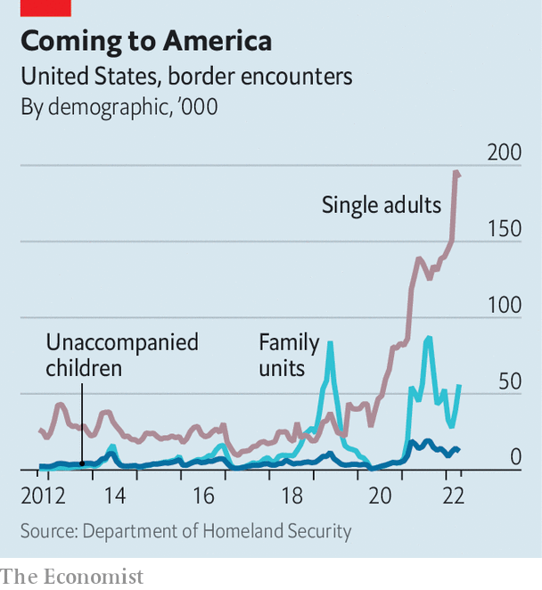
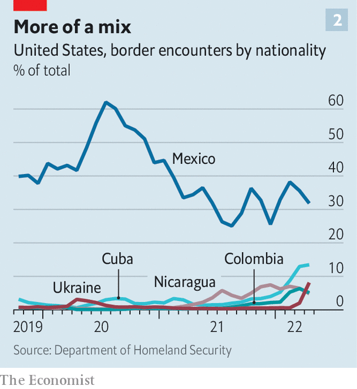

###### Bordering on chaos

# The Title 42 furore highlights America’s broken immigration system 

##### Whatever happens to the public-health rule, America will have to grapple with a surge in migration 

 

> May 22nd 2022 

When your rivals start offering their sympathies, you know you’re in trouble. Recently, this has been happening to Henry Cuellar, a Democratic congressman representing Laredo in south Texas, because of the Biden administration’s move to end “Title 42”, a border-management tool. “I’ve talked to a lot of Republicans, and they said, ‘We cannot believe, Henry, that the White House has given us our narrative’,” he says. (Mr Cuellar was in a tough primary election on May 24th, with border policy an animating issue.) The White House’s hope of lifting Title 42 from May 23rd played into the idea that Democrats are  at the border. 

 is a public-health rule invoked in March 2020 by Donald Trump’s administration to combat the spread of covid-19. It aimed to seal America’s borders from migrants, allowing the immediate expulsion of border-crossers, including asylum-seekers. The policy has been used in nearly 1.9m instances. Under Title 42, Customs and Border Patrol (cbp) can rapidly expel certain migrants to Mexico, instead of putting them through formal deportation proceedings. President Joe Biden has had to balance concern over rising numbers of migrants with his desire to create a more  and honour the legal right of people to seek asylum.

 


Opponents of ending Title 42, including Mr Cuellar, believe lifting it could add to the current migrant surge (see chart). In April, cbp apprehended migrants around 234,000 times at the southern border, the most in more than 22 years. Alejandro Mayorkas, the secretary of homeland security, has said once Title 42 is lifted as many as 18,000 a day could arrive—more than double the daily average in April. 

A coalition of Republican states sued to block the lifting of Title 42, and a federal judge ruled on May 20th that it must stay in place. The White House is going to appeal against the judge’s ruling. According to Aaron Reichlin-Melnick of the American Immigration Council, a think-tank, “It’s exceedingly unlikely that Title 42 is ended before the mid-term elections.” He predicts that the Supreme Court could ultimately take it up next year.

Designed as a public-health measure, Title 42 is flawed as a border-management tool. Migrants do not face charges for repeated entry, as they would if they were processed under normal immigration law. This encourages repeated attempts to cross. Recidivism surged from 11% in 2018 to 27% in 2021, inflating the number of apprehensions that cbp reports. “Hasta mañana,” one man recently told a border official, as he was about to be expelled. 

The measure has contributed to wildly different outcomes at the border, depending on a migrant’s nationality. Mexico accepts back Mexicans, Guatemalans, Hondurans and Salvadorans removed under Title 42, but not most others. Without the capacity to send these migrants home, cbp often releases them into America. At first, Title 42 “slowed people from coming”, but it “made border management less predictable and therefore gave people hope of getting in”, says Andrew Selee of the Migration Policy Institute, another think-tank. 

Morale among Border Patrol officers is the lowest it has been in at least 25 years, says Richard Douglas, who formerly worked for cbp and now runs security for the East Foundation, which owns ranchland in south Texas. Around 60% of cbp agents have been assigned to process migrants, taking them away from field work. One border expert estimates that less than 20% of people trying to cross the border undetected are stopped. Texas has deployed National Guard troops, filling whole hotels in south Texas. 

Three larger points are easily lost in all this. One is that high levels of migration are not occurring only at America’s southern border. Globally, more people are displaced from their home countries than at any time since 1945. Covid-hit economies, violence, persecution and hurricanes have pushed Central and South Americans to move. Last year in Mexico a record 131,000 people applied for asylum.

Previously, the migrants arriving at the southern border were mainly Mexicans, Salvadoreans, Hondurans and Guatemalans. But instability elsewhere has led large numbers from other countries, including Ukraine, to show up. In February 2021, when your correspondent visited the “humanitarian respite centre” run by the Catholic Relief Services of the Rio Grande Valley, it was full of Central American families released by cbp. Recently, most of the families there were Haitian. In the first seven months of this fiscal year, those stopped by cbp at the southern border included about 52,000 Colombians, compared with just 401 in 2019, and 6,700 Turks, up from 57 in 2019. 

 


The second, larger point is courts’ greater involvement in setting immigration law, in the absence of decisions by Congress. “The judiciary is now making our immigration policy on an ad hoc basis in different courts across the country,” explains Theresa Cardinal Brown of the Bipartisan Policy Centre, another think-tank. When Mr Biden tried to end the Migrant Protection Protocols (mpp), which force asylum-seekers to wait in Mexico pending their immigration hearings, Texas and Missouri sued, and a federal judge ordered Mr Biden to restart the mpp. The fate of the mpp will be decided by the Supreme Court. 

The fact that so many people want to rely on an obscure public-health tool as a border-management strategy points to a third issue: how dysfunctional America’s immigration system is. It was designed for a time when most migrants were Mexican single adults trying to come to America for work. Today whole families and children are arriving from around the world, many seeking asylum. A recent memorandum from Mr Mayorkas pointed the finger at Capitol Hill: “We are operating within a fundamentally broken immigration system that only Congress can fix.”

The Biden administration is about to introduce a faster system for adjudicating on new arrivals’ asylum claims, but that will not tackle the record backlog of asylum cases. (True to form, Texas has sued to block the move.) According to Mr Cuellar, the White House has been too close to immigrant-rights advocates and not listened enough to border communities and law enforcement. Sister Norma Pimentel, who runs Catholic Relief Services of the Rio Grande Valley, says the administration appears “uncertain as to how to proceed”.

Last year 650 migrants (and probably many more) are known to have died trying to enter America, the deadliest year on record. Some, including this newspaper, have argued that Mr Biden and his senior advisers should go to the border to witness the mess. Others want action, not a border tour. “I’m to the point where I don’t even want them here” for a photo-op, says Javier Villalobos, the mayor of McAllen, a Texas border town. The situation is so urgent that he wants them to “stay in Washington, sit down, figure out what to do and fix our border and our immigration problems”. ■


