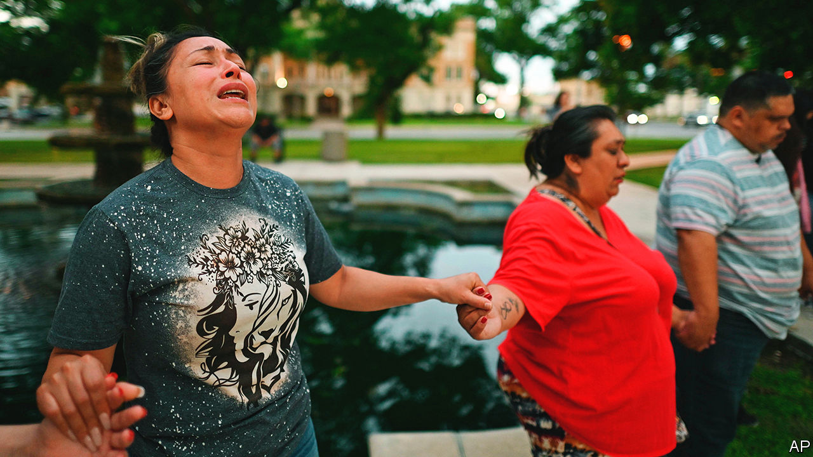
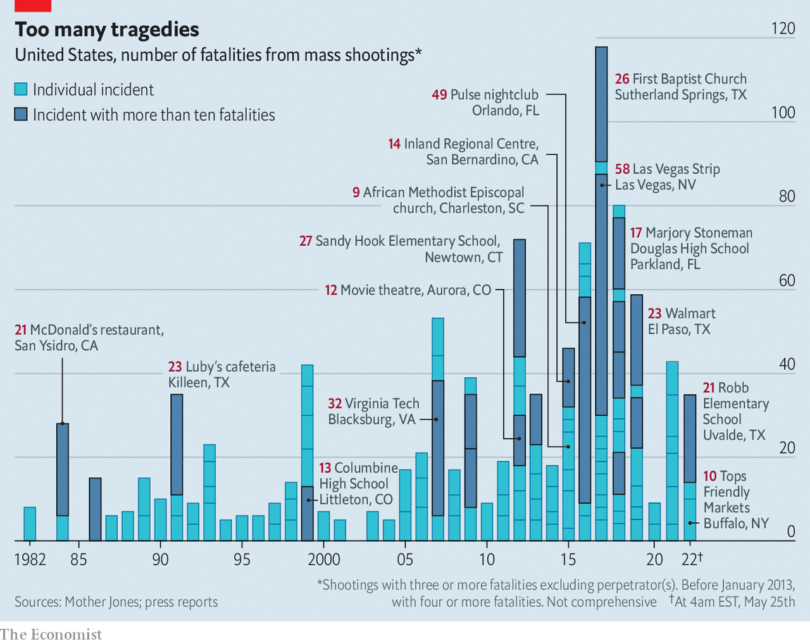

###### Another mass shooting

# The spate of gun violence shows American exceptionalism at its worst 

##### Texas and the country are weeping, again. But will anyone act? 

 

> May 25th 2022 

Uvalde is a small town in the picturesque Texas Hill Country, west of San Antonio, which used to be best known as the “honey capital of the world”. Today it is associated with senseless slaughter. On May 24th an 18-year-old gunman, Salvador Ramos, entered Robb Elementary School and carried out the largest school shooting since Sandy Hook Elementary in Newtown, Connecticut, in 2012. At least 21 are dead, including 19 children.

The gunman reportedly bought two assault rifles on his 18th birthday and is believed to have used one, and high-capacity magazines, which allowed him to fire multiple bullets quickly. In a haunting parallel with Sandy Hook, in which that gunman killed his mother before perpetrating the school attack, Mr Ramos shot his grandmother, who is in critical condition. No motive has been revealed.

There have been over 900 shootings on school grounds since the massacre of six- and seven-year-olds at Sandy Hook a decade ago. Whether in schools or elsewhere, mass shootings have become tragically common in America (see chart). Less than two weeks ago, another 18-year-old killed ten people at a grocery store in , targeting them because of their race. “We’re in this scenario where we keep watching the same movie play over and over again, and it’s a bad version of ‘Groundhog Day’,” says Joe Sakran, a surgeon and . 

 


President Joe Biden, freshly back from Asia, gave a sombre speech, which merged the gravity of a eulogy with the outrage of a prosecution. “What struck me on that 17-hour flight was these kinds of mass shootings rarely happen anywhere else in the world…Why are we willing to live with this carnage?” he asked. Mr Biden blamed the strength of the gun lobby, which has opposed even the most moderate of proposals, including funding federal research on gun violence and investing more in the Bureau of Alcohol, Tobacco, Firearms and Explosives (atf), an under-resourced agency that is responsible for background checks and ensuring firearms dealers comply with the law. The atf has had a permanent head only once in the past 15 years, owing to opposition by gun groups such as the National Rifle Association (nra). 

When it comes to guns, America is exceptional in three ways. Per head, it has the highest level of gun ownership in the world (war-torn Yemen ranks second). It has a significantly higher share of killings with guns than countries like Britain and Canada, which have stricter controls. And unlike other countries, such as Australia and New Zealand, which have experienced mass shootings but adapted their laws in the wake of tragedy, America has refused to change its gun laws. 

The lack of congressional action on gun control is its own sorry tale. After Sandy Hook, President Barack Obama gave the job of pushing through substantive gun-control legislation to his vice-president, Mr Biden. In 2013 a bill that would have introduced universal background checks on all gun sales failed in the Senate. There has been little federal action on gun control, because of Congress’s unwillingness to stare down the barrel of the nra, which remains influential in Washington despite the group’s own financial and reputational problems. In order to get things done, Mr Biden has tried to change policy by executive order, including regulating “ghost guns” that can be assembled from parts bought online and which had previously evaded regulation. 

More action has occurred at the state level. For example, after the shooting at Marjory Stoneman Douglas High School in Parkland, Florida, in 2018, many states passed , including the Republican-led Sunshine State. But there has also been a loosening of rules. Texas has embraced “, which allow people to carry guns around in public with no permit or training. In the absence of stronger federal legislation, places with stiffer restrictions see the results of their efforts diluted by anti-gun-control states. This is why there is an “iron pipeline” of guns trafficked from states in the South with fewer restrictions to those in the north-east which have stricter policies, says Mr Sakran. 

Although the shooting in Uvalde breaks hearts, will it change minds? As politicians prevaricate, more guns circulate. During 2020 and 2021, an estimated 43m guns were sold in America. Universal background checks would be the most meaningful reform—though an elusive one in a divided Congress. Some Democrats want to lengthen the waiting period for gun purchases. Currently the fbi has three days to conduct a background check for a gun sold by a federally licensed gun dealer, and if it does not object in that quick window, the buyer receives his firearm. This happened with the assailant in a grim shooting in Charleston in 2015.

The most likely change out of Washington could come soon from the Supreme Court, which is going to rule on a case regarding the constitutionality of New York’s restrictions on people’s ability to carry guns in public. Many expect the court to rule against New York, making it easier for individuals to carry firearms and potentially leading to more states’ gun restrictions being struck down. 

Messing with Texas

In Texas, voters will soon be able to indicate whether they are content to tolerate the status quo. In the wake of two mass shootings in 2019, Mr Abbott promised to look into solutions for avoiding future attacks but failed to act, instead signing permitless-carry into law. Beto O’Rourke, a Democrat who is running for governor, has made gun-control central to his political career (he confronted Mr Abbott at a news conference in Uvalde on May 25th). But his chances of victory against Mr Abbott are low, and there is little he could do to regulate guns in a Republican-controlled state legislature anyway.

On May 27th the nra is kicking off its annual conference, with speakers including Mr Abbott, Ted Cruz, a Republican senator from Texas, and former President Donald Trump. That the Uvalde atrocity and the nra’s gathering will occur in the same state, in the same week, is a symbol of America’s divisions and dysfunction. ■


