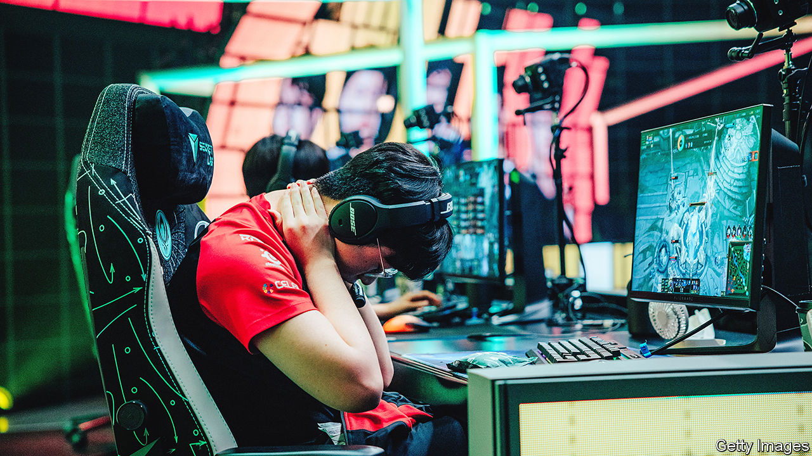

###### Powering up

# China’s e-sports players are challenging South Korea’s dominance 

##### But legal changes in both countries may help South Korea reclaim its crown 

 

> Jun 2nd 2022 

Some 4,000 fans gathered at the bexco Centre in Busan, a big port city in South Korea, on May 29th. Another 2.2m tuned in online. They were there for the finals of the Mid-Season Invitational, a prestigious e-sports tournament. A dozen teams had been competing over the course of three weeks to show off their skills at League of Legends (lol), an online strategy-fantasy game. Now just two remained: Royal Never Give Up from China and t1, representing the home side. As the battle raged, t1 soon sputtered. The mood in the hall grew sombre. Some fans left early. By the time the Chinese team, locked down at home and joining virtually, emerged victorious, few were left. Confetti rained down in a half-empty hall. 

The enthusiasm, and crushing disappointment, reflect the place e-sports have in South Korean youth culture. The games are not just fun, but a source of national pride. Since the 1990s players have honed their skills in pc (internet cafés), where children would go straight after school. Games such as StarCraft and lol filled time and fired up competitive spirit like after-class basketball in America or football in Brazil. The pool of talent expanded, and South Korean players came to dominate online-gaming championships. 

No longer. China is now on the rise. Chinese companies are at the heart of gaming globally. The country’s biggest tech firm, Tencent, owns Riot Games, which developed lol, as well as 40% of Epic Games, which makes Fortnite. They are among . Interest in the pastime has grown, too. There are some 685m gamers in China, including those who play on their phones, compared with 33m in South Korea. Over the past few years China has consistently beaten South Korea in big championships.

South Korea conspired in its own downfall. “Skilled Korean players and coaches played a role in cultivating the e-sport scene in China,” says Choi Eun-Kyoung of Hanshin University, near Seoul. South Korean masters, drawn in by big money, taught Chinese players the lessons of their success and established real-world gaming academies and systems for spotting and recruiting talent. 

South Korea now spies a chance to catch up. Last year, China limited under-18s to three hours of online gaming a week. Given that serious players start as young as 14 and practise some 70 hours a week, Chinese e-sports are bound to suffer. South Korea, meanwhile, last year scrapped a decade-old law banning under-16s from playing online games in the dead of night. Local governments are investing in gaming academies. During a campaign visit to lol Park, an e-sports venue in Seoul, Yoon Suk-yeol, South Korea’s new president, asked gamers for ideas on how to improve the perception of gaming among parents, who think it is addictive and a waste of time. “Our deeds shape the future,” he said, quoting a lol character. China’s deeds may help, too. 

