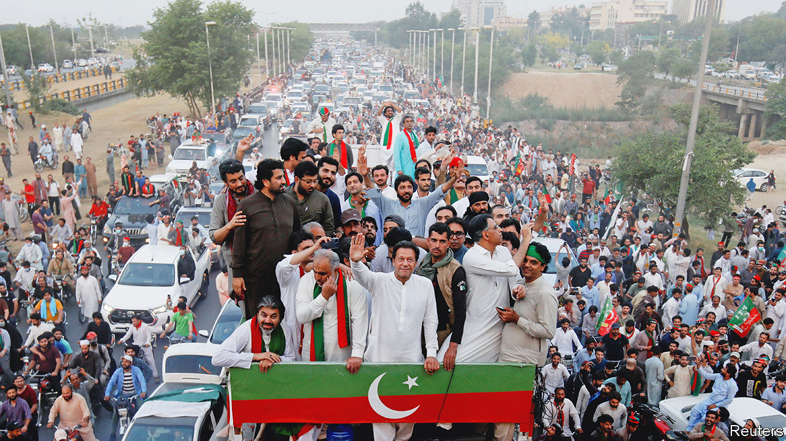
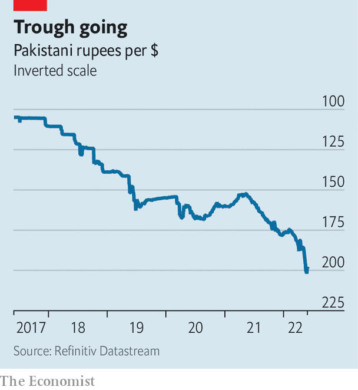

###### Another long march

# Imran Khan is jeopardising Pakistan’s attempts to fix its economy 

##### The interfering ex-prime minister is distracting the government with his constant threats 

 

> Jun 2nd 2022 

Once or twice a year, the approaches to Islamabad, Pakistan’s staid, leafy capital, start to resemble a jumbled cargo port. Piles of shipping containers sprout up at motorway junctions on the outskirts of the city and at strategic crossroads inside it. Lines of riot police stand guard. Residents grumble, knowing traffic will get choked, schools will close and getting to work will take twice as long.

The appearance of the barriers, put there by police, signals that the city of 1m is under siege from one of the country’s “long marches”. These are more aptly described as long drives: convoys of protesters travel in cars and minibuses from cities such as Lahore and Peshawar, a few hours away by road. These ritualised displays of street power, in which political parties rally their supporters and lead them towards the capital, are a favourite tactic for anyone trying to rattle the government.

No one is keener on them than Imran Khan (pictured, centre), the cricketer-turned-populist who leads his own Pakistan Tehreek-e-Insaf (pti) party. Since being  in a no-confidence vote in April, he has refused to leave the pitch. Instead he has taken to street protests, threatening to bring down the new government. 

He blames his inauspicious exit on a conspiracy between the opposition and America, which he claims was keen to see the back of him because he refused to pander to America’s foreign-policy demands. America says this is nonsense. Mr Khan’s supporters have lapped it up anyway. Over the past few weeks, huge crowds have rallied to him, demanding new elections to kick out the “imported” government. They have also criticised the armed forces, whose support is essential for any government, in unusually explicit terms.

Mr Khan’s latest hurrah came on May 25th, when he urged supporters to march on the capital and stage a sit-in until new elections are held. But turnout was unimpressive. In the end, he scrapped the plan as the protesters reached central Islamabad and skirmished with security forces, who fired tear gas. He announced a fresh deadline of May 31st for elections to be called and warned of more marches if the government does not comply. 

There has been much speculation about why the march was dispersed. Mr Khan says he wanted to prevent bloodshed. His opponents say he was disappointed with the size of the turnout. pti insiders claim that the march was halted after the generals gave assurances that elections, at present scheduled for late 2023 when the current parliament’s term ends, would be brought forward to this year. 

Mr Khan’s latest deadline came and went. He had not called a new march by the time  went to press. Some observers suspect that he may need time to rally his supporters after the anticlimactic ending to his last push on the capital. His allies think he is unlikely to return to Islamabad imminently. 

It is hard to see why the new prime minister, Shehbaz Sharif, a former chief minister of Punjab and the younger brother of Nawaz Sharif, a former prime minister, would agree to call early elections. His government, , has taken tentative steps towards repairing relations with the West. But it has not yet devised a strategy to tackle the economic crisis it inherited. In part that is because Mr Khan’s protests have kept it distracted. Mr Sharif has also failed to seize the political initiative. Last month the country watched the flailing prime minister board a plane to London to seek advice from his older brother, who lives in exile.

 


The country’s finances are in wretched shape. The pandemic and the fallout from the war in Ukraine have battered an economy already reeling from decades of mismanagement, outsize military spending and a focus on debt-driven infrastructure projects that generated no returns. Inflation hit 13.8% in May, driven largely by the price of food and transport. The rupee has lost 8% of its value against the dollar since early April (see chart). Foreign reserves had dwindled to $10bn by May 20th, enough to cover imports for only about six weeks. 

The reserves are at their lowest level since 2019, when Pakistan last sought help from the imf. Only half the $6bn bail-out agreed at the time has been disbursed. Mr Khan, then prime minister, originally agreed to cut subsidies and reform the economy but reduced fuel prices instead. The country is running deficits on both its budget and its current account. It needs some $37bn worth of financing for the fiscal year beginning in June, reckons the finance minister.

On May 26th Mr Sharif at last seemed to act more decisively. The government announced a cut in fuel subsidies, raising prices by 20%. This won approval from the imf, which has made the resumption of its loan programme conditional on policies to stabilise the economy. The currency and the stockmarket rallied slightly in response to the move. A bail-out will also unlock credit from allies such as China and Saudi Arabia, which are unwilling to extend more help without assurances that the imf will release the bail-out money.

To obtain those, the government will have to introduce more unpopular measures. This month it is likely to announce cuts to subsidies on electricity and the passage of an austerity budget. But dissolving parliament and calling early elections would distract from the goal of improving macroeconomic stability, even though Mr Sharif could win a real mandate. The imf is unlikely to take seriously a government that may not be in power for more than a few weeks, particularly given the risk that Mr Khan might return to power. Early elections would probably need approval from the generals. No matter what pti insiders claim, this will be harder to gain than it might have been a few months ago given  among Mr Khan’s supporters.

Even so, Mr Khan does not appear to be giving up hope. He is petitioning the Supreme Court to guarantee safe passage for potential follow-up marches. The coming spate of painful economic moves will supply him with plenty of excuses to paint the government as American stooges and enemies of the people. The appointment of a new army chief, due in November, will add yet more uncertainty to the political balance. To fix its economy, Pakistan badly needs stability. It will spend the coming months with anything but. ■

